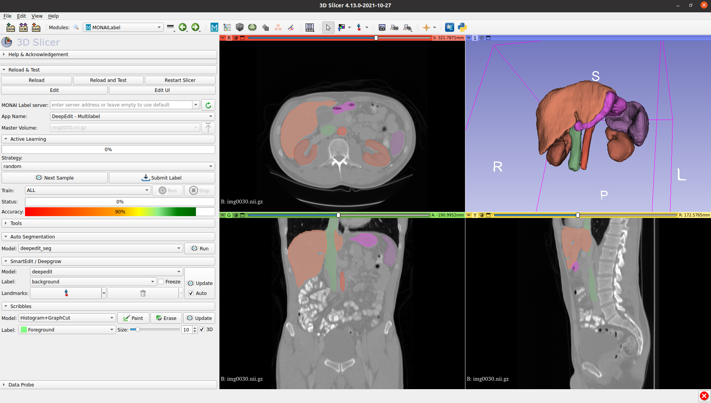

# MONAILabel

The MONAI-label is a server-client system that facilitates interactive medical image annotation by using AI.
It is an open-source and easy-to-install ecosystem that can run locally on a machine with one or two GPUs.
Both server and client work on the same/different machine.  However, initial support for multiple users is restricted.
It shares the same principles with [MONAI](https://github.com/Project-MONAI).

[](https://www.youtube.com/watch?v=vFirnscuOVI)



> **Development in Progress**. 
> We will be actively working on this repository to add more features, fix issues, update docs, readme etc... 
> as we make more progress.  Wiki's, LICENSE, Contributions, Code Compliance, CI Tool Integration etc... will follow similar to [MONAI repository](https://github.com/Project-MONAI).


## Simple UseCase


## Installation *(Development Mode)*
 - Pre-Trained models are available at [dropbox](https://www.dropbox.com/sh/gcobuwui5v2r8f5/AAAaJ3uFajwo4NRnQ0BqU46Ma?dl=0)
 - Download sample images/datasets from [monai-aws](https://github.com/Project-MONAI/MONAI/blob/master/monai/apps/datasets.py#L213-L224)

### Ubuntu
```bash
# One time setup (to pull monai with nvidia gpus)
docker run -it --rm --gpus all --ipc=host --net=host -v /rapid/xyz:/workspace/ projectmonai/monai:0.5.2
git clone git@github.com:Project-MONAI/MONAILabel.git /workspace/MONAILabel
cd /workspace/MONAILabel

pip install -r requirements.txt

export PATH=$PATH:/workspace/MONAILabel/monailabel
monailabel -h

# Download MSD Datasets from
mkdir -p /workspace/datasets
monailabel datasets
monailabel datasets --command download --name Task02_Heart --output /workspace/datasets/

# Run APP
monailabel samples
monailabel run --app /workspace/MONAILabel/sample-apps/deepedit_heart/ --studies /workspace/datasets/Task02_Heart/imagesTr
```

### Windows
 1. Install python and pip
    >Install python from https://www.python.org/downloads/

    `python -m pip install --upgrade pip setuptools wheel`

 2. Install cuda (Faster mode: install CUDA runtime only)
    >https://developer.nvidia.com/cuda-downloads


 3. Install torch (https://pytorch.org/get-started/locally/)

    `pip install torch==1.8.1+cu111 torchvision==0.9.1+cu111 torchaudio===0.8.1 -f https://download.pytorch.org/whl/torch_stable.html`


 4. Setup MONAILabel

    ```bash
    git clone git@github.com:Project-MONAI/MONAILabel.git C:\Projects
    pip install -r C:\Projects\MONAILabel\requirements.txt
    
    set PATH=%PATH%;C:\Projects\MONAILabel\monailabel
    monailabel -h


    # Download MSD Datasets from
    monailabel datasets --command download --name Task02_Heart --output C:\Datasets
    ```


 5. Run App
    ```bash
    monailabel samples
    monailabel run --app C:\Projects\MONAILabel\sample-apps\deepedit_heart --studies C:\Datasets\Task02_Heart\imagesTr
    ```


## App basic structure


## Dry Run basic flow (without slicer)

- http://127.0.0.1:8000/ will provide you the list of Rest APIs and click them to try any of them.


## Slicer

Install Plugin in developer mode

- git clone git@github.com:Project-MONAI/MONAILabel.git
- Open 3D Slicer: Go to Edit -> Application Settings -> Modules -> Additional Module Paths
- Add New Module Path: <FULL_PATH>/plugins/slicer/MONAILabel
- Restart


