# MONAI Label

MONAI Label is an open-source image labeling and learning tool for interactive AI annotation of medical images and videos. Use an assistant in **[3D Slicer](https://www.slicer.org/), [QuPath](https://qupath.github.io/), [OHIF](https://ohif.org/) or [CVAT](https://www.cvat.ai/)** for radiology, pathology and endoscopy.

Import datasets, review annotations, train and fine-tune models, and compare their results from one web workspace.

<p align="center">
<picture>
<source media="(prefers-reduced-motion: reduce)" srcset="docs/assets/overview.png">
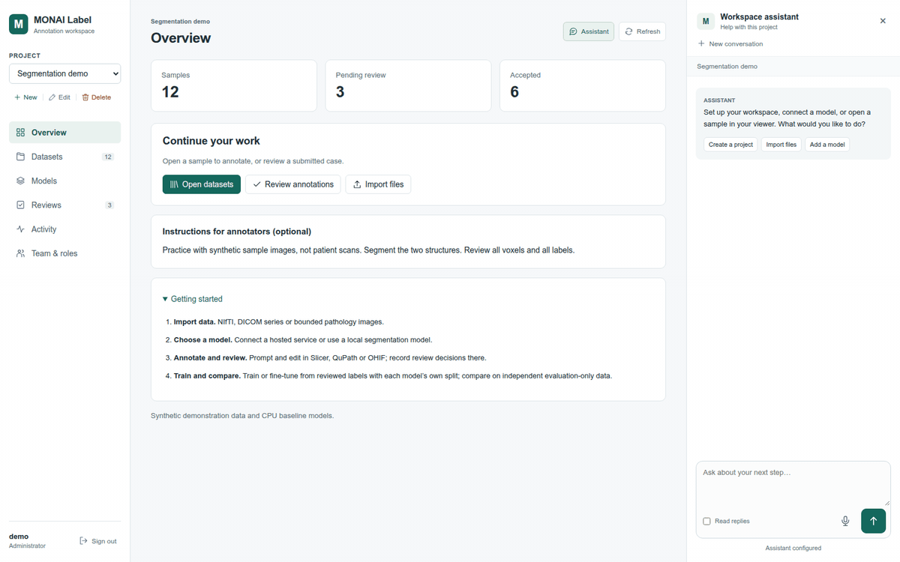
</picture>
</p>

<p align="center">
<a href="docs/assets/overview.png">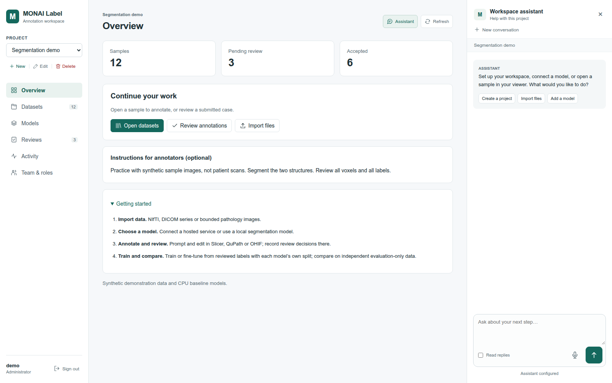</a>&nbsp;
<a href="docs/assets/datasets.png">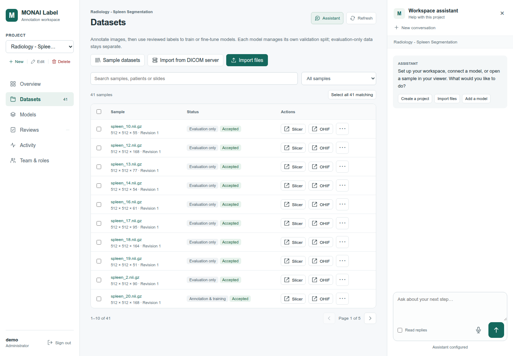</a>&nbsp;
<a href="docs/assets/models.png">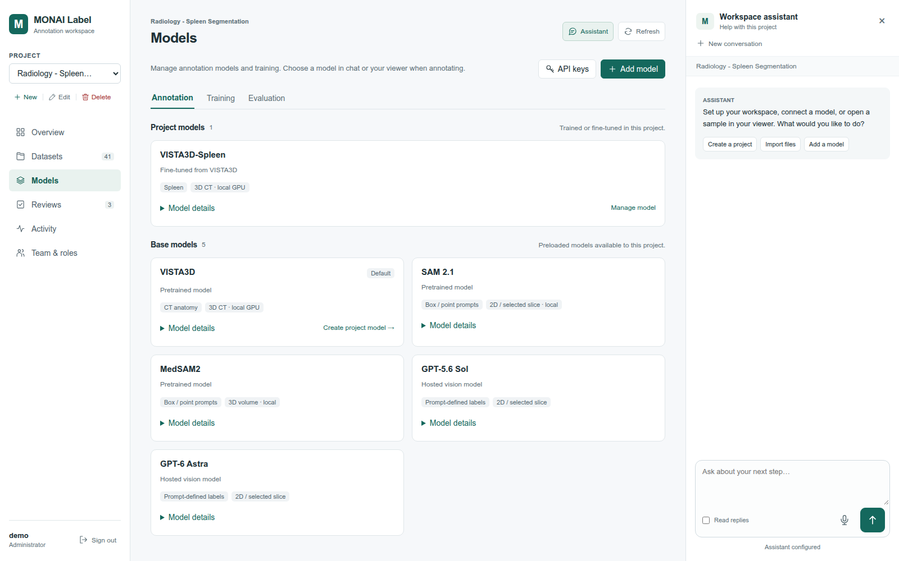</a>&nbsp;
<a href="docs/assets/reviews.png">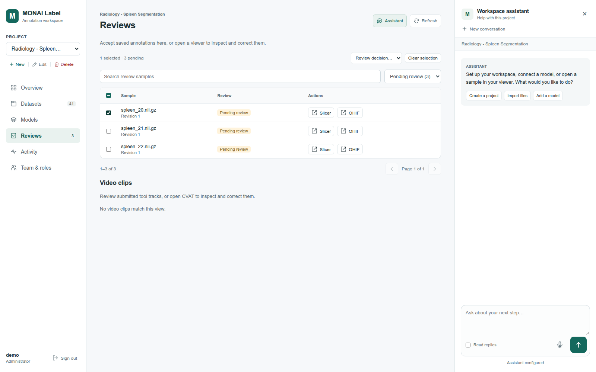</a>&nbsp;
<a href="docs/assets/slicer.png">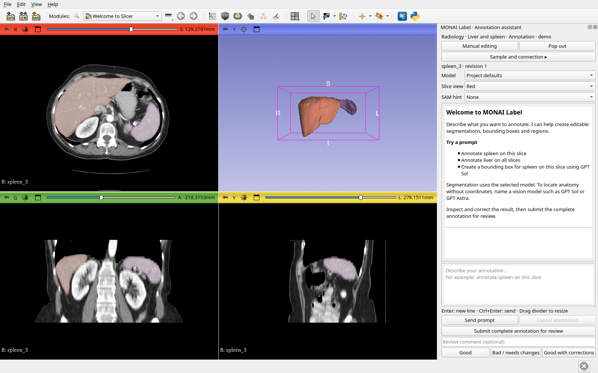</a>&nbsp;
<a href="docs/assets/ohif.png">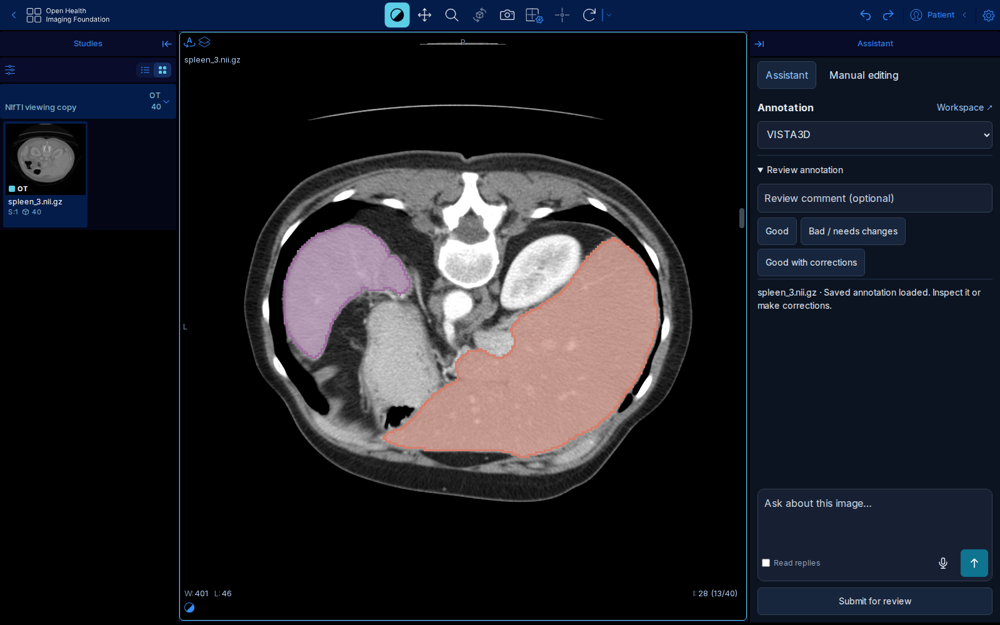</a>&nbsp;
<a href="docs/assets/qupath.png">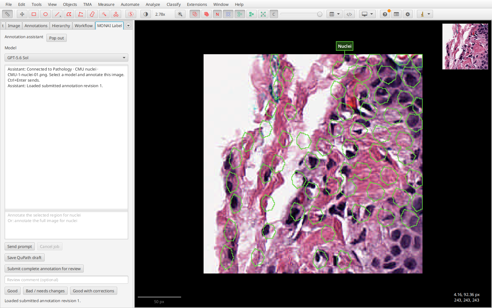</a>&nbsp;
<a href="docs/assets/cvat.png">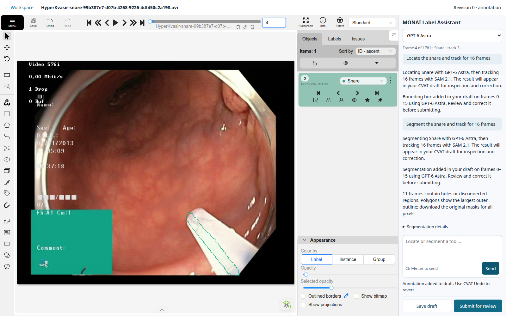</a>&nbsp;
<a href="docs/assets/training.png">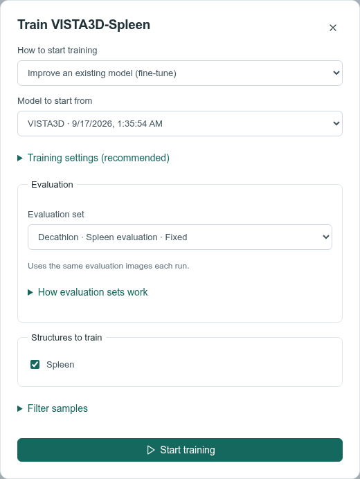</a>&nbsp;
<a href="docs/assets/comparison.png">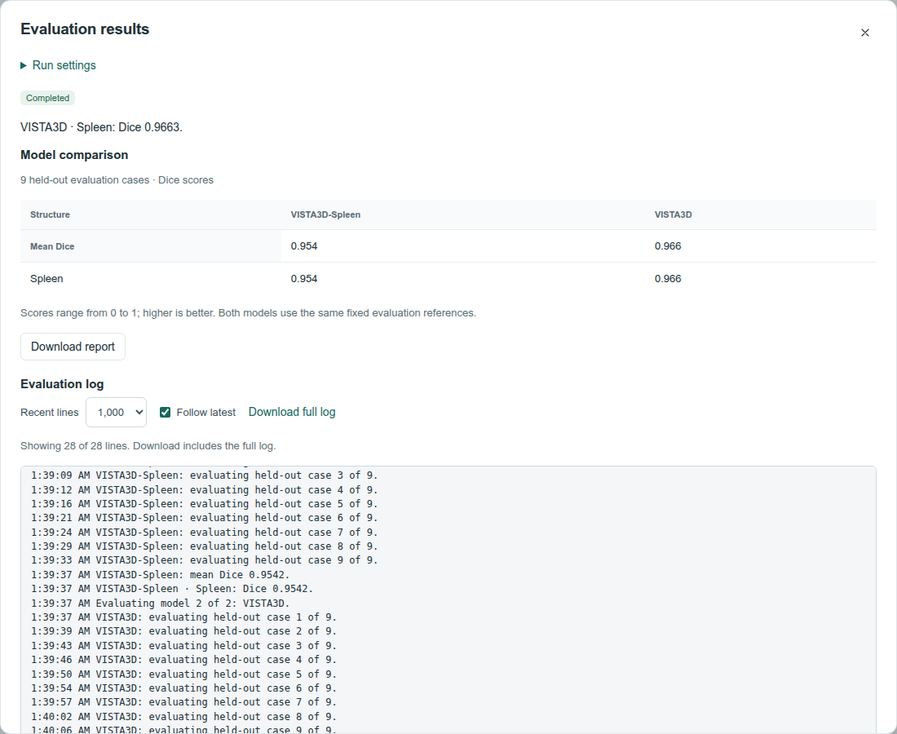</a>
</p>

## System requirements

- Linux for local GPU workflows.
- [Python 3.12+](https://www.python.org/downloads/), [uv](https://docs.astral.sh/uv/getting-started/installation/) and [Git](https://git-scm.com/downloads/).
- NVIDIA GPU with a compatible driver for local inference and training.
- [Docker](https://docs.docker.com/engine/install/) with [NVIDIA GPU support](https://docs.nvidia.com/datacenter/cloud-native/container-toolkit/latest/install-guide.html) for [local chat](docs/coordinator.md#setup). CVAT also uses Docker Compose and [FFmpeg](https://ffmpeg.org/).
- Internet access and disk space for downloads and project data.
- Modern browser; [Slicer](https://download.slicer.org/) or [QuPath](https://qupath.github.io/) for their respective viewers.
- [Node.js 22](https://nodejs.org/en/download) and [Corepack](https://github.com/nodejs/corepack) to build OHIF from source.

## Quickstart

On Ubuntu/Debian, run `./setup.sh` once to install missing dependencies and prepare the viewers. It uses sudo for system packages and requires a working NVIDIA driver. Use `./setup.sh --check` to check prerequisites.

Generate an [NVIDIA Inference API key](https://inference.nvidia.com) and export it in the shell so hosted GPT annotation (Sol/Astra) is available. NVIDIA Inference is one option; you can also bring any OpenAI-compatible model (see [providers](docs/providers.md)).

Start the server. Local chat uses Nemotron 3.5 Lightning by default; Nano 9B and Nano 4B are experimental options for smaller GPUs:

```bash
export NV_INFERENCE_API_KEY="<your-api-key>"
uv run monailabel-server

# If you have a smaller GPU, try Nemotron Nano 9B or Nano 4B:
uv run monailabel-server --assistant-variant 9b
uv run monailabel-server --assistant-variant 4b
```

Open **http://localhost:8000**, create an administrator account, and wait for **Assistant ready**. Send prompts one at a time and wait for each job to finish. Inspect and apply proposals before submitting.

Each example session below is one prompt per line, sent in order from the window named in the comment. Choose the specialty that matches your data.

<details open>
<summary><b>Radiology</b> — Decathlon Spleen, VISTA3D, OHIF</summary>

```text
# Main window
Create a project called "Radiology".
Import 80% of Decathlon Spleen images for annotation and 20% with labels for evaluation.
Annotate spleen in the first 3 images using VISTA3D and submit for review.
Open the first image in OHIF.

# OHIF assistant
Segment the spleen in the whole volume using VISTA3D.
Submit this annotation for review.

# Main window, after inspecting the annotations and evaluation labels
Mark all reviews as good for imported evaluation samples.
Mark all pending reviews as good.
Create a VISTA3D model named "VISTA3D-Spleen" for spleen.
Fine-tune VISTA3D-Spleen using the fixed Decathlon Spleen evaluation set.
Compare VISTA3D-Spleen with VISTA3D on that same evaluation set.
```

The same sequence, kept in sync with its test definitions, is in [datasets, models and learning](docs/workflows.md#try-the-spleen-learning-workflow).

</details>

<details open>
<summary><b>Pathology</b> — OpenSlide sample, nuclei, QuPath</summary>

```text
# Main window
Create a project called "Pathology".
Import the OpenSlide pathology sample.
Open this sample in QuPath.

# QuPath assistant, after drawing a region
Segment nuclei in the selected region using GPT-5.6 Sol.
Submit this annotation for review.
```

</details>

<details open>
<summary><b>Endoscopy</b> — HyperKvasir clip, tool tracking, CVAT</summary>

```text
# Main window
Create a project called "Endoscopy".
Import the HyperKvasir tool-tracking sample.
Open the video in CVAT.

# CVAT assistant
Use GPT-5.6 Sol to locate the snare on this frame.
Use GPT-5.6 Sol to segment the snare on this frame.
Use GPT-5.6 Sol to segment the snare and track it for 16 frames.
Use GPT-5.6 Sol to segment the snare and track the whole video.
```

</details>

## Workspace

Projects, accounts, annotations and models are saved in the Git-ignored `workspace/` folder. Downloads and managed tools are cached in `workspace/.cache/`. To use a different location:

```bash
uv run monailabel-server --data-dir /path/to/workspace
```

To start fresh, stop the server and viewers, delete the workspace contents (including `.cache/`) and restart. This removes all local accounts and project data.

This is a development preview. See [current limitations](docs/roadmap.md).
