# MONAI Label

MONAI Label is an open-source image labeling and learning tool for interactive AI annotation of medical images and videos. Use an assistant in **[3D Slicer](https://www.slicer.org/), [QuPath](https://qupath.github.io/), [OHIF](https://ohif.org/) or [CVAT](https://www.cvat.ai/)** for radiology, pathology and endoscopy.

Import datasets, review annotations, train and fine-tune models, and compare their results from one web workspace.

<p>
<a href="https://github.com/user-attachments/assets/9cd51524-68a5-4d12-a79d-11fd49ed3cb9"><strong>Watch the MONAI Label demo</strong></a>
</p>

<p align="center">
<picture>
<source media="(prefers-reduced-motion: reduce)" srcset="docs/assets/overview.png">
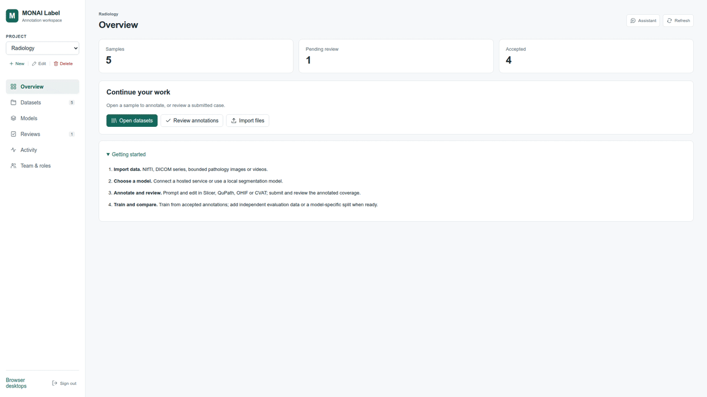
</picture>
</p>

<p align="center">
<a href="docs/assets/overview.png">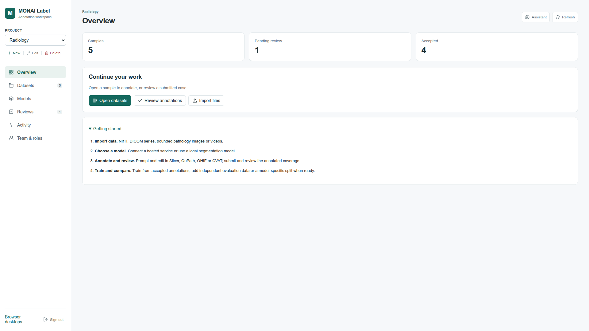</a>&nbsp;
<a href="docs/assets/datasets.png">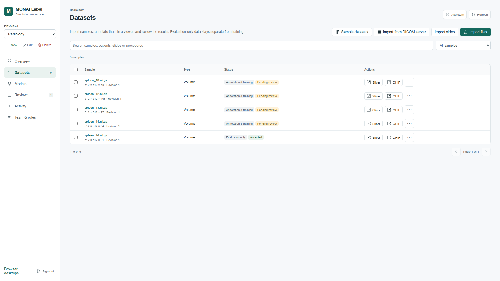</a>&nbsp;
<a href="docs/assets/models.png">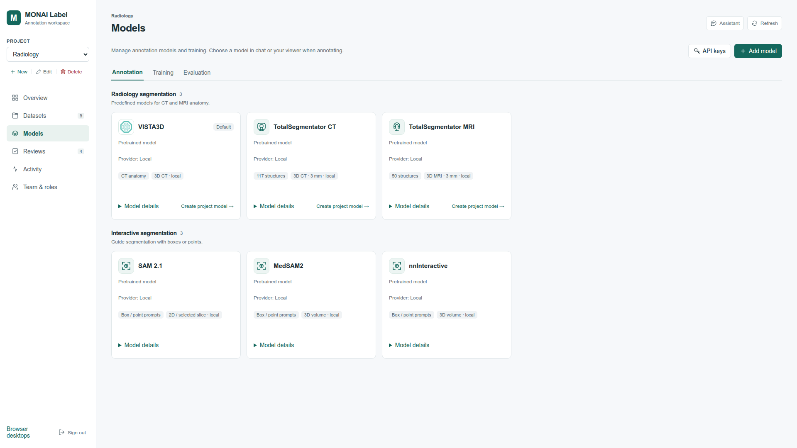</a>&nbsp;
<a href="docs/assets/reviews.png">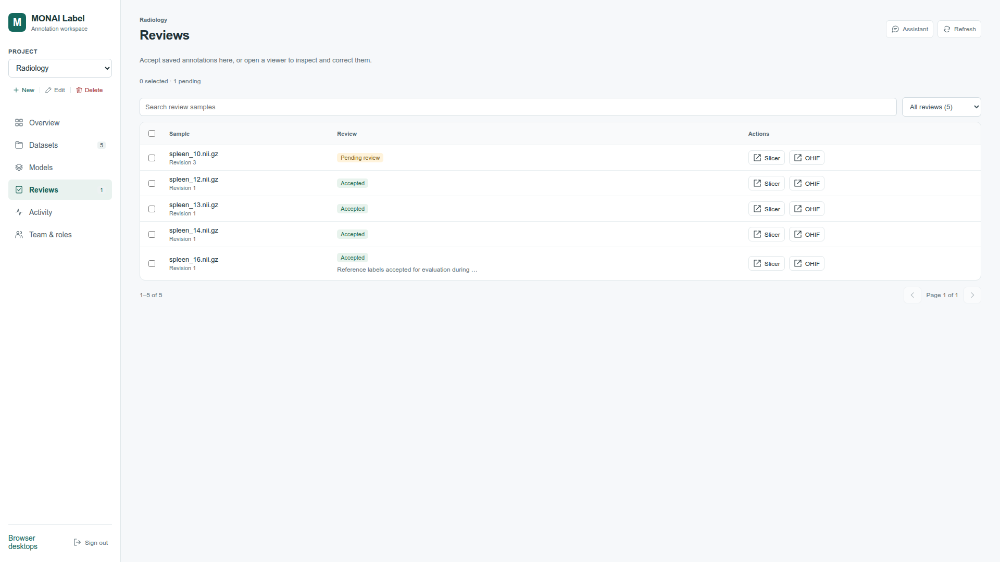</a>&nbsp;
<a href="docs/assets/slicer.png">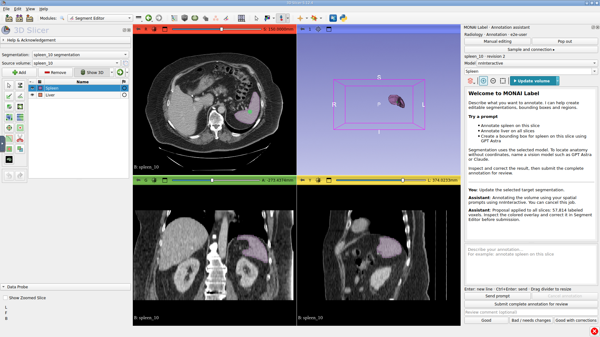</a>&nbsp;
<a href="docs/assets/ohif.png">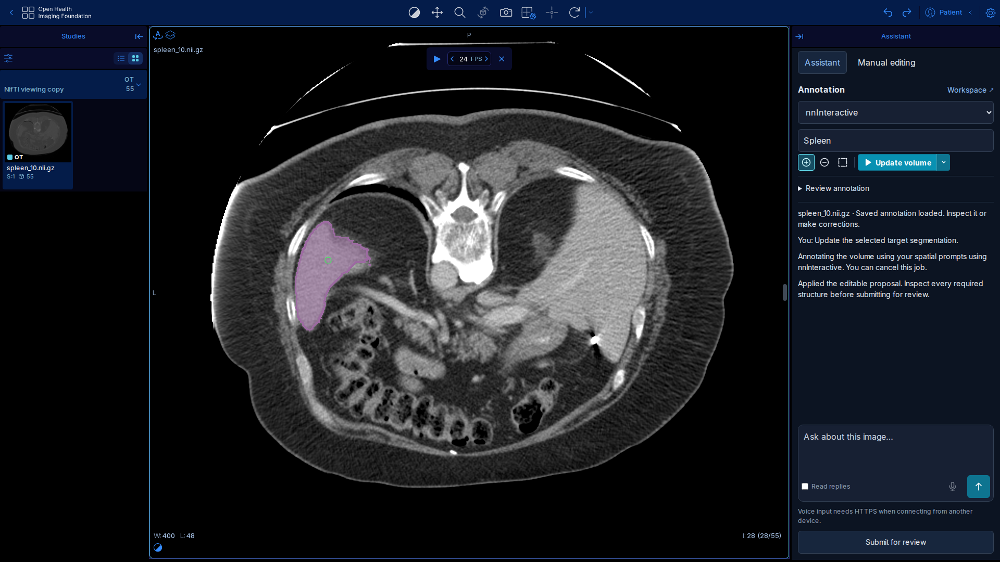</a>&nbsp;
<a href="docs/assets/qupath.png">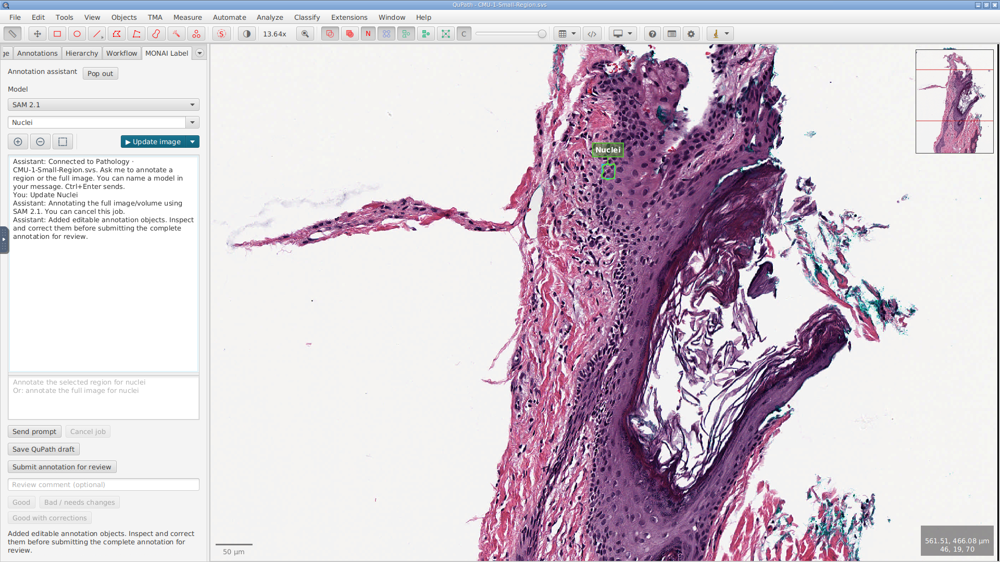</a>&nbsp;
<a href="docs/assets/cvat.png">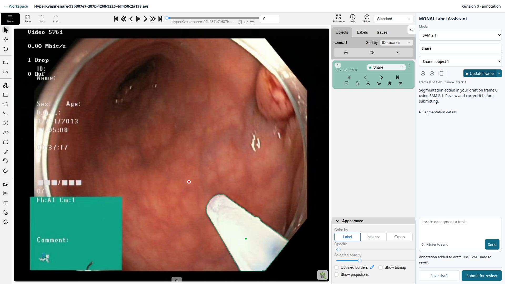</a>&nbsp;
<a href="docs/assets/training.png">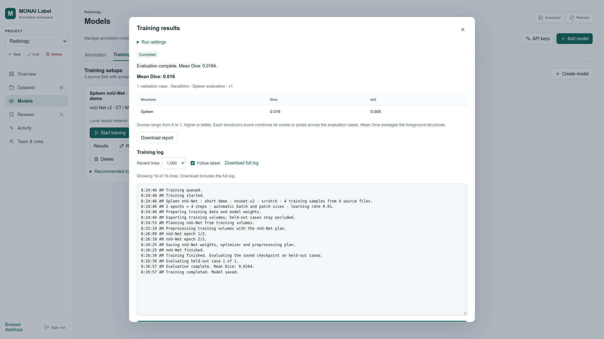</a>&nbsp;
<a href="docs/assets/comparison.png">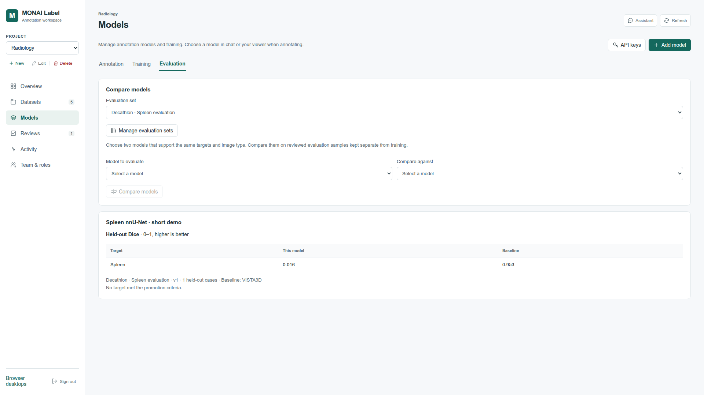</a>
</p>

[Screenshot credits](docs/assets/README.md)

## System requirements

- Linux x86_64 or ARM64. On Jetson Thor, complete [NVIDIA's Docker setup](https://docs.nvidia.com/jetson/agx-thor-devkit/user-guide/0.1.0/setup_docker.html) first, including its default runtime setting.
- DGX Spark: [ARM64 setup and verification](docs/spark.md).
- [Python 3.12+](https://www.python.org/downloads/). Development from source also uses [uv](https://docs.astral.sh/uv/getting-started/installation/) and [Git](https://git-scm.com/downloads/).
- NVIDIA GPU with a CUDA 13-compatible driver and [NVIDIA Container Toolkit](https://docs.nvidia.com/datacenter/cloud-native/container-toolkit/latest/install-guide.html). Default nnU-Net training targets 24 GB of available memory.
- [Docker](https://docs.docker.com/engine/install/) for [local chat](docs/coordinator.md#setup). CVAT also uses Docker Compose and [FFmpeg](https://ffmpeg.org/).
- Internet access and approximately **100 GB of free disk space** for installation and the default local assistant. Allow more for datasets, additional models and training checkpoints.
- Modern browser. Slicer and QuPath launch normally on localhost; remote clients use a browser desktop hosted by the Linux server with Docker. No viewer installation is needed on remote clients.
- [Node.js 22](https://nodejs.org/en/download) and [Corepack](https://github.com/nodejs/corepack) to build OHIF from source.

## Quickstart

Install with pip ([environment setup](docs/installation.md)):

```bash
pip install monailabel -U
```

Add `--pre` to install a release candidate after it is published. Start with `monailabel`, or use [Docker](docs/docker.md).

For a source installation on Ubuntu/Debian:

```bash
./setup.sh # may prompt for sudo

# Optional: enable predefined NVIDIA-hosted annotation models
export NV_INFERENCE_API_KEY="<your-api-key>"

uv run monailabel

# Optional smaller assistant models
uv run monailabel --assistant-variant 9b
uv run monailabel --assistant-variant 4b

# Hosted chat (requires OPENAI_API_KEY)
uv run monailabel --assistant openai --assistant-model gpt-6-astra
```

You can also use Anthropic, Gemini, or any compatible endpoint for chat. See [chat setup](docs/coordinator.md#setup) and [annotation model setup](docs/providers.md).

Open **http://localhost:8000**, create an administrator account, and wait for **Assistant ready**.
Add `--host 0.0.0.0` to reach the server from another device, or `--host 0.0.0.0 --https` for [HTTPS and voice input](docs/viewers.md#https).

Send each prompt **one at a time, in order**. **Workspace** means the main web window; viewer prompts go into its **MONAI Label** assistant. Inspect and correct masks before submitting or accepting them.

### Radiology

#### CT spleen — annotate, review and fine-tune

```text
# 1. Workspace — import and annotate
Create a project called "Radiology".
Import Decathlon Spleen: 80% images only, 20% with evaluation labels.
Annotate spleen in 3 images with VISTA3D; submit for review.
Annotate spleen in 2 images with TotalSegmentator CT; submit for review.

# 2. Reviews → open the first pending review in OHIF
Clear the spleen annotation on the current slice.
Annotate the spleen on the current slice using GPT Astra.
Accept my corrected segmentation.

# 3. Datasets → open an unannotated CT in Slicer
Start nnInteractive for spleen.
# Add +/− points, then press Update volume
Submit this annotation for review.
# Open another unannotated CT in Slicer
Draw a spleen box with nnInteractive.
# Click two opposite corners, then press Update volume
Submit this annotation for review.

# 4. Reviews — after inspecting the remaining masks
Accept all pending reviews.

# 5. Workspace — fine-tune and compare
List all training recipes.
Based on VISTA3D, create model "VISTA3D-Spleen" for spleen.
Fine-tune VISTA3D-Spleen on approved masks; use the fixed evaluation set.
Compare VISTA3D-Spleen with VISTA3D on the fixed evaluation set.

# 6. Datasets → open an unannotated case in OHIF
Segment the spleen in the whole volume using VISTA3D-Spleen.
```

#### nnU-Net v2 — CT lung tumors

Train lung tumor segmentation from supplied CT labels. The Decathlon Lung archive is about 9 GB.

```text
# 1. Workspace — import labeled CT cases
Create a project called "Lung tumors".
Import all Decathlon Lung images with labels; reserve 20% for evaluation.

# 2. Reviews — inspect the imported training masks
Accept all pending reviews.

# 3. Workspace — train and compare
Create CT nnU-Net v2 model "Lung nnU-Net" for all imported labels.
Train Lung nnU-Net for 1000 epochs, 250 steps each; use the fixed evaluation set.
Compare Lung nnU-Net with VISTA3D on the fixed evaluation set.
Show the comparison results.
```

The reserve is held out from nnU-Net. [VISTA3D's training sources](https://github.com/Project-MONAI/VISTA/blob/main/vista3d/data/make_datalists.py) include Decathlon Lung, so this comparison is a workflow example, not an independent benchmark of VISTA3D.

#### nnU-Net v2 — MRI prostate zones

Train peripheral and transition zone segmentation using the T2 sequence from [Decathlon Prostate](http://medicaldecathlon.com/). The archive is about 240 MB.

```text
# 1. Workspace — import labeled T2 MRI cases
Create a project called "Prostate zones".
Import all Decathlon Prostate T2 images with labels; reserve 20% for evaluation.

# 2. Reviews — inspect the imported training masks
Accept all pending reviews.

# 3. Workspace — train and evaluate
Create MRI nnU-Net v2 model "Prostate nnU-Net" for all imported labels.
Train Prostate nnU-Net for 500 epochs, 250 steps each; use the fixed evaluation set.
Show the evaluation results for Prostate nnU-Net.
```

Both nnU-Net examples use all labeled cases. Inspect predictions and per-class scores after training; these starting budgets do not guarantee model quality.

### Pathology

```text
# 1. Workspace — import
Create a project called "Pathology".
Import the OpenSlide pathology sample.

# 2. Datasets → open the sample in QuPath and select a small region
Segment nuclei in the selected region using GPT Astra.
Submit this annotation for review.

# 3. Reviews — after inspecting the submitted region
Accept all pending reviews.

# 4. Workspace — train
Create a U-Net model named "Nuclei U-Net" for nuclei.
Train Nuclei U-Net with approved samples.

# 5. Datasets → open the sample in QuPath and select a new, non-overlapping region
Segment nuclei in the selected region using Nuclei U-Net.
```

### Endoscopy

```text
# 1. Workspace — import
Create a project called "Endoscopy".
Import the HyperKvasir tool-tracking sample.

# 2. Datasets → open the clip in CVAT and select a frame with the snare
Segment the snare and track it for 16 frames using GPT Astra.
Submit this annotation for review.

# 3. Reviews — after inspecting the tracked frames
Accept all pending reviews.

# 4. Workspace — train
Create a U-Net model named "Snare U-Net" for snare.
Train Snare U-Net with approved samples.

# 5. Datasets → open the clip in CVAT on an untracked frame, with no track selected
Segment the snare on this frame using Snare U-Net.
```

The pathology and endoscopy examples train without an evaluation score. Evaluation needs separate slides or procedures; see [learning options](docs/workflows.md#train-a-model). For labeled TNBC nuclei and Kvasir-Instrument samples, see [dataset templates](docs/datasets.md).

## Workspace

Projects, accounts, annotations and models are saved in the Git-ignored `workspace/` folder. Downloads and managed tools are cached in `workspace/.cache/`. To use a different location:

```bash
uv run monailabel --data-dir /path/to/workspace
```

To start fresh, stop the server and viewers, delete the workspace contents (including `.cache/`) and restart. This removes all local accounts and project data.

This is the 1.0 release candidate. See the [design guide](docs/design.md) and [current limitations](docs/roadmap.md).

MONAI Label uses Apache-2.0; bundled third-party material, downloaded datasets, model weights and viewers retain their own terms. See [third-party notices](THIRD_PARTY_NOTICES.md).

For research using MONAI Label, cite [MONAI Label: A framework for AI-assisted interactive labeling of 3D medical images](https://doi.org/10.1016/j.media.2024.103207).
