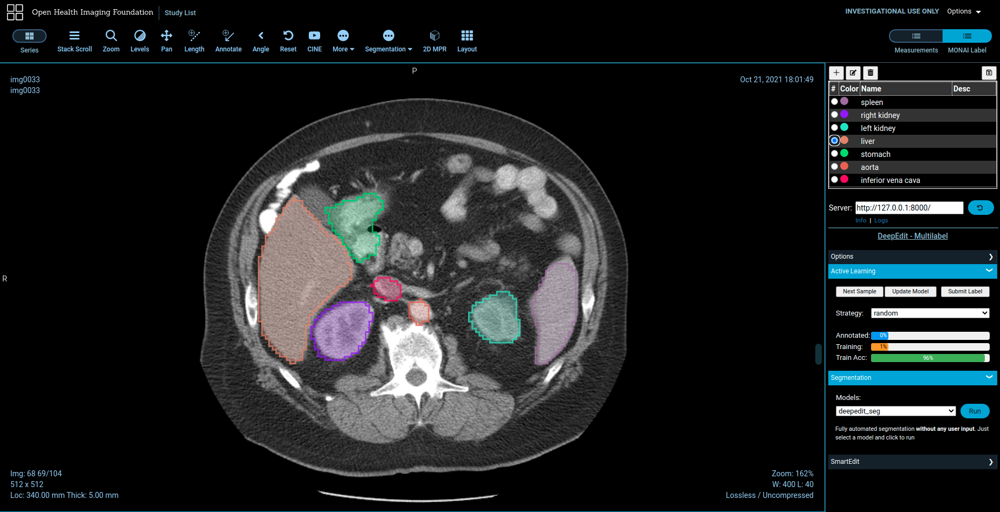

# MONAI Label

[](https://opensource.org/licenses/Apache-2.0)
[](https://github.com/Project-MONAI/MONAILabel/commits/main)
[](https://docs.monai.io/projects/label/en/latest/?badge=latest)
[](https://codecov.io/gh/Project-MONAI/MONAILabel)
[](https://badge.fury.io/py/monailabel)

MONAI Label is a server-client system that facilitates interactive medical image annotation by using AI. It is an
open-source and easy-to-install ecosystem that can run locally on a machine with one or two GPUs. Both server and client
work on the same/different machine. However, initial support for multiple users is restricted. It shares the same
principles with [MONAI](https://github.com/Project-MONAI).

[Brief Demo](https://youtu.be/gzAR-Ix31Gs)


## Features

> _The codebase is currently under active development._

- framework for developing and deploying MONAI Label Apps to train and infer AI models
- compositional & portable APIs for ease of integration in existing workflows
- customizable design for varying user expertise
- 3DSlicer support

## Installation

MONAI Label supports following OS with **GPU/CUDA** enabled.

- Ubuntu
- [Windows](https://docs.monai.io/projects/label/en/latest/installation.html#windows)

To install the current release, you can simply run:

```bash
  pip install monailabel
  
  # download sample apps/dataset
  monailabel apps --download --name deepedit_left_atrium --output apps
  monailabel datasets --download --name Task02_Heart --output datasets
  
  # run server
  monailabel start_server --app apps\deepedit_left_atrium --studies datasets\Task02_Heart\imagesTr
  
```

For **_prerequisites_**, other installation methods (using the default GitHub branch, using Docker, etc.), please refer
to the [installation guide](https://docs.monai.io/projects/label/en/latest/installation.html).

> Once you start the MONAI Label Server, by default it will be up and serving at http://127.0.0.1:8000/. Open the serving URL in browser. It will provide you the list of Rest APIs available.

### 3D Slicer

Download **Preview Release** from https://download.slicer.org/ and install MONAI Label plugin from Slicer Extension
Manager.

Refer [3D Slicer plugin](plugins/slicer) for other options to install and run MONAI Label plugin in 3D Slicer.
> To avoid accidentally using an older Slicer version, you may want to _uninstall_ any previously installed 3D Slicer package.

### OHIF

MONAI Label comes with pre-built plugin for [OHIF Viewer](https://github.com/OHIF/Viewers).
> Please install [Orthanc](https://www.orthanc-server.com/download.php) before using OHIF Viewer.
> For Ubuntu 20.x, Orthanc can be installed as `apt-get install orthanc orthanc-dicomweb`. However, you have to **upgrade to latest version** by following steps mentioned [here](https://book.orthanc-server.com/users/debian-packages.html#replacing-the-package-from-the-service-by-the-lsb-binaries)
>
> You can use [PlastiMatch](https://plastimatch.org/plastimatch.html#plastimatch-convert) to convert NIFTI to DICOM

> OHIF Viewer will be accessible at http://127.0.0.1:8000/ohif/
> For development OHIF can be built by running 



## Contributing

For guidance on making a contribution to MONAI Label, see the [contributing guidelines](CONTRIBUTING.md).

## Community

Join the conversation on Twitter [@ProjectMONAI](https://twitter.com/ProjectMONAI) or join
our [Slack channel](https://forms.gle/QTxJq3hFictp31UM9).

Ask and answer questions over
on [MONAI Label's GitHub Discussions tab](https://github.com/Project-MONAI/MONAILabel/discussions).

## Links

- Website: https://monai.io/
- API documentation: https://docs.monai.io/projects/label
- Code: https://github.com/Project-MONAI/MONAILabel
- Project tracker: https://github.com/Project-MONAI/MONAILabel/projects
- Issue tracker: https://github.com/Project-MONAI/MONAILabel/issues
- Wiki: https://github.com/Project-MONAI/MONAILabel/wiki
- Test status: https://github.com/Project-MONAI/MONAILabel/actions
- PyPI package: https://pypi.org/project/monailabel/
- Weekly previews: https://pypi.org/project/monailabel-weekly/
- Docker Hub: https://hub.docker.com/r/projectmonai/monailabel
