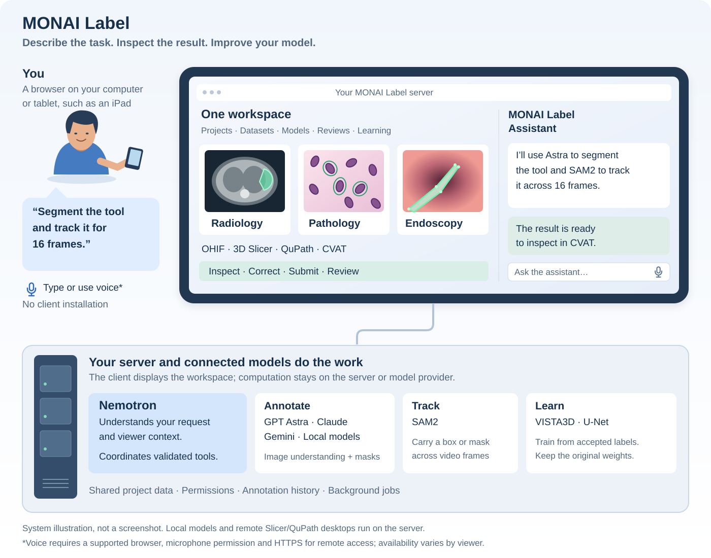
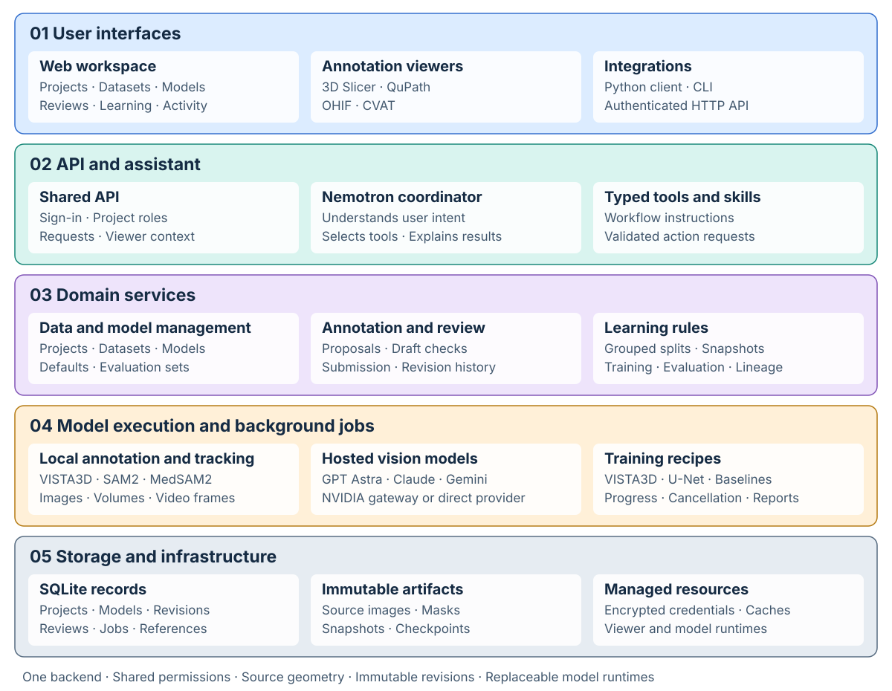
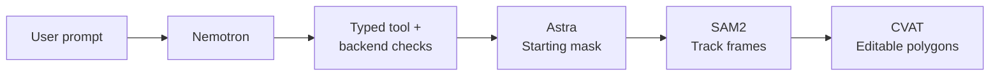
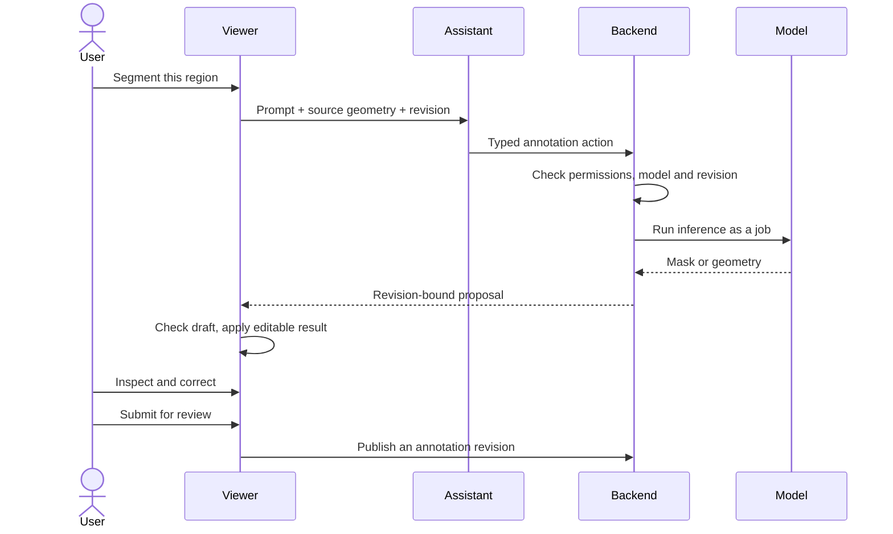
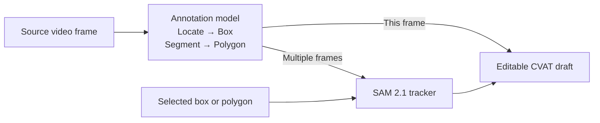
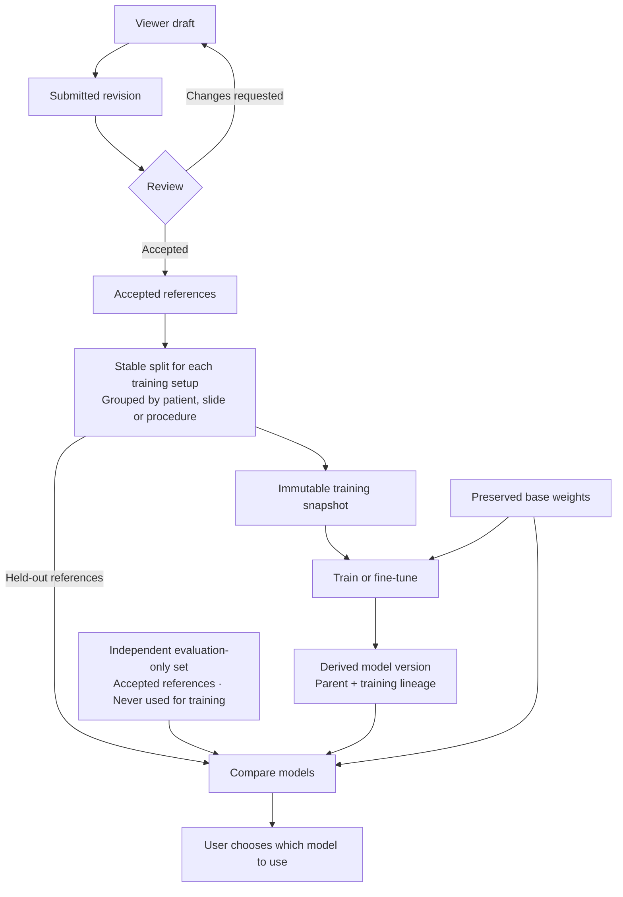
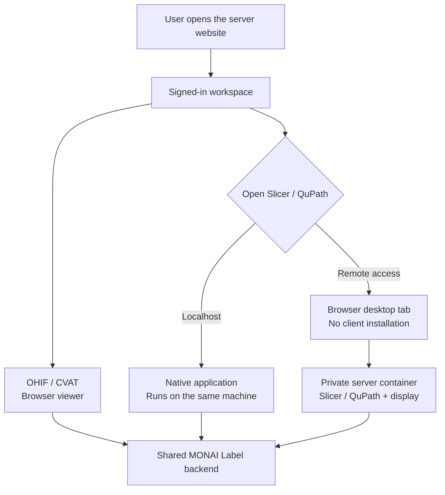

# MONAI Label 1.0 design

One workspace connects datasets, annotation viewers, models, reviews and learning. Every viewer uses the same backend, permissions and project data.

## MONAI Label from the user's perspective

The direction is **agentic annotation**: describe a task in ordinary language and let the assistant coordinate the tools and models needed to carry it out. You inspect editable results, make corrections and submit work for review. Accepted annotations provide the basis for learning faster, task-specific models; the workflow and specialty limits below describe what is available today.

For example, “Segment the tool and track it for 16 frames” gives the CVAT assistant the target, action and duration. Nemotron combines those words with the active video and frame, then calls the backend's typed tools. An annotation model such as GPT Astra produces the initial mask; SAM2 carries it across frames. CVAT shows editable polygons, while the shared workspace keeps the submitted revision and review decision.

The same workspace supports prompts such as “Segment the spleen in the whole volume” in OHIF or “Segment nuclei in the selected region” in QuPath. Models run behind the server; remote users need only a browser to open the workspace and viewers. Voice input is available in supported browser interfaces, with HTTPS and microphone permission for remote access. Physical iPad compatibility has not yet been validated.

## The building blocks

Requests enter through the top layers. Domain services enforce the rules, use model runtimes when needed and read/write storage directly. The assistant and UI buttons call the same services. Typed tools turn chat into validated actions; background jobs handle longer work.

| Block | Code |
| --- | --- |
| Domain records, geometry and interfaces | `core` |
| API, services, jobs, storage and web workspace | `server` |
| Hosted annotation and conversation adapters | `providers` |
| Local inference and training | `monai`, `sam` |
| DICOM import and conversion | `dicom` |
| Viewer provisioning and native adapters | `viewers` |
| HTTP client and command line | `client` |

Core contracts are independent of HTTP, storage and model vendors. Providers and clients do not import server code. [Package boundaries →](implementation.md)

## What each model does

| Role | Current choices | Responsibility |
| --- | --- | --- |
| Conversation coordinator | Local Nemotron 3.5 Lightning by default; experimental Nano 9B/4B; configurable conversation endpoint | Interprets language, resolves names and viewer context, calls typed tools and explains results. It does not replace the annotation model or bypass backend validation. |
| Hosted image annotation | GPT-6 Astra, Claude Opus 5, Gemini 3.5 Flash and compatible named imports | Inspects image pixels to locate targets or produce segmentation polygons. Capabilities depend on the model adapter. These models can annotate a video frame; they do not perform temporal tracking. |
| Local image annotation | VISTA3D, SAM 2.1, MedSAM2, U-Net and baselines | Runs supported segmentation tasks. VISTA3D is preferred for supported radiology targets; SAM-family image annotation uses spatial prompts. |
| Temporal tracking | SAM 2.1 | Carries an initial box or mask across a selected frame range or whole clip, producing editable boxes or polygons and retaining original masks. |
| Learning | VISTA3D, U-Net and baseline training recipes | Trains or fine-tunes from accepted annotations and publishes derived versions. Conversation and hosted annotation models are not automatically fine-tuned. |

The coordinator endpoint and annotation endpoint are separate. A request can use local Nemotron for chat, NVIDIA-hosted Astra for the first-frame segmentation and local SAM2 for tracking. Changing the annotation provider does not change the conversation model.

Astra is the automatic hosted annotation choice for pathology and video when available. Explicit model names and compatible project defaults take precedence. Predefined hosted models resolve available connections at startup, preferring NVIDIA over the corresponding direct provider. Users can switch a preset's provider later; imported models keep their provider and project-specific name. Missing capabilities or credentials produce an actionable error rather than an undisclosed provider switch. [Conversation setup →](coordinator.md) · [Model connections →](providers.md)

## Feature inventory

These are the current capabilities. **Show** marks the central demo actions; **Tour** marks shorter supporting views. Scope and provider limits remain in the linked guides.

| Area | Implemented features | Demo priority |
| --- | --- | --- |
| Workspace | Persistent projects, instructions and multiple structures; overview, datasets, models, reviews and activity; search, filtering, pagination and persistent selections; automatic refresh that preserves forms and drafts | Show |
| Accounts and permissions | Administrator setup and sign-in; project membership with manager, annotator and reviewer roles; authenticated browser, API and viewer access | Tour |
| Assistant | Shared workspace/viewer chat; local or hosted coordinator; bundled workflow skills, contextual typed tools, named models and targets; job receipts and cancellation; optional microphone and spoken replies where supported | Show |
| File import | Images alone or with labels; filename pairing, label mapping, geometry validation, patient/slide grouping, provenance and duplicate protection; partial-import reporting | Tour |
| Sample datasets | Medical Decathlon tasks, TotalSegmentator CT, a bounded OpenSlide region and the HyperKvasir tool-tracking clip; cached downloads and annotation/evaluation import choices | Show |
| DICOM | Authenticated DICOMweb query/import, source-instance retention and project-scoped viewing; cached NIfTI-to-DICOM viewing conversion with original-grid annotations | Tour |
| Radiology | Slicer and OHIF; multi-structure segmentation, full volume or current source slice, explicit whole-volume iteration with slice-only models, localization/ROIs and native corrections | Show |
| Pathology | QuPath; selected-region or tiled image segmentation, editable nuclei masks and native object classification proposals | Show |
| Endoscopy | Managed CVAT; locate a tool as a box or segment it as a polygon; annotate one frame, track N frames or the whole clip; SAM2 propagation, editable tracks, original-mask download and source-frame provenance | Show |
| Interactive editing | Viewer-native edits; supported chat clear, undo/redo and structure-color changes; SAM boxes and positive/negative points; preservation of other structures and outside-scope edits | Show |
| Annotation lifecycle | Saved annotations reopen in viewers; separate editable drafts, proposals and immutable submissions; geometry, revision and local-draft checks; mask import/export and annotation revision history | Show |
| Batch annotation and selection | Ordered batch annotation with submission for review, per-case progress and failures; skips protected/evaluation cases; model-based case ranking for the next annotation batch | Show |
| Reviews | Pending, Good and Needs changes; individual or batch decisions; reviewer viewer sessions, comments and corrected acceptance; independent pathology-region and video-range review | Show |
| Local model library | VISTA3D, SAM2 and MedSAM2 presets; trainable 2D/3D U-Net from accepted volumes, regions or video polygons; project and per-target defaults; derived versions and lineage | Show |
| Hosted discovery and import | API-key discovery for NVIDIA, OpenAI, Anthropic and Gemini; compatible image/structured-output filtering; named project imports; NVIDIA's two newest family versions with hosting routes preserved | Show |
| Hosted presets | Fixed Astra, Claude and Gemini identities; NVIDIA-first startup resolution with direct-provider alternatives; visible provider/route, runtime switching and persistent manual overrides | Show |
| Credentials and custom connections | Environment references or encrypted project keys; saved-key rotation; manual HTTP-mask, deployed Hugging Face and compatible vision API connections; no credentials in chat or model metadata | Tour |
| Training | Scratch, continue and fine-tune where the recipe supports them; selected structures and image filters; optional run settings; immutable base weights and separately published derived versions | Show |
| Data separation | Shared ordinary datasets; stable patient/slide-grouped split per training setup; fixed independent evaluation-only reservations; immutable source/annotation snapshots and known-overlap rejection | Show |
| Evaluation | Versioned accepted references; model comparison on the same references; per-structure Dice/IoU and mean Dice; named evaluation sets with rename/archive/restore; retry scoring after training; explicit model promotion and rollback | Show |
| Jobs and reports | Background progress, cancellation, restart interruption handling, activity logs and event streaming; training/evaluation reports, JSON export and full-log download | Tour |
| Browser access | Native Slicer/QuPath on localhost; isolated server-hosted desktops for remote browsers; adaptive resolution, clipboard exchange and session cleanup; OHIF/CVAT remain browser viewers | Show |
| Operations | Managed tool/model caches, configurable workspace location, one-process workspace lock, dependency-aware deletion and unreferenced-artifact cleanup | Tour |
| Extension points | Typed domain/provider/trainer contracts, authenticated HTTP API/OpenAPI, Python client and CLI; synthetic demonstration and automated prompt/viewer workflows | Tour |

Streaming whole slides, durable cell-type learning, additional video trackers, temporal tracking evaluation, automatic draft recovery, DICOM SEG export, SSO and distributed workers are **planned**, not demonstrated as implemented. The complete remaining list is in the [roadmap](roadmap.md).

## From a prompt to an editable annotation

The conversation model interprets the request; the annotation model processes the image. VISTA3D is the default for supported radiology targets. GPT-6 Astra is the default hosted model for pathology and video. Explicit choices and compatible project defaults take precedence.

CVAT adds completed results to the draft automatically. Other viewer flows can ask the user to apply a proposal. Submission remains a separate action. Geometry and revision checks protect existing work.

## Review and learning

Datasets stay shared; each training setup owns its split. Snapshots freeze source and annotation revisions. Evaluation rejects known training overlap, and training never silently changes annotation defaults. Accepted image regions and video polygon ranges can train a local 2D U-Net; accepted volumes can train a 3D U-Net or fine-tune VISTA3D. Unreviewed region pixels are excluded from loss. Evaluation is optional: train on approved coverage alone, or reserve independent source groups with a requested ratio. A single slide/video cannot be its own held-out case. Temporal tracking evaluation remains planned.

## Where the viewers run

Browser desktops adapt to the client size and share its clipboard. Closing the last tab ends the desktop after a short refresh grace period. Annotation drafts must be submitted before ending the session. [Viewer behavior →](viewers.md)

These diagrams describe current behavior. See the [roadmap](roadmap.md) for planned work and [provider contracts](providers.md) for model integrations.
