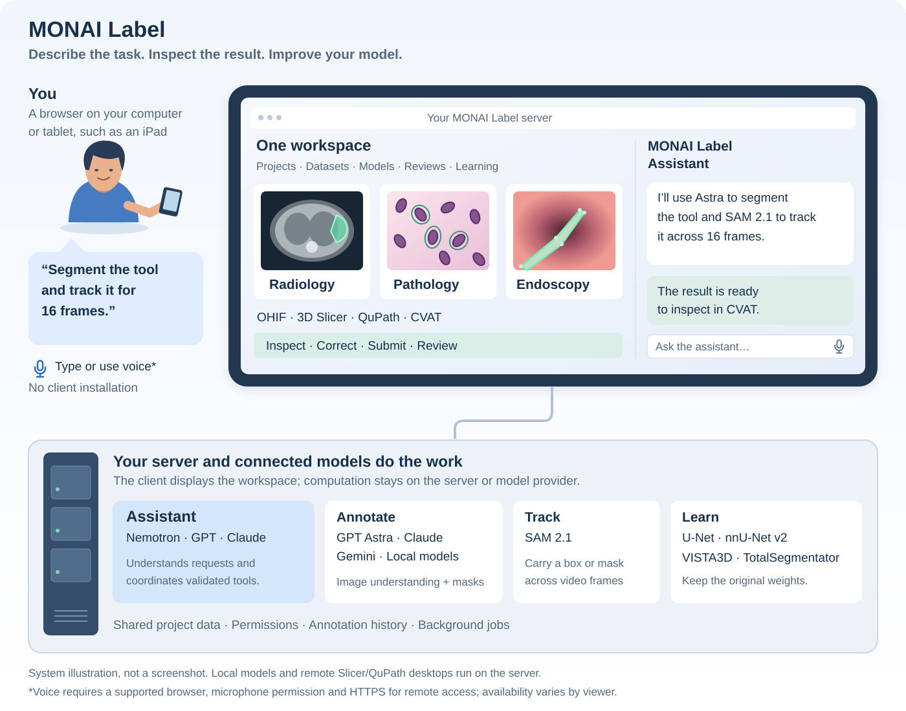
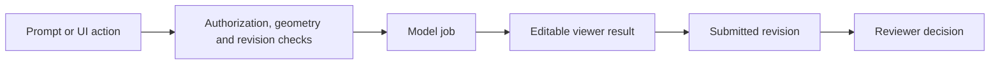
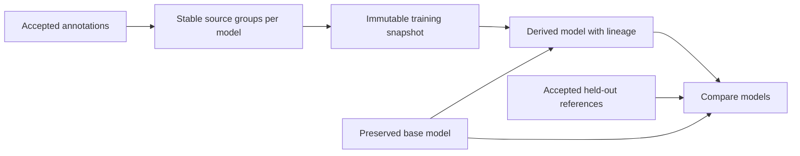

# Design

Projects share datasets, models, reviews and learning across the web workspace, Slicer, QuPath, OHIF and CVAT.

## Model roles

| Role | Models | Purpose |
| --- | --- | --- |
| Conversation | Nemotron, OpenAI GPT, Anthropic Claude or another configured endpoint | Interpret requests and call typed tools |
| Annotation | VISTA3D, TotalSegmentator CT/MRI, nnInteractive, SAM 2.1, MedSAM2, trained models and hosted vision | Produce masks, boxes or polygons |
| Video tracking | SAM 2.1 | Propagate a box or mask across frames |
| Training | U-Net, nnU-Net v2, VISTA3D and TotalSegmentator CT/MRI | Learn from accepted annotations and publish derived versions |

Conversation and annotation models are configured separately. Explicit annotation choices and compatible project defaults take precedence. New projects default to GPT-6 Astra when available. Named models override that default; local VISTA3D remains available for CT volumes.

## Annotation flow

```mermaid
flowchart LR
    Request[Prompt or UI action] --> Checks[Authorization, geometry and revision checks]
    Checks --> Job[Model job]
    Job --> Draft[Editable viewer result]
    Draft --> Submit[Submitted revision]
    Submit --> Review[Reviewer decision]
```

Users inspect and correct results before submission. New edits must not overwrite newer revisions or viewer drafts. CVAT applies completed proposals to its draft automatically; submission remains separate.

## Review and learning

```mermaid
flowchart LR
    Accepted[Accepted annotations] --> Split[Stable source groups per model]
    Split --> Train[Immutable training snapshot]
    Train --> Derived[Derived model with lineage]
    Base[Preserved base model] --> Derived
    HeldOut[Accepted held-out references] --> Compare[Compare models]
    Base --> Compare
    Derived --> Compare
```

Patient, slide and procedure groups stay together. Independent evaluation-only sets are excluded from all training. Evaluation rejects known training overlap. Training can run without evaluation and does not automatically change the annotation default.

## Viewer deployment

OHIF and CVAT run in the browser. Slicer and QuPath open natively for localhost access and in private server-hosted browser desktops for remote access. Submit or save drafts before ending a desktop session.

See [package boundaries](implementation.md), [user workflows](workflows.md), [viewer setup](viewers.md) and [planned work](roadmap.md).
