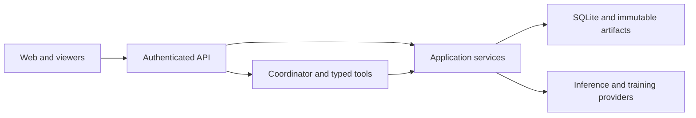

# Architecture

## Packages

| Package | Responsibility |
| --- | --- |
| `core` | Typed domain records, geometry and provider/trainer interfaces |
| `providers` | Local baselines, remote annotation and conversation adapters |
| `monai` | U-Net and VISTA3D runtimes |
| `sam` | SAM 2.1 and MedSAM2 inference |
| `dicom` | DICOMweb import, decoding and NIfTI viewing conversion |
| `viewers` | Provisioning and Slicer, QuPath, OHIF and CVAT adapters |
| `server` | Services, SQLite/artifacts, jobs, authentication, API and web console |
| `client` | Public HTTP client, CLI and synthetic demo |

Core has no HTTP, persistence or vendor dependencies. Providers and clients do not import server code. The server includes the MONAI and SAM runtimes as dependencies. These separate packages implement the interfaces in `core/ports.py`; model loading happens when a job needs it.

Within the server, `desktops/`, `dicom/` and `video/` group their routes and workflow services. Persistent desktop/CVAT identities live in feature-local `models.py` modules so other services can refer to them without importing runtime orchestration. `assistant_tools/` adapts typed chat actions to the same services. Keep Docker provisioning in `viewers` and DICOM decoding in the separate `dicom` package; feature routes handle authentication and transport, while services own lifecycle and revision rules.

Python imports use the `monailabel` namespace, such as `monailabel.core` and `monailabel.server`. Each distribution contributes its own subpackage without a shared `monailabel/__init__.py`. Installable names remain `monailabel-core`, `monailabel-server`, etc.; CLI commands remain `monailabel` and `monailabel-server`.

## Data and learning

- Images use feature-last arrays: `H×W×C` or `I×J×K×1`. Masks use integer project class IDs on the source grid. Binary masks are uint8 in C-order.
- Proposals record geometry, model and base revision. Applying or submitting checks that revision; viewers also protect intervening local edits.
- Submission and reviewer acceptance are separate. Corrected acceptance saves a new annotation revision and its decision atomically.
- Shared data stays available to each model's persistent patient-group split. Every training run freezes image/mask revisions. Evaluation-only reservations exclude cases from all training. See [split rules](workflows.md#train-a-model).
- Validation requires accepted references and rejects known training lineage and duplicates. Promotion is a separate, per-class decision; training never switches annotation defaults automatically.

Source-plane inference applies lossless orientation changes and restores the source layout afterwards. A slice updates only its requested plane. Selected pathology regions run as one crop; whole-image inference can use tiles. Failed or cancelled multi-part inference publishes no partial proposal.

Video clips use separate `VideoAsset` and `TrackAnnotation` records. Original source files and presentation timestamps are immutable; rectangle and polygon tracks refer to zero-based source frames and source pixel edge coordinates. CVAT transport/conversion lives in `viewers/cvat.py`; server editor bindings retain label/track mappings and the base revision. Reopening resumes saved drafts, review uses a separate task, and submission publishes the track revision and consumed editor receipt atomically. A managed, workspace-specific CVAT runtime serves the native editor through authenticated project-scoped routes. Vision providers implement the independent `ToolDetector` port for localization; compatible 2D `Segmenter` providers produce masks from the chosen annotation model. Single-frame requests skip temporal tracking. SAM 2.1 implements the independent `VideoTracker` port with bounded overlapping chunks, returning box/polygon keyframes, lossless source masks and contour warnings. Proposals retain these masks separately from editable polygon approximations, record model provenance and require unchanged native drafts and submitted revisions before application. Video is excluded from image learning; evaluation-only procedure groups also exclude related images from training. See [video annotation](video.md).

## Services and storage

One server process owns a workspace lock. SQLite transactions publish related records atomically; immutable arrays, files and checkpoints are content-addressed. Two background workers run jobs with cooperative cancellation. Restart records interrupted work instead of silently replaying it. Idempotency keys only reuse matching project, operation and payload.

The workspace defaults to `workspace/`, including `.cache/` for downloads and managed runtimes. Credentials are encrypted separately; back up `secrets.key` with the database. Passwords use salted scrypt and session tokens are stored as hashes.

Deletion checks active jobs and saved training/reference dependencies. Project removal affects that project's records; shared caches and external sources remain. Unreferenced artifacts are collected at startup before workers begin.

## API and clients

Run the server for interactive **/docs** and **/openapi.json**. Browser cookies and bearer tokens share the same project authorization. Buttons and chat tools invoke the same services; the coordinator has no arbitrary shell/code execution tool. Trusted assistant guidance is packaged under `server/resources/assistant/`.

The web console uses small JavaScript modules without a frontend build. Section URLs, browser history and the selected project survive navigation. Committed project changes trigger polling refreshes while preserving active forms and drafts.

Desktop viewers use private session files. Loopback workspace access launches native Slicer/QuPath; remote access prepares account-owned Docker desktops with noVNC. Provisioning and display processes live in `viewers`; ownership, credential renewal, session limits and the authenticated WebSocket-to-Unix-socket relay live in `server`. Closing the last viewer tab ends the native process after a short grace period that permits refreshes. A network disconnect without a tab-close notification preserves the draft. OHIF uses authenticated browser sessions and workspace DICOMweb routes. Viewer adapters own native geometry and editing; model execution stays behind backend providers. See [viewer setup](viewers.md) and [provider contracts](providers.md).

Run the [development checks](../AGENTS.md#development) and relevant viewer checks in disposable workspaces. Synthetic fixtures demonstrate software behavior, not clinical quality. [Remaining work](roadmap.md) is separate from these contracts.
