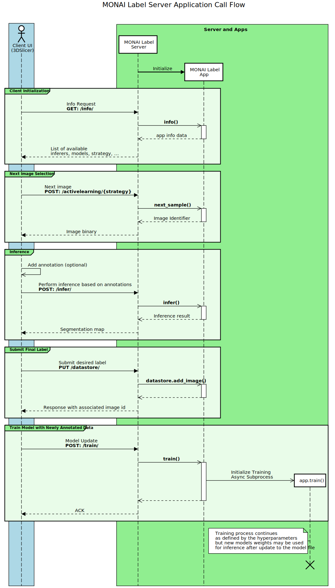

.. comment
    Copyright (c) MONAI Consortium
    Licensed under the Apache License, Version 2.0 (the "License");
    you may not use this file except in compliance with the License.
    You may obtain a copy of the License at
        http://www.apache.org/licenses/LICENSE-2.0
    Unless required by applicable law or agreed to in writing, software
    distributed under the License is distributed on an "AS IS" BASIS,
    WITHOUT WARRANTIES OR CONDITIONS OF ANY KIND, either express or implied.
    See the License for the specific language governing permissions and
    limitations under the License.

======================
Application Deployment
======================

MONAI Label user apps are readily deployable on the MONAI Label Server. Simply, MONAI Label Server
opens a number of HTTP connection endpoints that define *what actions* clients can take, and in turn
the server relays the action to the MONAI Label application which defines *how the actions are taken*.

Deploying an Application
========================

The MONAI Label Server endpoints are available at startup. The user may download and start a sample app

.. code-block:: bash

  # download a sample app
  monailabel apps --name radiology --download --output .

  # start the sample app locally
  monailabel start_server --app radiology --studies <path/to/datastore> --conf models (deepedit|deepgrow|segmentation|segmentation_speen|all)

and navigate to `http://127.0.0.1:8000/ <http://127.0.0.1:8000/>`_ on the browser (if the server
is running on the local machine). The user may choose to use the web UI to invoke the various endpoints
for the purpose of integration testing their labeling app.

The ``--studies`` argument may point to an empty folder or a folder with images in a flat structure.
If the datastore is empty the user is required to first upload an image (e.g. via 3DSlicer client or
web UI), however, if the datastore is populated the user may select the "next image" to annotate
based on the image selection strategy defined in the labeling app.

Application Call-flow
=====================

Figure 1 shows a typical call-flow between the client (e.g. 3DSlicer),
the MONAI Label Server, and the deployed MONAI Label application.

  **Figure 1:** MONAI Label Server relays endpoint requests to the MONAI Label App
  via the implemented methods in the API.
