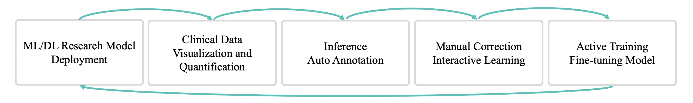

===========
MONAI Label
===========

*The Leading Open Platform for Medical Data Labeling with AI*

MONAI Label is an intelligent open source image labeling and learning tool that enables
users to create annotated datasets and build AI annotation models for clinical evaluation.
MONAI Label enables application developers to build labeling apps in a *serverless* way,
where custom labeling apps are exposed as a service through the MONAI Label Server.

**Sample Apps in MONAILabel**

Example developed labeling apps for use. Learn more apps and MONAILabel use cases here. 

*Deploy Labeling and Medical AI Faster*

The end-to-end ecosystem from research stage to easy model deployment. Combining clinical 
imaging data visualizations, curations with the model inference. After labeling automatically, 
the visualization tools provide flexibility for label correction. The active learning modules 
can learn the new labels online to fine tune the current AI models. The fine-tuned model can be 
improved and used for next batch of labeling task.

**Features and Highlights**

MONAI Label reduces the time and effort of annotating new datasets and enables the adaptation
of AI to the task at hand by continuously learning from user interactions and data. MONAI Label
allows researchers and developers to make continuous improvements to their apps by allowing them
to interact with their apps at the user would. End-users (clinicians, technologists, and annotators
in general) benefit from AI continuously learning and becoming better at understanding what the
end-user is trying to annotate.

MONAI Label aims to fill the gap between developers creating new annotation applications, and
the end users which want to benefit from these innovations.

-----------------
Table of Contents
-----------------

.. toctree::
   :maxdepth: 1

   whatsnew
   installation
   quickstart
   modules
   appdeployment
   apis

------------
Contributing
------------

For guidance on making a contribution to MONAI, see the `contributing guidelines
<https://github.com/Project-MONAI/MONAILabel/blob/main/CONTRIBUTING.md>`_.

-----
Links
-----

- Website: https://monai.io/
- API documentation: https://docs.monai.io/projects/label
- Code: https://github.com/Project-MONAI/MONAILabel
- Project tracker: https://github.com/Project-MONAI/MONAILabel/projects
- Issue tracker: https://github.com/Project-MONAI/MONAILabel/issues
- Changelog: https://github.com/Project-MONAI/MONAILabel/blob/master/CHANGELOG.md
- Wiki: https://github.com/Project-MONAI/MONAILabel/wiki
- Test status: https://github.com/Project-MONAI/MONAILabel/actions
- PyPI package: https://pypi.org/project/monailabel/
- Weekly previews: https://pypi.org/project/monailabel-weekly/

------------------
Indices and tables
------------------

* :ref:`genindex`
* :ref:`modindex`
* :ref:`search`
