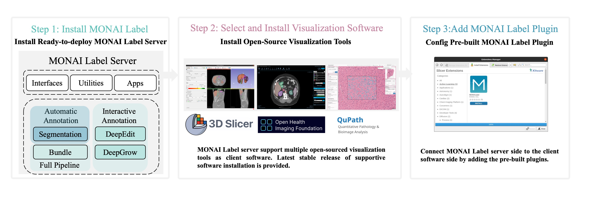

.. comment
    Copyright (c) MONAI Consortium
    Licensed under the Apache License, Version 2.0 (the "License");
    you may not use this file except in compliance with the License.
    You may obtain a copy of the License at
        http://www.apache.org/licenses/LICENSE-2.0
    Unless required by applicable law or agreed to in writing, software
    distributed under the License is distributed on an "AS IS" BASIS,
    WITHOUT WARRANTIES OR CONDITIONS OF ANY KIND, either express or implied.
    See the License for the specific language governing permissions and
    limitations under the License.

========================
Installation
========================

Start using MONAI Label locally and run installlation with your familiar visualization tools. Stable version software represents the currently tested
and supported visualization tools with latest release of MONAI Label.

Current Milestone Release of MONAI Label:

* `Latest MONAI Label <https://pypi.org/project/monailabel/>`_

MONAI Label Supported Stable Visualization Tools:

* 3D Slicer: `Stable and Preview Version >= 5.0 <https://download.slicer.org/>`_

* MITK: `Version >= 2024.06.2 <https://www.mitk.org/wiki/Downloads>`_

* OHIF: `Version >= 3.1 <https://ohif.org/>`_

* QuPath: `Version >= 0.3.2 <https://qupath.github.io/>`_

Start using MONAI Label with just three steps!

--------------- `Install MONAI Label`_  -------------------- `Guide of Visualization Tools`_ ------------------------ `Add Plugins`_ -----------------

Install MONAI Label
===========================================
.. _Monailabel:

Prerequisites
--------------------------
MONAI Label supports both **Ubuntu** and **Windows** OS with GPU/CUDA enabled.

Make sure you have python 3.9/3.10 version environment with PyTorch and CUDA installed. MONAI Label features on other python version are not verified.

- Install `Python <https://www.python.org/downloads/>`_
- Install the following Python libraries

.. code-block::

    python -m pip install --upgrade pip setuptools wheel

    # Install latest stable version for pytorch
    pip install torch torchvision torchaudio --extra-index-url https://download.pytorch.org/whl/cu113

    # Check if cuda enabled
    python -c "import torch; print(torch.cuda.is_available())"

On **Ubuntu** only, `python3-dev`, which contains the header files for the Python C API, is not bundled with Python and needs to be installed separately.

.. code-block::

    sudo apt install python3-dev

Install From PyPI
------------------------

Milestone release
*********************

To install the `current milestone release <https://pypi.org/project/monailabel/>`_:
::

    pip install monailabel

The milestone versions are currently planned and released every few months.  As the
codebase is under active development, you may want to install MONAI from GitHub
for the latest features

From GitHub
*********************
To install latest from github main branch
::

    pip install git+https://github.com/Project-MONAI/MONAILabel#egg=monailabel

.. note::

    If you have installed the
    PyPI release version using ``pip install monailabel``, please run ``pip uninstall
    monailabel`` before using the commands from this section. Because ``pip`` by
    default prefers the milestone release.

    This will not build/include OHIF by default.
    To include OHIF as part of this setup/build, make sure `YARN <https://classic.yarnpkg.com/lang/en/docs/install/#windows-stable/>`_ is installed and `export OHIF_BUILD=true` before running the above command.

From DockerHub
********************
To install latest from `DockerHub <https://hub.docker.com/r/projectmonai/monailabel>`_:
::

    docker run -it --rm --gpus all --ipc=host --net=host -v ~:/workspace/ projectmonai/monailabel:latest bash

MONAI Label CLI
-----------------------
Simple *monailabel* command will help user to download sample apps, datasets and run server.
::

    monailabel --help

Downloading Sample Apps or Datasets
***********************************
You can download sample apps and datasets from *monailabel* CLI.

.. code-block::

  # Download Sample Apps
  monailabel apps # List sample apps
  monailabel apps --download --name radiology --output apps

  # Download MSD Datasets
  monailabel datasets # List sample datasets
  monailabel datasets --download --name Task09_Spleen --output datasets

Starting Server
**********************
You can start server using *monailabel* CLI
::

  # Run Deepedit Model.
  # Options can be (deepedit|deepgrow|segmentation|segmentation_spleen|all) in case of radiology app.
  # You can also pass comma separated models like --conf models deepedit,segmentation

  monailabel start_server --app apps/radiology --studies datasets/Task09_Spleen/imagesTr --conf models deepedit

.. note::

    Once you start the MONAI Label Server, by default it will be up and serving at http://127.0.0.1:8000/. Open the serving
    URL in browser. It will provide you the list of Rest APIs available.

Deployment
----------------------------
MONAI Label Server uses `Uvicorn <https://www.uvicorn.org/>`_ which is a lightning-fast ASGI server implementation.
However user can deploy the application in any server that supports `ASGI specification <https://asgi.readthedocs.io/en/latest/>`_

There are `multiple choices <https://www.uvicorn.org/deployment/>`_ available for Uvicorn to run as Development Server vs Standalone Server vs Production.

Deploying MONAI Label server for production use is out of project scope.

Run MONAI Label server in ssl mode:
***********************************
You can run MONAILabel server in https mode.
.. code-block::

  # Create self-signed ssl cert
  openssl req -x509 -nodes -days 365 -newkey rsa:2048 -keyout uvicorn-selfsigned.key -out uvicorn-selfsigned.crt

  # Start server in ssl mode
  monailabel start_server --app apps/radiology --studies datasets/Task09_Spleen/imagesTr --conf models deepedit --ssl_keyfile uvicorn-selfsigned.key --ssl_certfile uvicorn-selfsigned.crt

However for basic production deployment, you might need to run Uvicorn independently.  In such cases, you can following these simple steps.

::

  # dryrun the MONAI Label CLI for pre-init and dump the env variables to .env or env.bat
  monailabel start_server --app apps/radiology --studies datasets/Task09_Spleen/imagesTr --host 0.0.0.0 --port 8000 --dryrun

  # Linux/Ubuntu
  source .env
  uvicorn monailabel.app:app \
    --host 0.0.0.0 \
    --port 8000 \
    --log-config apps/radiology/logs/logging.json \
    --no-access-log

  # Windows
  call env.bat
  uvicorn monailabel.app:app ^
    --host 0.0.0.0 ^
    --port 8000 ^
    --log-config apps\radiology\logs\logging.json ^
    --no-access-log

For more options about Uvicorn (concurrency, SSL etc..) refer: https://www.uvicorn.org/#command-line-options

.. _Visualization Tools:

Guide of Visualization Tools
================================

MONAI Label supports the most adopted open-source viewers for Radiology and Pathology

3D Slicer
-------------------------

3D Slicer, a free and open-source platform for analyzing, visualizing and understanding medical image data. In MONAI Label, 3D Slicer is most tested with radiology studies and
algorithms, develpoment and integration.

MONAI Label is most currently tested and supported with stable release of 3D Slicer every version. Preview version of 3D Slicer is not fully tested and supported.

To install stable released version of 3D Slicer, see `3D Slicer installation <https://download.slicer.org/>`_.

Currently, Windows and Linux version are supported.

MITK
-----------------------

The Medical imaging Interaction ToolKit (MITK) is an open source, standalone, medical imaging platform. MONAI Label is partially integrated to MITK Workbench,
a powerful and free application to view, process, and segment medical images. The MONAI Label tool in MITK is mostly tested for inferencing using radiology and bundle apps
allowing for Auto and Click-based interactive models.

To install MITK, see `MITK download <https://www.mitk.org/wiki/Downloads>`_.

OHIF (Web-based)
-----------------------

The Open Health Imaging Foundation (OHIF) Viewer is an open source, web-based, medical imaging platform.
It aims to provide a core framework for building complex imaging applications.

At this point OHIF can be used to annotate the data in the DICOM server via the MONAI Label server.

To use OHIF web-based application, refer to `extensible web imaging platform <https://ohif.org/>`_

QuPath
-----------------------
Quantitative Pathology & Bioimage Analysis (QuPath)

QuPath is an open, powerful, flexible, extensible software platform for bioimage analysis.

To install stable released version of QuPath, see `QuPath installation <https://qupath.github.io/>`_.

Currently, Windows and Linux version are supported. Detailed documentation can be found `QuPath Doc <https://qupath.readthedocs.io/en/stable/>`_

Add Plugins
========================

3D Slicer Plugin
------------------------

.. note::

    To avoid accidentally using an older Slicer version, you may want to *uninstall* any previously installed 3D Slicer package.

Install 3DSlicer Preview Version with in-built MONAI Label plugin

- Download and Install `3D Slicer <https://download.slicer.org/>`_ version 5.0 or later.
- Start 3DSlicer
- On the menu bar navigate **View** -> **Extension Manager** -> **Active Learning** -> **MONAI Label**

  .. image:: ../images/quickstart/3dslicer-extensions-manager.png
    :alt: 3DSlicer Extensions Manager
    :width: 600

- Install MONAI Label plugin (click "Install")
- Restart 3D Slicer (click "Restart" in the same dialog box)

To add the MONAI Label icon shortcut on the 3DSlicer toolbar

- Navigate **Edit** -> **Application Settings**
- Under the **Modules** panel drag **MONAI Label** into **Favorite Modules**

  .. image:: ../images/quickstart/monai-label-plugin-favorite-modules-1.png
    :alt: MONAI Label Favorite Module
    :width: 600

- Restart 3DSlicer
- Look for the MONAI Label module icon |MLIcon| in the 3DSlicer toolbar

.. |MLIcon| image:: ../images/quickstart/MONAILabel.png
  :width: 20

Refer `3D Slicer plugin <https://github.com/Project-MONAI/MONAILabel/tree/main/plugins/slicer>`_ for other options to install and run MONAI Label plugin in 3D Slicer.

MITK Plugin
----------------------
MITK comes pre-built with the MONAI Label plugin. The tool interface can be found in both MITK's Segmentation View > 2D tools and also in Segmentation View > 3D tools.
As the the name suggests, the hosted MONAI Label app's 2D models are featured in 2D tools and vice versa. Refer `MITK Documentation <https://github.com/Project-MONAI/MONAILabel/tree/main/plugins/mitk>`_
to know more using MONAI Label in MITK.

OHIF Plugin
----------------------
MONAI Label comes with `pre-built plugin <https://github.com/Project-MONAI/MONAILabel/tree/main/plugins/ohif>`_ for `OHIF Viewer <https://github.com/OHIF/Viewers>`_.  To use OHIF Viewer, you need to provide DICOMWeb instead of FileSystem as *studies* when you start the server.

::

  monailabel start_server --app apps/radiology --studies http://127.0.0.1:8042/dicom-web --conf models deepedit

If you have authentication set for dicom-web then you can pass the credentials using environment `variables <https://github.com/Project-MONAI/MONAILabel/blob/main/monailabel/config.py>`_ while running the server.

::

  export MONAI_LABEL_DICOMWEB_USERNAME=xyz
  export MONAI_LABEL_DICOMWEB_PASSWORD=abc
  monailabel start_server --app apps/radiology --studies http://127.0.0.1:8042/dicom-web --conf models deepedit

If you are using only OHIF, it is recommended to disable DICOM to NIFTI conversion for faster performance.

::

  export MONAI_LABEL_DICOMWEB_CONVERT_TO_NIFTI=false
  monailabel start_server --app apps/radiology --studies http://127.0.0.1:8042/dicom-web --conf models deepedit

.. note::

    Please install `Orthanc <https://www.orthanc-server.com/download.php>`_ before using OHIF Viewer.

    For Ubuntu 20.x, Orthanc can be installed as `apt-get install orthanc orthanc-dicomweb`.
    However, you have to **upgrade to latest version** by following steps mentioned `here <https://book.orthanc-server.com/users/debian-packages.html#replacing-the-package-from-the-service-by-the-lsb-binaries>`_

    You can use `PlastiMatch <https://plastimatch.org/plastimatch.html#plastimatch-convert>`_ to convert NIFTI to DICOM

    OHIF Viewer will be accessible at http://127.0.0.1:8000/ohif/

QuPath Plugin
-----------------------
For pathology usecase, you can install `QuPath <https://qupath.github.io/>`_ and basic monailabel extension in QuPath.
You can download sample whole slide images
from `https://portal.gdc.cancer.gov/repository <https://portal.gdc.cancer.gov/repository?filters=%7B%22op%22%3A%22and%22%2C%22content%22%3A%5B%7B%22op%22%3A%22in%22%2C%22content%22%3A%7B%22field%22%3A%22files.data_type%22%2C%22value%22%3A%5B%22Slide%20Image%22%5D%7D%7D%5D%7D>`_

::

  # start server using pathology over downloaded whole slide images
  monailabel start_server --app apps/pathology --studies wsi_images

Refer `QuPath Plugin <https://github.com/Project-MONAI/MONAILabel/tree/main/plugins/qupath>`_ for installing and running MONAILabel plugin in QuPath.

Digital Slide Archive (DSA)
---------------------------
If you have `DSA <https://digitalslidearchive.github.io/digital_slide_archive/>`_ setup running,  you can use the same for annotating Pathology images using MONAILabel.

::

  # start server using pathology connecting to DSA server
  monailabel start_server --app apps/pathology --studies http://0.0.0.0:8080/api/v1

Refer `DSA Plugin <https://github.com/Project-MONAI/MONAILabel/tree/main/plugins/dsa>`_ for running a sample pathology use-case in MONAILabel using DSA.
