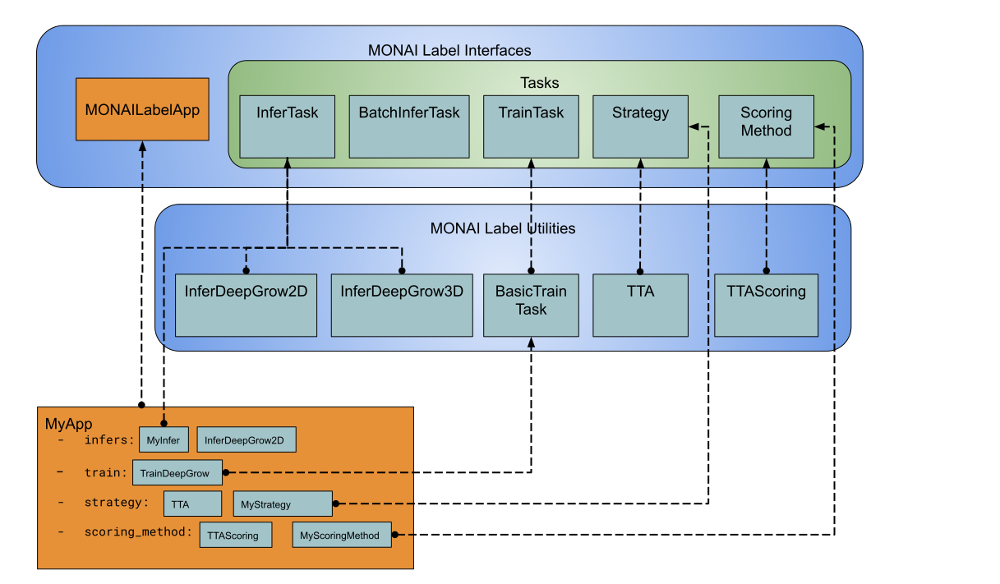

.. comment
    Copyright (c) MONAI Consortium
    Licensed under the Apache License, Version 2.0 (the "License");
    you may not use this file except in compliance with the License.
    You may obtain a copy of the License at
        http://www.apache.org/licenses/LICENSE-2.0
    Unless required by applicable law or agreed to in writing, software
    distributed under the License is distributed on an "AS IS" BASIS,
    WITHOUT WARRANTIES OR CONDITIONS OF ANY KIND, either express or implied.
    See the License for the specific language governing permissions and
    limitations under the License.

================
Modules Overview
================

MONAI Label aims to allow researchers to build labeling applications in a serverless way.
This means that MONAI Label applications are always ready-to-deploy via MONAI Label server.

To develop a new MONAI labeling app, developers must inherit the :py:class:`~monailabel.interfaces.MONAILabelApp` interface
and implement the methods in the interface that are relevant to their application. Typically a
labeling applications will consist of

- inferencing tasks to allow end-users to invoke select pre-trained models,
- training tasks used to allow end-users to train a set of models,
- strategies that allow the users to select the next image to label based on some criteria.

Figure 1 shows the base interfaces that a developer may use to implement their app
and the various tasks their app may perform. For example, in the figure the user app :py:class:`MyApp`
employs

- | two inferencing tasks, namely :py:class:`MyInfer` which is a custom implementation of :py:class:`~monailabel.interfaces.tasks.InferTask`,
  | and :py:class:`~monailabel.utils.infer.deepgrow_2d.InferDeepGrow2D` which is a ready-to-use utility included with MONAI Label,
- one training task, :py:class:`TrainDeepGrow` which is an extension of the :py:class:`~monailabel.utils.train.base_train.BasicTrainTask` utility,
- | and two next image selection strategies, :py:class:`~monailabel.interfaces.utils.activelearning.Random` included with MONAI Label which allow
  | the user to select the next image at random, and :py:class:`MyStrategy` which implements the interface
  | :py:class:`~monailabel.interfaces.Strategy` which the end user may select as a custom alternative for next image selection

  **Figure 1:** MONAI Label provides interfaces which can be implemented by the label app developer
  for custom functionality as well as utilities which are readily usable in the labeling app.

Quickstart with Template App
============================

MONAI Label currently provides three template applications which developers
may start using out of the box, or with few modifications to achieve the desired
behavior. Template applications currently available are

- `radiology <LINKREF_GITHUB_MONAILABEL/sample-apps/radiology>`_
- `pathology <LINKREF_GITHUB_MONAILABEL/sample-apps/pathology>`_

For a quickstart the developer may use

.. code-block:: bash

  monailabel apps --name <desired_app> --download --output myapp

where ``desired_app`` may be any of ``pathology``, ``radiology``.

To better understand template apps, the next few sections we will go into the details of implementing

- :ref:`Inference Task`
- :ref:`Training Task`
- :ref:`Image Selection Strategy`

and putting these to work together in a :ref:`MONAI Label App`.

.. _Inference Task:

Inference Task
==============

Inference tasks must implement the :py:class:`~monailabel.interfaces.InferTask` interface where one must specify a list of pre- and post-transforms
and an inferer model. The code snippet below is an example implementation of :py:class:`~monailabel.interfaces.InferTask` where the image is pre-processed
to a Numpy array, input into :py:class:`SimpleInferer`, and the result is post-processed by applying sigmoid activation with binary
discretization.

.. code-block:: python
  :emphasize-lines: 7, 9, 15, 18

  from monai.inferers import SimpleInferer
  from monai.transforms import (LoadImaged, ToNumpyd, Activationsd AsDiscreted, ToNumpyd)

  from monailabel.interfaces.tasks import InferTask

  class MyInfer(InferTask):

    def pre_transforms(self, data=None):
        return [
            LoadImaged(keys="image"),
            ToNumpyd(keys="image"),
        ]

    def inferer(self, data=None):
        return SimpleInferer()

    def post_transforms(self, data=None):
        return [
            Activationsd(keys="pred", sigmoid=True),
            AsDiscreted(keys="pred", threshold_values=True, logit_thresh=0.5),
            ToNumpyd(keys="pred"),
        ]

.. _Training Task:

Training Task
=============

Training tasks may extend the base class :py:class:`~monailabel.utils.train.basic_train.BasicTrainTask` which is an abstraction over supervised trainers and evaluators.
Here, the developer may override the functionality of the base training class with the desired behavior.

The code block below shows a sample implementation specifying the loss function, training pre- and post-transforms, and validation
pre-transforms and inference. There are many more aspects of :py:class:`~monailabel.utils.train.basic_train.BasicTrainTask` that the developer may choose to override, but
in this example they follow the default behavior in the base class.

.. code-block:: python
  :emphasize-lines: 6, 8, 11, 19, 25, 34

  from monai.inferers import SlidingWindowInferer
  from monai.transforms import *

  from monailabel.utils.train.basic_train import BasicTrainTask, Context

  class MyTrainTask(BasicTrainTask):

    def loss_function(self, context: Context):
        return DiceLoss(sigmoid=True, squared_pred=True)

    def train_pre_transforms(self, context: Context):
        return Compose([
            LoadImaged(keys=("image", "label")),
            AsChannelFirstd(keys=("image", "label")),
            SpatialCropForegroundd(keys=("image", "label"), source_key="label", spatial_size=(128, 128, 128)),
            NormalizeIntensityd(keys="image"),
        ])

    def train_post_transforms(self, context: Context):
        return Compose([
            Activationsd(keys="pred", sigmoid=True),
            AsDiscreted(keys="pred", threshold_values=True, logit_thresh=0.5),
        ])

    def val_pre_transforms(self, context: Context):
        return Compose([
            LoadImaged(keys=("image", "label")),
            AsChannelFirstd(keys=("image", "label")),
            ScaleIntensityRanged(keys="image", a_min=-57, a_max=164, b_min=0.0, b_max=1.0, clip=True),
            CropForegroundd(keys=("image", "label"), source_key="image"),
            ToTensord(keys=("image", "label")),
        ])

    def val_inferer(self):
        return SlidingWindowInferer(roi_size=(128, 128, 128))

.. _Image Selection Strategy:

Image Selection Strategy
========================

Selecting the next image to load in the end-users client may be of importance to some labeling
applications where the developer may want to allow the user to select one (of perhaps many)
strategies to select the next image to annotate as a means to efficiently annotate the datastore
by, for example, presenting the most representative image of an unlabeled subset of images.

To select the next image the user will have to implement at least selection :py:class:`Strategy` (if not using
one available with MONAI Label), which can be optionally supported by a :py:class:`ScoringMethod`. The rule of thumb is:

  - if the next image selection strategy is lightweight (e.g. choose an unlabeled image at random) and can be performed as the client waits
    for MONAI Label server, you do `NOT` need a scoring method;
  - if the next image selection strategy is computationally bound (e.g. all unlabeled images must be scored) then it is recommended that
    the user implement a :py:class:`ScoringMethod` that would ease the user's interaction with MONAI Label server.

The example code below shows a simple image selection strategy where :py:class:`SelectImageWithMyScore` returns
the unlabeled image which scores with the highest ``my_score`` it finds in the :py:class:`~monailabel.interfaces.Datastore`
based on the score generated by :py:class:`MyScoreGeneratorMethod`.

.. code-block:: python
  :emphasize-lines: 4, 6, 21, 32, 42

  from monailabel.interfaces import Datastore
  from monailabel.interfaces.tasks.scoring import ScoringMethod

  class MyScoreGeneratorMethod(ScoringMethod):

    def __call__(self, request, datastore: Datastore):
      result = {}

      scoring_model_timestamp = int(os.stat(self.scoring_model_path).st_mtime)
      scoring_model = torch.jit.load(self.scoring_model_path)

      if not scoring_model:
        return None

      scoring_model = scoring_model.to(self.device).eval()

      skipped = 0
      unlabeled_images = datastore.get_unlabeled_images()
      num_samples = request.get("num_samples", self.num_samples)

      for image_id in unlabeled_images:
          image_info = datastore.get_image_info(image_id)
          prev_timestamp = image_info.get("my_score_timestamp", 0)

          # if the timestamps match we dont' need to recompute score
          if prev_timestamp == scoring_model_timestamp:
            skipped += 1
            continue

          with torch.no_grad():
            data = {"image": datastore.get_image_uri(image_id)}
            my_score = scoring_model(data)

          if self.device == "cuda":
            torch.cuda.empty_cache()

          # add `my_score` in datastore to use later in `SelectImageWithMyScore`
          info = {
            "my_score": my_score,
            "my_score_timestamp": scoring_model_timestamp
          }
          datastore.update_image_info(image_id, info)
          result[image_id] = info

      return result

.. code-block:: python
  :emphasize-lines: 4, 6, 11

  from monailabel.interfaces import Datastore
  from monailabel.interfaces.tasks import Strategy

  class SelectImageWithMyScore(Strategy):

      def __call__(self, request, datastore: Datastore):
        images = datastore.get_unlabeled_images()
        if not len(images):
            return None

        my_scores = {image: datastore.get_image_info(image).get("my_score", 0) for image in images}

        # default to picking at random if `my_score` is not available
        if sum(my_scores.values()) == 0:
            image = random.choice(images)
            logger.info(f"Randomly selected Image '{image}'")
        else:
            my_max_score, image = max(zip(my_scores.values(), my_scores.keys()))
            logger.info(f"Selected image '{image}' using `my_score` ({my_score})")
        return image

.. _MONAI Label App:

Developing a MONAI Label App
============================

A MONAI Label app ties together inference, training, and image selection to provide the end-user with
a seamless simultaneous model training and annotation experience, where a segmentation model learns
how to segment the region of interest as the user annotates the data.

The labeling app in the example code below utilizes the tasks :py:class:`MyInfer`, :py:class:`MyTrain`,
:py:class:`SelectImageWithMyScore` and :py:class:`MyScoreGeneratorMethod` we have defined so far.
In the labeling app, the developer overrides

  - :py:meth:`init_infers` method to define their own set of inferers
  - :py:meth:`init_strategies` to define the next image selection strategies they want to make available to the end users
  - :py:meth:`init_scoring_methods` to define the scoring method that assists the selection strategy
  - :py:meth:`init_trainers` to define the training tasks that will update the various models required by the labeling app

.. code-block:: python
  :emphasize-lines: 5, 9, 14, 19, 26

  from monailabel.interfaces import MONAILabelApp

  import MyInfer, MyTrain, SelectImageWithMyScore, MyScoreGeneratorMethod

  class MyApp(MONAILabelApp):

    def init_infers(self):
      return {
        "segmentation_spleen": MyInfer(self.final_model, load_from_mmar(self.mmar, self.model_dir)),
      }

    def init_strategies(self):
      return {
        "my_score": SelectImageWithMyScore(),
      }

    def init_trainers(self) -> Dict[str, TrainTask]:
      return {
        "segmentation": MyTrainTask(
          self.model_dir, self.network, load_path=self.pretrained_model, publish_path=self.final_model
        )
      }

    def init_scoring_methods(self) -> Dict[str, ScoringMethod]:
      return = {
        "my_scoring_method": MyScoreGeneratorMethod(
          model="/path/to/scoring_model",
        )
      }
