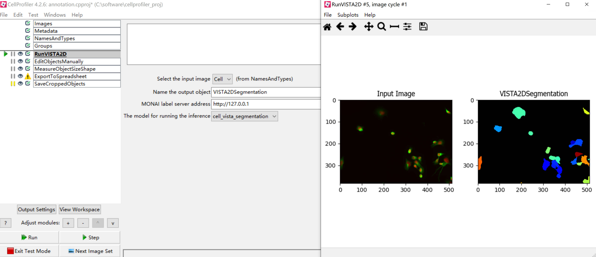
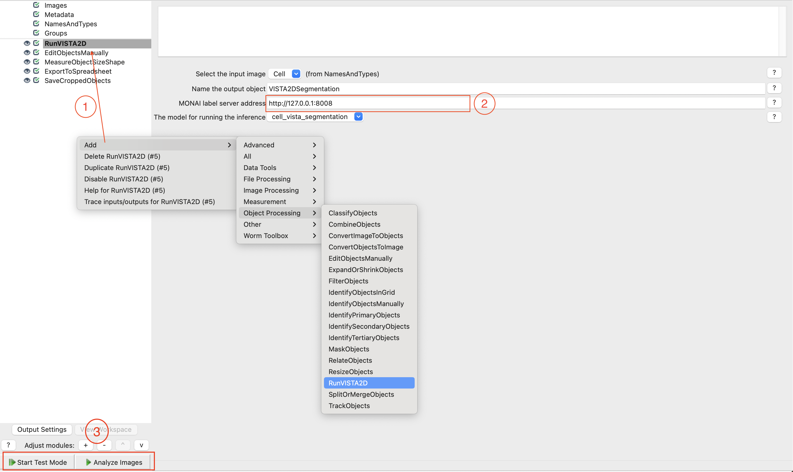

<!--
Copyright (c) MONAI Consortium
Licensed under the Apache License, Version 2.0 (the "License");
you may not use this file except in compliance with the License.
You may obtain a copy of the License at
    http://www.apache.org/licenses/LICENSE-2.0
Unless required by applicable law or agreed to in writing, software
distributed under the License is distributed on an "AS IS" BASIS,
WITHOUT WARRANTIES OR CONDITIONS OF ANY KIND, either express or implied.
See the License for the specific language governing permissions and
limitations under the License.
-->

# MONAI Label Plugin for CellProfiler
CellProfiler is a free open-source software designed to enable biologists without training in computer vision or programming to quantitatively measure phenotypes from thousands of images automatically.

CellProfiler is designed to serve biologists as well as bioimage analysts who want a flexible system that is easy to deploy to collaborators who lack computational skills. It is commonly used for small-scale experiments involving a few images but is also routinely run on millions of images using cluster or cloud computing resources at some of the largest pharmaceutical companies and academic screening centers in the world.

### Table of Contents
- [Supported Applications](#supported-applications)
- [Installing CellProfiler](#installing-cellprofiler)
- [Install MONAI Label Extension](#install-monai-label-extension)
- [Using the Plugin](#using-the-plugin)

### Supported Applications
Users can find supported applications in the [sample-apps](../../sample-apps/vista2d/) folder and use the vista2d bundle. Currently, only this bundle can be used to create and refine labels for medical imaging tasks in CellProfiler.

### Installing CellProfiler

To use MONAILabel with CellProfiler, you first need to install CellProfiler from source code following the installation part of [CellProfiler WiKi](https://github.com/CellProfiler/CellProfiler/wiki). Once you have CellProfiler installed, you can install the MONAILabel plugin as shown in the `Install MONAI Label Extension` part.

Please note these tips when installing the software:
1. After cloned the source code, you must switch to a specific version tag of the repo to start installation.
1. For Macbooks with Apple Silicon, please note [this issue](https://github.com/CellProfiler/CellProfiler/issues/4932) before you start to install.
1. Before actually running the command `pip install -e .`, you may need to install numpy if it doesn't exist in your environment.

### Install MONAI Label Extension
1. Save the runvista2d.py file to a local path.
1. Start CellProfiler from CLI, open the `File-->preferences` option and fill in the `CellProfiler plugin directory` parameter with your local path.

## Using the Plugin

1. Start the MONAI Label server with vista2d bundle.
1. Add the `RunVISTA2D` module to your pipeline for object processing.
1. Make sure the MONAILabel Server URL is correctly set in the plugin input.
1. Click the `Analyse Images` or `Start Test Mode` button to execute the pipeline.
1. Update masks and perform the sequential modules to get measurement results.

