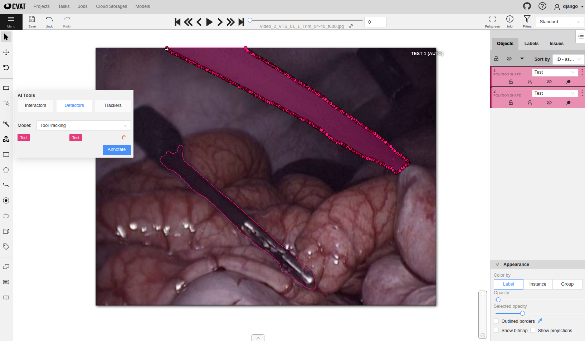
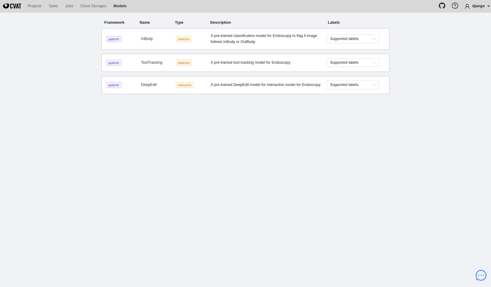

<!--
Copyright (c) MONAI Consortium
Licensed under the Apache License, Version 2.0 (the "License");
you may not use this file except in compliance with the License.
You may obtain a copy of the License at
    http://www.apache.org/licenses/LICENSE-2.0
Unless required by applicable law or agreed to in writing, software
distributed under the License is distributed on an "AS IS" BASIS,
WITHOUT WARRANTIES OR CONDITIONS OF ANY KIND, either express or implied.
See the License for the specific language governing permissions and
limitations under the License.
-->

# MONAI Label Extension for CVAT
CVAT is an interactive video and image annotation tool for computer vision. It provides a user-friendly interface for annotating images and videos, making it ideal for computer-assisted intervention applications. MONAI Label can deploy computer vision-related tasks with the CVAT viewer, such as endoscopy segmentation and tracking.



### Table of Contents
- [Supported Applications](#supported-applications)
- [Installing CVAT](#installing-cvat)
- [Publish Models to CVAT/Nuclio](#publish-latest-model-to-cvatnuclio)

### Supported Applications
Supported applications can be found in the [sample-apps](../../sample-apps/endoscopy/) folder under the endoscopy section. These applications include models like DeepEdit, Tooltracking, and InBody/OutBody classification, which can be used to create and refine labels for various medical imaging tasks.

### Installing CVAT
To install CVAT and enable Semi-Automatic and Automatic Annotation, follow these steps:

```bash
git clone https://github.com/opencv/cvat
cd cvat
git checkout v2.1.0 # MONAI Label requires tag v2.1.0

# Use your external IP instead of localhost to make the CVAT projects sharable
export CVAT_HOST=127.0.0.1
export CVAT_VERSION=v2.1.0

# Start CVAT from docker-compose, make sure the IP and port are available.
docker-compose -f docker-compose.yml -f components/serverless/docker-compose.serverless.yml up -d

# Create a CVAT superuser account
docker exec -it cvat bash -ic 'python3 ~/manage.py createsuperuser'

```
**Note:** The setup process uses ports 8070, 8080, and 8090. If alternative ports are preferred, please refer to the [CVAT Guide](https://opencv.github.io/cvat/docs/administration/basics/installation/). For more information on installation steps, see the CVAT [Documentation for Semi-automatic and Automatic Annotation](https://opencv.github.io/cvat/docs/administration/advanced/installation_automatic_annotation/).

After completing these steps, CVAT should be accessible via http://127.0.0.1:8080 in Chrome. Use the superuser account created during installation to log in.

#### Setup Nuclio Container Platform
```bash
# Get Nuclio dashboard
wget https://github.com/nuclio/nuclio/releases/download/1.5.16/nuctl-1.5.16-linux-amd64
chmod +x nuctl-1.5.16-linux-amd64
ln -sf $(pwd)/nuctl-1.5.16-linux-amd64 /usr/local/bin/nuctl
```

#### Deployment of Endoscopy Models
This step is to deploy MONAI Label plugin with endoscopic models using Nuclio tool.

```bash
git clone https://github.com/Project-MONAI/MONAILabel.git
# Deploy all endoscopy models
./plugins/cvat/deploy.sh endoscopy
# Or to deploy specific function and model, e.g., tooltracking
./plugins/cvat/deploy.sh endoscopy tooltracking
```

After model deployment, you can see the model names in the `Models` page of CVAT.



To check or monitor the status of deployed function containers, you can open the Nuclio platform at http://127.0.0.1:8070 (by default) and check whether the deployed models are running.


That's it! With these steps, you should have successfully installed CVAT with the MONAI Label extension and deployed endoscopic models using the Nuclio tool.

### Publish Latest Model to CVAT/Nuclio
Once you've fine-tuned the model and confirmed that it meets all the necessary conditions, you can push the updated model to the CVAT/Nuclio function container. This will allow you to use the latest version of the model in your workflows and applications.

```bash
workspace/endoscopy/update_cvat_model.sh <FUNCTION_NAME>

# Bundle Example: publish tool tracking bundle trained model (run this command on the node where cvat/nuclio containers are running)
workspace/endoscopy/update_cvat_model.sh tootracking
# Bundle Example: publish inbody trained model
workspace/endoscopy/update_cvat_model.sh inbody
# DeepEdit Example: publish deepedit trained model (Not from bundle)
workspace/endoscopy/update_cvat_model.sh deepedit
```
