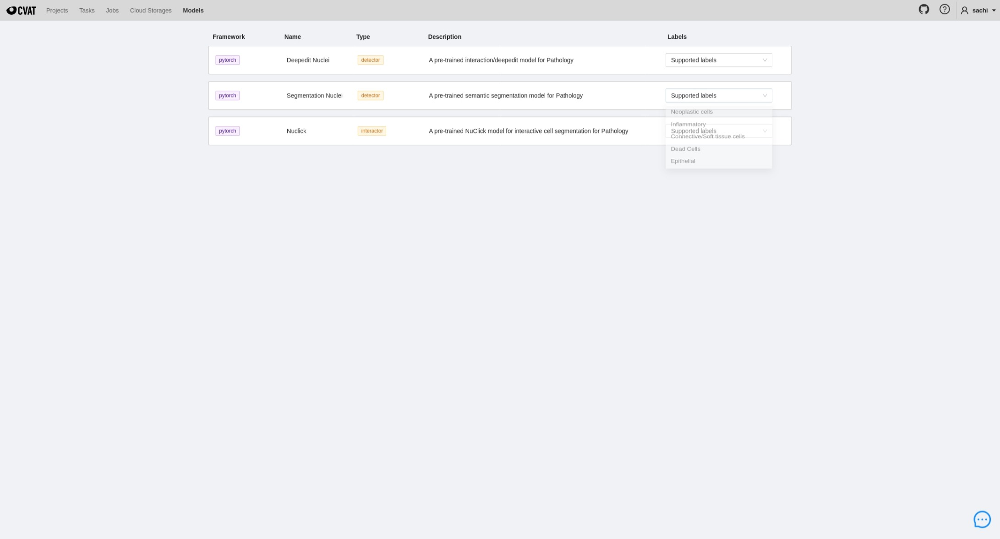
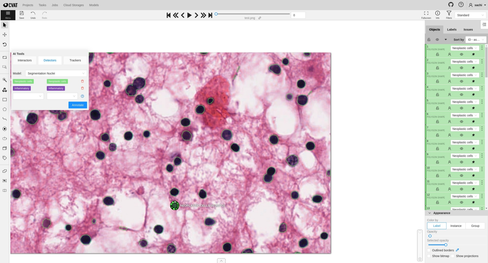
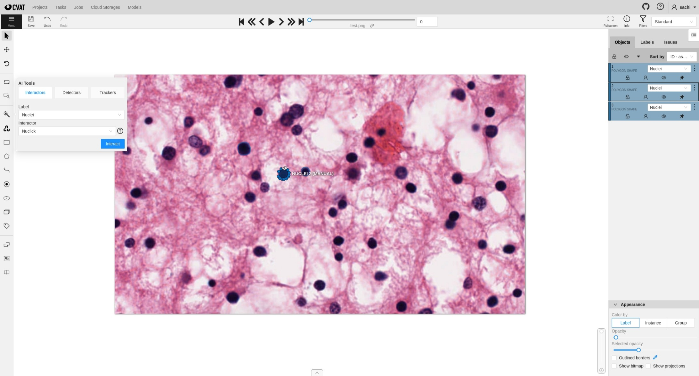

<!--
Copyright (c) MONAI Consortium
Licensed under the Apache License, Version 2.0 (the "License");
you may not use this file except in compliance with the License.
You may obtain a copy of the License at
    http://www.apache.org/licenses/LICENSE-2.0
Unless required by applicable law or agreed to in writing, software
distributed under the License is distributed on an "AS IS" BASIS,
WITHOUT WARRANTIES OR CONDITIONS OF ANY KIND, either express or implied.
See the License for the specific language governing permissions and
limitations under the License.
-->

# CVAT MONAILabel extension

## Requirement

Install CVAT and enable Semi-Automatic and Automatic Annotation

- https://opencv.github.io/cvat/docs/administration/basics/installation/
- https://opencv.github.io/cvat/docs/administration/advanced/installation_automatic_annotation/

> #### Reference Guide for installing CVAT

```bash
git clone https://github.com/opencv/cvat
cd cvat
git checkout v2.1.0

# use real-ip instead of localhost if you want to share it on network
export CVAT_HOST=127.0.0.1
export CVAT_VERSION=v2.1.0

docker-compose -f docker-compose.yml -f components/serverless/docker-compose.serverless.yml up -d
docker exec -it cvat bash -ic 'python3 ~/manage.py createsuperuser'

wget https://github.com/nuclio/nuclio/releases/download/1.5.16/nuctl-1.5.16-linux-amd64
chmod +x nuctl-1.5.16-linux-amd64
mv nuctl-1.5.16-linux-amd64 ~/.local/bin/nuctl
```

## Installation

Run `./deploy.sh` to install all available models from MONAI Label into CVAT.
```bash
# all functions (endoscopy, pathology)
./deploy.sh

# to deploy specific function
./deploy.sh endoscopy

# to deploy specific function and model
./deploy.sh endoscopy tooltracking
```

Currently, following sample models are available for CVAT.

### Endoscopy
- [ToolTracking](https://github.com/Project-MONAI/MONAILabel/tree/main/sample-apps/endoscopy) ([Detector](https://openvinotoolkit.github.io/cvat/docs/manual/advanced/ai-tools/#detectors))
- [DeepEdit](https://github.com/Project-MONAI/MONAILabel/tree/main/sample-apps/endoscopy) ([Interactor](https://openvinotoolkit.github.io/cvat/docs/manual/advanced/ai-tools/#interactors))

### Pathology
- [Segmentation Nuclei](https://github.com/Project-MONAI/MONAILabel/tree/main/sample-apps/pathology#pathology-use-case) ([Detector](https://openvinotoolkit.github.io/cvat/docs/manual/advanced/ai-tools/#detectors))
- [Deepedit Nuclei](https://github.com/Project-MONAI/MONAILabel/tree/main/sample-apps/pathology#pathology-use-case) ([Detector](https://openvinotoolkit.github.io/cvat/docs/manual/advanced/ai-tools/#detectors))
- [NuClick](https://github.com/Project-MONAI/MONAILabel/tree/main/sample-apps/pathology#pathology-use-case) ([Interactor](https://openvinotoolkit.github.io/cvat/docs/manual/advanced/ai-tools/#interactors))


## Using Plugin

> Currently we can use MONAI Label models only for annotation. Other features like ActiveLearning, Finetuning/Training
> models is not supported.
>
> Annotation functions are verified only on basic png/jpeg images in CVAT.

### Models



### Detector



### Interactor

> Currently CVAT supports single polygon as result for Interactor. Hence, NuClick model in CVAT will return only one
> polygon mask.



