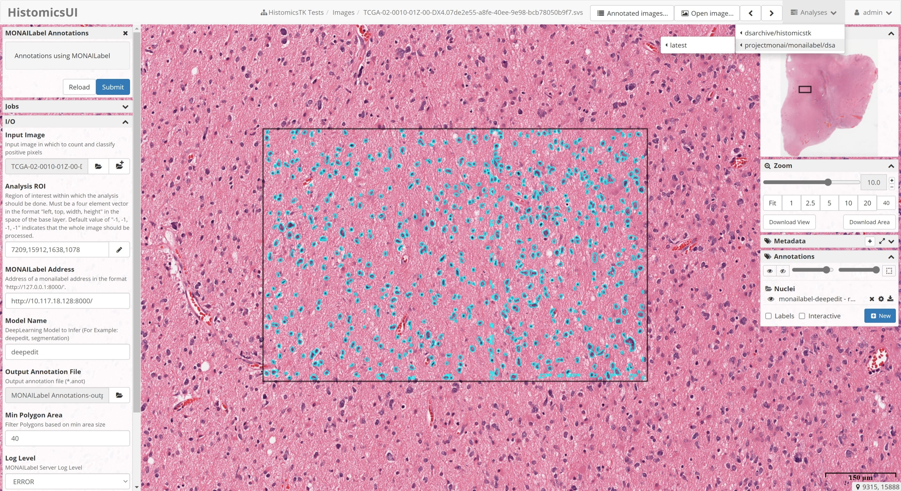

<!--
Copyright (c) MONAI Consortium
Licensed under the Apache License, Version 2.0 (the "License");
you may not use this file except in compliance with the License.
You may obtain a copy of the License at
    http://www.apache.org/licenses/LICENSE-2.0
Unless required by applicable law or agreed to in writing, software
distributed under the License is distributed on an "AS IS" BASIS,
WITHOUT WARRANTIES OR CONDITIONS OF ANY KIND, either express or implied.
See the License for the specific language governing permissions and
limitations under the License.
-->

# DSA MONAILabel extension

## Requirement

You need to install DSA and upload some test images.
> Refer: https://github.com/DigitalSlideArchive/digital_slide_archive/tree/master/devops/dsa

## Installation

You can use [projectmonai/monailabel-dsa:latest](https://hub.docker.com/r/projectmonai/monailabel-dsa/tags) plugin from
dockerhub. Otherwise you can build from sources as follows.

```bash
  cd plugins/dsa
  docker build -t projectmonai/monailabel-dsa:latest .
```

You can pass the default MONAILabel server by defining following environment variable
in [docker compose](https://github.com/DigitalSlideArchive/digital_slide_archive/blob/master/devops/dsa/docker-compose.yml)
for DSA.
This will also help to pre-fetch the available models from MONAILabel server.

```
---
version: '3'
services:
  girder:
    environment:
      SLICER_CLI_WEB_MONAI_LABEL_SERVER: http://monai.label.com:8000
```

Upload new Task (under Slicer CLI Web Tasks) using the above docker image. This will add/enable MONAILabel under
Analysis Page.



> **NOTE::** Provide
> additional [options](https://github.com/Project-MONAI/MONAILabel/tree/main/sample-apps/pathology#digital-slide-arhive-dsa-as-datastore)
> like `dsa_api_key` and `dsa_asset_store_path` while running the MONAILabel server for faster resource sharing between
> MONAILabel and DSA.

##### MONAILabel Server configs for DSA

Following are some config options:

| Name                 | Description                                                                                                                 |
|----------------------|-----------------------------------------------------------------------------------------------------------------------------|
| preload              | Preload models into GPU. Default is False.                                                                                  |
| roi_size             | Default ROI Size for inference in [x,y] format. Default is [1024,1024].                                                       |
| dsa_folder           | Optional. Comma seperated DSA Folder IDs. Normally it is <folder_id> of a folder under Collections where Images are stored. |
| dsa_api_key          | Optional. API Key helps to query asset store to fetch direct local path for WSI Images.                                     |
| dsa_asset_store_path | Optional. It is the DSA assetstore path that can be shared with MONAI Label server to directly read WSI Images.             |

```bash
  # run server (Example: DSA API URL is http://0.0.0.0:8080/api/v1)
  ./monailabel/scripts/monailabel start_server --app sample-apps/pathology \
    --studies http://0.0.0.0:8080/api/v1 \

  # run server (Advanced options)
  ./monailabel/scripts/monailabel start_server --app sample-apps/pathology \
    --studies http://0.0.0.0:8080/api/v1 \
    --conf dsa_folder 621e94e2b6881a7a4bef5170 \
    --conf dsa_api_key OJDE9hjuOIS6R8oEqhnVYHUpRpk18NfJABMt36dJ \
    --conf dsa_asset_store_path digital_slide_archive/devops/dsa/assetstore

```


