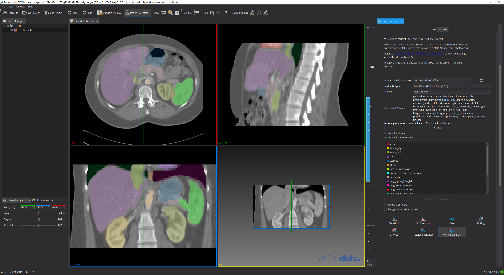
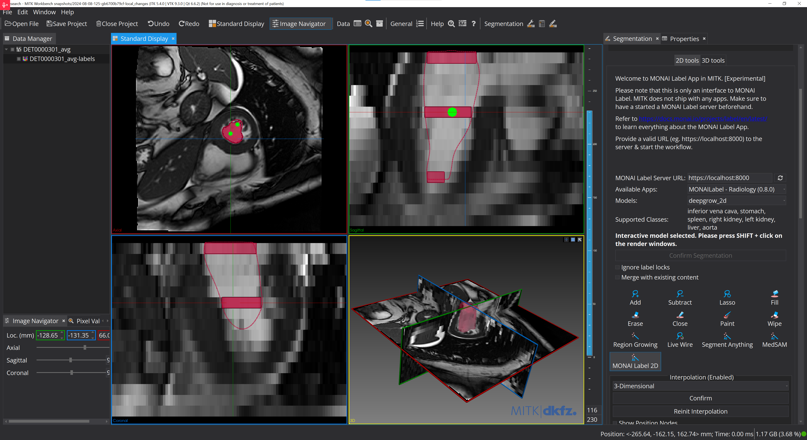

<!--
Copyright (c) MONAI Consortium
Licensed under the Apache License, Version 2.0 (the "License");
you may not use this file except in compliance with the License.
You may obtain a copy of the License at
    http://www.apache.org/licenses/LICENSE-2.0
Unless required by applicable law or agreed to in writing, software
distributed under the License is distributed on an "AS IS" BASIS,
WITHOUT WARRANTIES OR CONDITIONS OF ANY KIND, either express or implied.
See the License for the specific language governing permissions and
limitations under the License.
-->

## MONAI Label tool in MITK

The Medical Imaging Interaction Toolkit (MITK) is a free open-source software for the development of interactive medical image processing software. Based on MITK, the MITK Workbench, a powerful and free standalone application to view, process, and segment medical images. The MONAI Label tool in the segmentation view supports 2D & 3D images with radiology and monaibundle apps for inferencing only.

<figure>

<figcaption>Segmentation generated for a 3D image loaded in MITK using “segmentation” model from the Radiology app</figcaption>
</figure>

### Table of Contents
- [Supported Applications](#supported-applications)
- [Installing MITK Workbench](#installing-mitk)
- [Segmentation using MONAI Label](#segmentation-using-MONAI-Label)
- [Added Value from MITK](#added-value-from-mitk)

### Supported Applications
Users can find supported applications in the [sample-apps](../../sample-apps/radiology/) folder under the radiology section. They'll find models like DeepEdit, DeepGrow, Segmentation, and more. These applications can be used to create and refine labels for various medical imaging tasks.

### Installing MITK
To use MONAI Label with MITK, you'll need to download and install the MITK Workbench. MONAI Label tool in MITK is tested against version 0.8 or higher. For more information on installing MITK Workbench, check out the [MITK Documentation](https://www.mitk.org/wiki/The_Medical_Imaging_Interaction_Toolkit_(MITK))
The MONAI Label tool needs no separate installation. It is included in the MITK's installer.

### Segmentation using MONAI Label
MONAI Label tool interface can be found in both MITK's Segmentation View > 2D tools and also in Segmentation View > 3D tools. As the the name indicates, the hosted MONAI Label app's 2D models are featured in 2D tools and vice versa. For details usage refer to [MITK Documentation](https://docs.mitk.org/nightly/org_mitk_views_segmentation.html#org_mitk_views_segmentationMonaiLabel3D)

### Added Value from MITK
1. 4D image support: MONAI Label app models can be applied to dynamic (2D+t & 3D+t) images recursively to all time frames in one step.
2. Automatic 3D interpolation: On 3D images, sparse 2D label segmentations generated using MONAI 2D models can be interpolated on the fly to create 3D segmentations of specific structures with fewer interactions needed.
<figure>

<figcaption>Segmentation generated for a 3D image using “deepgrow_2d” model from the Radiology app and the 3D interpolation feature of MITK</figcaption>
</figure>
