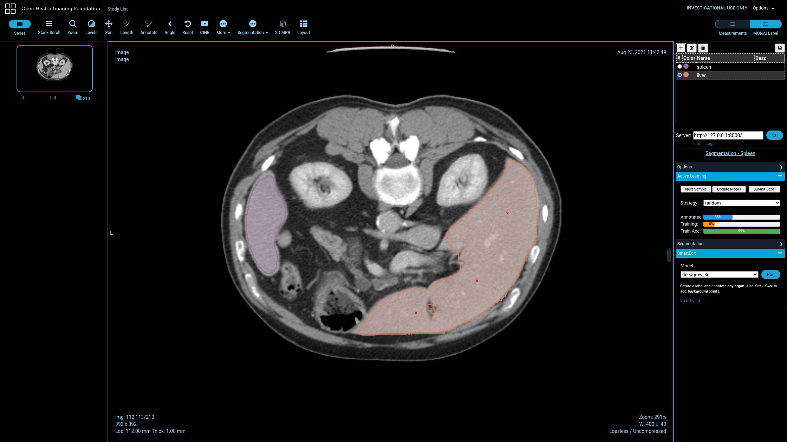

## MONAILabel Plugin for OHIF Viewer



## Release mode
`pip install monailabel` will install the OHIF that is pre-built with MONAI Label.
OHIF will be accessible at http://127.0.0.1:8000/ohif/ when you start monailabel server connecting to local/remote dicom-web storage.

## Development setup

- Build the OHIF plugin for development:

  `(cd plugins/ohif && ./build.sh)`

- Run App with Orthanc (DICOMWeb):

  `./monailabel/monailabel start_server -a samples/segmentation_spleen -s http://127.0.0.1:8042/dicom-web`

- Access OHIF: http://127.0.0.1:8000/ohif/

```shell
# If you want to avoid building OHIF package for every code changes,
# you can run OHIF Viewer directly in checked-out git submodule
cd plugins/ohif/Viewers

yarn run dev:orthanc

# in this case ohif will run at http://127.0.0.1:3000/
xdg-open http://127.0.0.1:3000/
```

## Installing Orthanc (DICOMWeb)

### Ubuntu 20.x

```shell
# Install orthanc and dicomweb plugin
sudo apt-get install orthanc orthanc-dicomweb -y

# Install plastimatch
sudo apt-get install plastimatch -y
```

However, you have to **upgrade to latest version** by following steps
mentioned [here](https://book.orthanc-server.com/users/debian-packages.html#replacing-the-package-from-the-service-by-the-lsb-binaries)

```shell
sudo service orthanc stop
sudo wget https://lsb.orthanc-server.com/orthanc/1.9.7/Orthanc --output-document /usr/sbin/Orthanc
sudo rm -f /usr/share/orthanc/plugins/*.so

sudo wget https://lsb.orthanc-server.com/orthanc/1.9.7/libServeFolders.so --output-document /usr/share/orthanc/plugins/libServeFolders.so
sudo wget https://lsb.orthanc-server.com/orthanc/1.9.7/libModalityWorklists.so --output-document /usr/share/orthanc/plugins/libModalityWorklists.so
sudo wget https://lsb.orthanc-server.com/plugin-dicom-web/1.6/libOrthancDicomWeb.so --output-document /usr/share/orthanc/plugins/libOrthancDicomWeb.so

sudo service orthanc restart
```

### Windows/Others _(latest version)_

- Download and Install Orthanc from https://www.orthanc-server.com/download.php

## Converting NIFTI images to DICOM

```shell
plastimatch convert --patient-id patient1 --input image.nii.gz --output-dicom test
```

## Converting NIFTI Annotations to DICOM-SEG

If you'd like to upload image annotations to the DICOMWeb server (i.e. Orthanc), you should use DICOM-SEG. For that you could use itk tools such as `itkimage2segimage` (https://qiicr.gitbook.io/dcmqi-guide/opening/cmd_tools/seg/itkimage2segimage).


## Uploading DICOM to Orthanc

### Use Orthanc Browser

Use orthanc browser located at http://127.0.0.1:8042/app/explorer.html#upload to upload the files.

### Using STORE SCP/SCU

#### Enable AET

`sudo vim /etc/orthanc/orthanc.json`

```json5
// The list of the known DICOM modalities
"DicomModalities" : {
/**
 * Uncommenting the following line would enable Orthanc to
 * connect to an instance of the "storescp" open-source DICOM
 * store (shipped in the DCMTK distribution) started by the
 * command line "storescp 2000".
 **/
"sample": ["MONAILABEL", "127.0.0.1", 104]
```

`sudo service orthanc restart`

#### Upload Files

```shell
# If AET 'MONAILABEL' is enabled in Orthanc
python -m pynetdicom storescu 127.0.0.1 4242 test -aet MONAILABEL -r
```