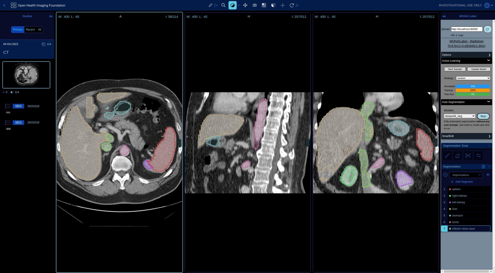

<!--
Copyright (c) MONAI Consortium
Licensed under the Apache License, Version 2.0 (the "License");
you may not use this file except in compliance with the License.
You may obtain a copy of the License at
    http://www.apache.org/licenses/LICENSE-2.0
Unless required by applicable law or agreed to in writing, software
distributed under the License is distributed on an "AS IS" BASIS,
WITHOUT WARRANTIES OR CONDITIONS OF ANY KIND, either express or implied.
See the License for the specific language governing permissions and
limitations under the License.
-->

## MONAI Label Plugin for OHIF Viewer
The Open Health Imaging Foundation (OHIF) Viewer is an open-source, web-based platform for medical imaging. OHIF Viewer provides a framework for building complex imaging applications with user-friendly interfaces. MONAI Label supports the web-based OHIF viewer with connectivity to a remote DICOM server via DICOMweb.



### Table of Contents
- [Supported Applications](#supported-applications)
- [Installing OHIF](#installing-ohif)
- [Installing Orthanc](#installing-orthanc-dicomweb)
- [Converting NIFTI Images to DICOM](#converting-nifti-images-to-dicom)
- [Converting NIFTI Annotations to DICOM-SEG](#converting-nifti-annotations-to-dicom-seg)
- [Uploading DICOM to Orthanc](#uploading-dicom-to-orthanc)

### Supported Applications
Supported applications can be found in the [sample-apps](../../sample-apps/radiology/) folder under the radiology section. These applications include models like DeepEdit, DeepGrow, Segmentation, and more, which can be used to create and refine labels for various medical imaging tasks.

### Installing OHIF
When installing MONAI Label with `pip install monailabel`, a version of OHIF that is pre-built with the MONAI Label library is automatically installed. OHIF will be accessible at http://127.0.0.1:8000/ohif/ when you start the MONAI Label server and connect to local/remote DICOM-web storage.

#### Development setup

To build the OHIF plugin for development, follow these steps:
```bash
sudo sh requirements.sh # installs yarn/ngnix
sh build.sh
```

To run the OHIF plugin, update DICOM and MONAI Server Endpoints in configs/nginx.conf
```bash
sh run.sh
```
You can then visit http://127.0.0.1:3000/ohif/ on your browser to see the running OHIF.

### Installing Orthanc (DICOMWeb)

#### Ubuntu 20.x

```bash
# Install Orthanc and DICOMweb plugin
sudo apt-get install orthanc orthanc-dicomweb -y

# Install Plastimatch
sudo apt-get install plastimatch -y
```

However, you must upgrade to the latest version by following the steps mentioned on the [Orthanc Installation Guide](https://book.orthanc-server.com/users/debian-packages.html#replacing-the-package-from-the-service-by-the-lsb-binaries)

```bash
sudo service orthanc stop
sudo wget https://lsb.orthanc-server.com/orthanc/1.9.7/Orthanc --output-document /usr/sbin/Orthanc
sudo rm -f /usr/share/orthanc/plugins/*.so

sudo wget https://lsb.orthanc-server.com/orthanc/1.9.7/libServeFolders.so --output-document /usr/share/orthanc/plugins/libServeFolders.so
sudo wget https://lsb.orthanc-server.com/orthanc/1.9.7/libModalityWorklists.so --output-document /usr/share/orthanc/plugins/libModalityWorklists.so
sudo wget https://lsb.orthanc-server.com/plugin-dicom-web/1.6/libOrthancDicomWeb.so --output-document /usr/share/orthanc/plugins/libOrthancDicomWeb.so

sudo service orthanc restart
```

#### Windows/Others _(latest version)_

- Download and Install Orthanc from https://www.orthanc-server.com/download.php

### Converting NIFTI images to DICOM
To use Orthanc, your files need to be in DICOM format. You can convert any Nifti files to DICOM using the following command:
```bash
plastimatch convert --patient-id patient1 --input image.nii.gz --output-dicom test
```
- `plastimatch convert`: This is the command to run the conversion tool.
- `--patient-id patient1`: This option specifies the ID of the patient to be associated with the DICOM files. In this example, it is set to `patient1`.
- `--input image.nii.gz`: This option specifies the path to the input Nifti file that you want to convert to DICOM. In this example, the input file is `image.nii.gz`.
- `--output-dicom test`: This option specifies the path to the output folder where the DICOM files will be saved. In this example, the output folder is named `test`.

When you run this command, plastimatch will read the input Nifti file and convert it to a series of DICOM files with the specified patient ID. These files will be saved in the test folder in DICOM format, which can be uploaded to an Orthanc server.

### Converting NIFTI Annotations to DICOM-SEG

If you want to upload image annotations to the DICOMWeb server (such as Orthanc), you should use DICOM-SEG format. DICOM-SEG is a DICOM standard format for image segmentation. To convert NIFTI annotations to DICOM-SEG, you can use the itkimage2segimage tool from ITK (Insight Toolkit).

Here's how to use itkimage2segimage to convert NIFTI annotations to DICOM-SEG:

1. Install ITK: You can download and install ITK from their website, or use a package manager such as pip or conda to install it.
2. Convert NIFTI annotations to NIFTI-Segmentations: Use the `plastimatch convert` command to convert the NIFTI annotations to NIFTI-Segmentations format. This format is required as an input to `itkimage2segimage`. The command is similar to the one used to convert NIFTI images to DICOM, but with an additional option:

```bash
plastimatch convert --input annotations.nii.gz --output-nifti-seg annotations-seg.nii.gz
```
This command will convert the NIFTI annotations file named `annotations.nii.gz` to NIFTI-Segmentations format and save the result in a file named `annotations-seg.nii.gz`.

3. Convert NIFTI-Segmentations to DICOM-SEG: Use the `itkimage2segimage` command to convert the NIFTI-Segmentations file to DICOM-SEG format. Here's an example command:

```bash
itkimage2segimage --inputImage annotations-seg.nii.gz --outputDICOM annotations-seg.dcm --patientID patient1
```
This command will convert the `annotations-seg.nii.gz` file to DICOM-SEG format and save the result in a file named `annotations-seg.dcm`. The `--patientID` option specifies the ID of the patient to be associated with the DICOM-SEG file.

After conversion, you can upload the DICOM-SEG file to the DICOMWeb server such as Orthanc.


### Uploading DICOM to Orthanc

#### Use Orthanc Browser
You can use the Orthanc browser located at http://127.0.0.1:8042/app/explorer.html#upload to upload files.

#### Using STORE SCP/SCU
To upload files using STORE SCP/SCU, you need to enable AET by editing the `orthanc.json` file:
`sudo vim /etc/orthanc/orthanc.json`

```json5
// The list of the known DICOM modalities
"DicomModalities" : {
/**
 * Uncommenting the following line would enable Orthanc to
 * connect to an instance of the "storescp" open-source DICOM
 * store (shipped in the DCMTK distribution) started by the
 * command line "storescp 2000".
 **/
"sample": ["MONAILABEL", "127.0.0.1", 104]
```
Then, restart Orthanc:

```
sudo service orthanc restart
```

#### Upload Files
To upload files, use the following command:

```bash
python -m pynetdicom storescu 127.0.0.1 4242 test -aet MONAILABEL -r
```
That's it! With these steps, you should have successfully installed MONAI Label with the OHIF viewer plugin and connected it to a remote DICOM server via DICOMweb.
