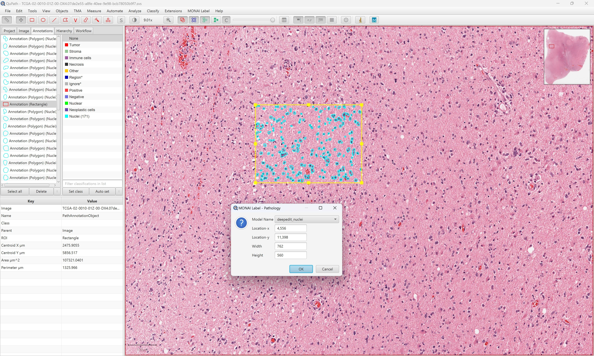

<!--
Copyright (c) MONAI Consortium
Licensed under the Apache License, Version 2.0 (the "License");
you may not use this file except in compliance with the License.
You may obtain a copy of the License at
    http://www.apache.org/licenses/LICENSE-2.0
Unless required by applicable law or agreed to in writing, software
distributed under the License is distributed on an "AS IS" BASIS,
WITHOUT WARRANTIES OR CONDITIONS OF ANY KIND, either express or implied.
See the License for the specific language governing permissions and
limitations under the License.
-->

# MONAI Label Plugin for QuPath
QuPath is an open, flexible, extensible software platform for bioimage analysis. It is designed to support a wide range of tasks in digital pathology, including cell and nuclei detection, tissue classification, and biomarker quantification.



### Table of Contents
- [Supported Applications](#supported-applications)
- [Installing QuPath](#installing-qupath)
- [Install MONAI Label Extension From Binaries](#install-monai-label-extension-from-binaries)
- [Building MONAI Label Extension from source ](#building-monai-label-extension-from-source)
- [Using the Plugin](#using-the-plugin)

### Supported Applications
Users can find supported applications in the [sample-apps](../../sample-apps/radiology/) folder under the radiology section. They'll find models like DeepEdit, DeepGrow, Segmentation, and more. These applications can be used to create and refine labels for various medical imaging tasks.

### Installing QuPath

To use MONAILabel with QuPath, you first need to download QuPath from https://qupath.github.io/. Once you have QuPath installed, you can install the MONAILabel plugin using one of the following methods

### Install MONAI Label Extension From Binaries
1. Download  [qupath-extension-monailabel-0.3.0.jar](https://github.com/Project-MONAI/MONAILabel/releases/download/data/qupath-extension-monailabel-0.3.0.jar).
2. Drag the jar file onto the running QuPath application window (black screen area) to install the extension.

**Note:** If you have previously installed the MONAILabel plugin, make sure to remove/uninstall the extension before updating.

### Building MONAI Label Extension from source

To build the latest extension jar using [OpenJDK 11](https://openjdk.java.net/) or later
with [gradle](https://gradle.org/install/), follow these steps:

1. Navigate to the directory where you cloned the MONAILabel repository and then navigate to the `plugins/qupath` folder.
2. Run the following command to build the jar file:
```bash
gradle clean build
```
3. The output extension jar will be located under `build/libs`.
4. Drag the jar file onto QuPath to install the extension.

## Using the Plugin

1. Make sure the MONAILabel Server URL is correctly set in the Preferences.
2. Open a sample Whole Slide Image in QuPath (which is shared as studies for MONAILabel server).
3. Add or select a rectangle ROI to run annotations using MONAI Label models.
4. For interactive models (e.g. DeepEdit), you can choose to provide positive and negative points through the Annotation panel.


