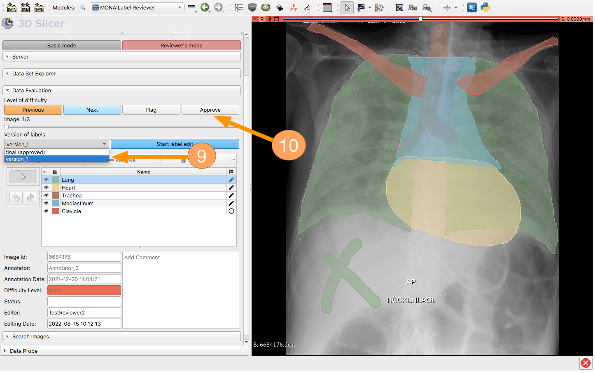

<!--
Copyright (c) MONAI Consortium
Licensed under the Apache License, Version 2.0 (the "License");
you may not use this file except in compliance with the License.
You may obtain a copy of the License at
    http://www.apache.org/licenses/LICENSE-2.0
Unless required by applicable law or agreed to in writing, software
distributed under the License is distributed on an "AS IS" BASIS,
WITHOUT WARRANTIES OR CONDITIONS OF ANY KIND, either express or implied.
See the License for the specific language governing permissions and
limitations under the License.
-->

# Purpose
Radiologists have different levels of experience reading X-ray images.
Therefore, agreement of several radiologists on X-ray segmentations (especially in difficult cases) is required to increase the overall quality of a data set, which is then used to model a neural network.
MONAILABELReviewer is a tool for research groups to check the quality of the segmentation of their data sets.


# Import MONAILABELReviewer into 3D Slicer
1. Select "Edit"
2. Select "Application Settings"
3. Select "Modules"
4. Select "Add"
5. Within Browser select folder "MONAILabelReviewer"


# MonaiLabelReviewer UI
MonaiLabelReviewer has two usage modes, "Reviewer Mode" and "Basic Mode". The latter can be enabled by checking the checkbox next to "Basic Mode".
"Reviewer Mode" provides advanced features such as filer options and segmentation classification by difficulty (see subsection "UI in Reviewer Mode" for further description)

# UI in basic mode
1. If checkbox is selected, "basic mode" is activated (just for streaming through the segmentations)
2. Progress bar displays how many images have already been segmented in total.
3. Progress bar displays how many images have already been segmented by the selected annotator
4. Combobox: Selection of annotator (if option "All" is selected, the dataset includes segmentations of all annotators)
5. Slide bar: Displays currently index of image within the selected dataset
6. Lines which displays the meta data: imageId, annotator's name, date
7. Segmentation selection box: Hide/Show-option of segmentation layers


#Required extensions in MonaiLabel

In order to persist the information created by MonaiLabelReviewer during the review process, an additional rest endpoint needs to be introduced into MonaiLabel.
In particular, the following methods (see below) need to be added in the datastore.py file.
(We will apply these changes in the monai community, so the workflow in MonaiLabelReviewer will be available without any additional manual changes in MonaiLabel.)

├── MONAILAIBEL
    ├── monailabel
        ├── endpoints
            ├── datastore.py

```
@router.put("/updatelabelinfo", summary="Update label info")
async def api_update_label_info(label_id: str, label_tag : str, params: str = Form("{}")):
    return update_label_info(label_id, label_tag, params)

def update_label_info(label_id: str, label_tag : str, params: str = Form("{}")):
   save_params: Dict[str, Any] = json.loads(params) if params else {}
   instance: MONAILabelApp = app_instance()
   instance.datastore().update_label_info(label_id=label_id, label_tag=label_tag, info=save_params)
   return {}
```

# UI in Reviewer mode
1. If checkbox is not selected, "Reviewer Mode" is activated (the enables all feature for reviewing the segmentations)
2. Selection of reviewer's name or add new reviewer
3. Progress bar displays how many images have already been approved in total.
4. Progress bar displays how many images of selected Annotator have already been approved
5. Buttons (Easy, Medium, Hard) allows reviewer to classify the difficulty of segmentation to Easy, Medium, Hard
6. "Approve" Button: After the reviewer approves the segmentation, it can be included in the neural network modelling dataset
7. "Flag" Button allows the reviewer to mark a segmentation for later evaluation by another radiologist
8. Comment field: Reviewer can add comment into that box regarding the segmentation. If commented review is flagged additionally, the annotator can improve the segmentation according to comment
9. Filter options allows the reviewer to select a subset of image data set (not segmented, segmented, flagged, approved)


# Search  by Image Id
After entering a list of comma-separated image IDs in the left field, the right field displays a list of IDs of the corresponding found images.
That data set can be reviewed using the "Next"-"Previous"-Button.


# Editing/Improving segmentation & Version control
1. After clicking the combo box, a list of segmentation version tags will appear.
(The tag of the initial segmentation is "final". The tag of all subsequent improved/edited segmentations starts with "version_" (followed by a number).

2. By clicking the "Start Label Editing" button, the user can start improving the subjected segmentation.


3. Three new buttons appear:
      * 1. Overwrite this version (Warning: "final" segmentation, cannot be overwritten, however)
      * 2. Save as new version (Version_2 --> Version_3, ascending numbering)
      * 3. Delete this version (Warning: "final" segmentation, cannot be deleted)

4. Editing tools appear on the left side of the Hide/Show toolbar.

5. Also, all buttons (like "Easy", "Medium", "Hard", "Previous", "Next") are disabled
during the editing process; except for the "Flagged" and "Approved" buttons.


6. After finishing editing the segmentation (a cross is drawn on the image for demonstration purposes)

7. The user has 3 options:
      * 1. Overwrite current version (Caution: "final" segmentation cannot be overwritten because it is the original segmentation)
      * 2. Save as new version (e.g. Version_2 --> Version_3, ascending numbering)
      * 3. Delete technical version (Caution: "final" segmentation cannot be deleted because it is the original segmentation)
8. When one of the three options has been selected, the user must confirm their choice by clicking on the "Confirm:..." button.


9. After confirming "Save as new version", the edited segmentation remains in the MONAIServer.
In addition, the version (e.g. "version_1") now appears in the drop-down list.

10. When you click the "Approve" button, the version tag (of the currently depicted segmentation) is marked as "Version_1 (approved)" in the drop-down list. Consequently, the previously approved segmentation is no longer approved.



11. When you click the "Approve" button, the version tag (of the currently depicted segmentation) is marked as "Version_1 (approved)" in the drop-down list.
12. The status "approved" is also displayed in the information field in green.


