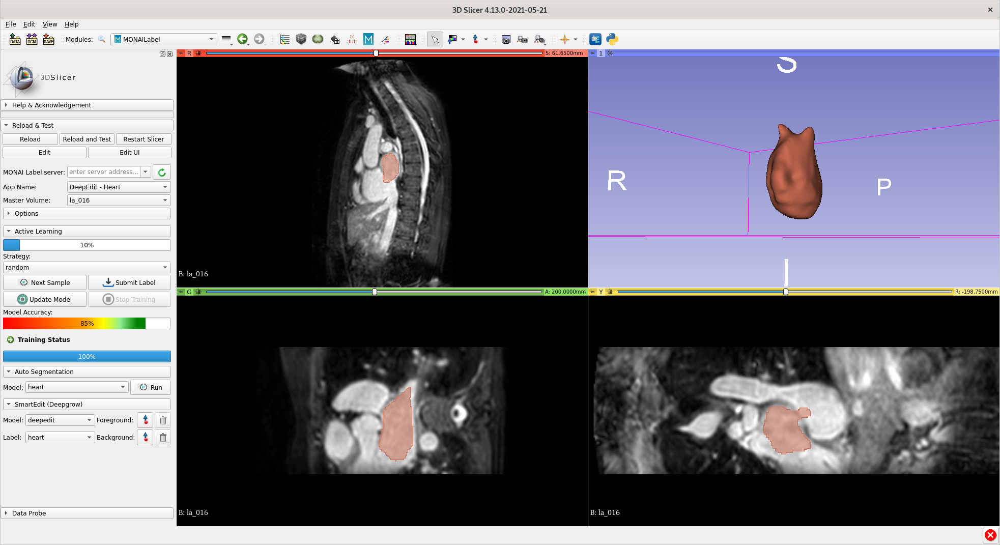

<!--
Copyright (c) MONAI Consortium
Licensed under the Apache License, Version 2.0 (the "License");
you may not use this file except in compliance with the License.
You may obtain a copy of the License at
    http://www.apache.org/licenses/LICENSE-2.0
Unless required by applicable law or agreed to in writing, software
distributed under the License is distributed on an "AS IS" BASIS,
WITHOUT WARRANTIES OR CONDITIONS OF ANY KIND, either express or implied.
See the License for the specific language governing permissions and
limitations under the License.
-->

## MONAI Label Plugin for 3D Slicer

3D Slicer is a free, open-source software for visualization, processing, segmentation, registration, and other 3D images and meshes. MONAI Label supports 3D Slicer with radiology and monaibundle applications. With its advanced features, 3D Slicer is a mature and well-tested viewer for radiology studies and algorithms.

### Table of Contents
- [Supported Applications](#supported-applications)
- [Installing 3D Slicer](#installing-3d-slicer)
- [Installing MONAI Label Plugin](#installing-monai-label-plugin)
- [Plugin in Developer Mode](#plugin-in-developer-mode)
- [Plugin Settings](#plugin-settings)

### Supported Applications
Users can find supported applications in the [sample-apps](../../sample-apps/radiology/) folder under the radiology section. They'll find models like DeepEdit, DeepGrow, Segmentation, and more. These applications can be used to create and refine labels for various medical imaging tasks.

### Installing 3D Slicer
To use MONAI Label with 3D Slicer, you'll need to download and install 3D Slicer. MONAI Label supports stable and preview versions of 3D Slicer, version 5.0 or higher. For more information on installing 3D Slicer, check out the [3D Slicer Documentation](https://slicer.readthedocs.io/en/latest/user_guide/getting_started.html#installing-3d-slicer)

### Installing MONAI Label Plugin

- Go to **View** -> **Extension Manager** -> **Active Learning** -> **MONAI Label**
- Install MONAI Label plugin
- _**Restart**_ 3D Slicer

**Note:** To update the plugin to the latest version, you have to uninstall the existing 3D Slicer version and download and install the new preview version of 3D Slicer again

### Plugin in Developer Mode

- `git clone git@github.com:Project-MONAI/MONAILabel.git`
- Open 3D Slicer: Go to **Edit** -> **Application Settings** -> **Modules** -> **Additional Module Paths**
- Add New Module Path: _<FULL_PATH>_/plugins/slicer/MONAILabel
- _**Restart**_ 3D Slicer

### Plugin Settings
You can change some default behaviors for the MONAI Label plugin by following these steps:

1. Go to **Edit** -> **Application Settings** -> **MONAI Label**
2. Customize the settings as per your requirement.

