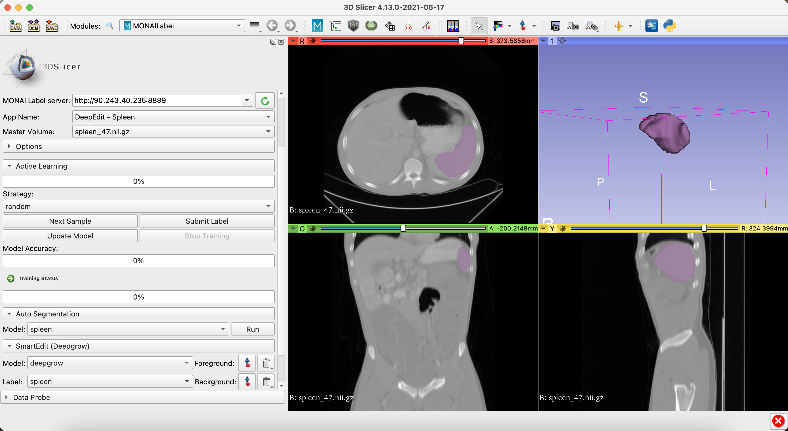

# DeepEdit for Spleen Segmentation

### Model Overview

Interactive MONAI Label App using DeepEdit to label spleen over CT Images.

### Data

The training data is from Medical Segmentation Decathlon (http://medicaldecathlon.com/). Specifically, 35 CT images of size 256x256x128 from the **Task09_Spleen** dataset were used to train this DeepEdit model. 6 images were used to validate this model.

- Target: Spleen
- Task: Segmentation 
- Modality: CT

### Inputs

- 1 channel CT
- 3 channels (CT + foreground points + background points)

### Output

- 1 channel representing Spleen

