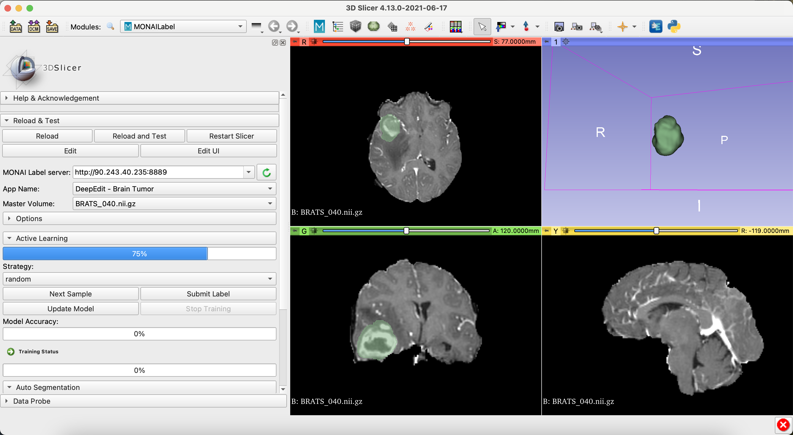

# DeepEdit for Brain Tumor

### Model Overview

Interactive MONAI Label App using DeepEdit to label brain tumour over single modality 3D MRI Images

### Data

The training data is from the Multimodal Brain Tumor Segmentation Challenge (BraTS) 2018 (https://www.med.upenn.edu/cbica/brats2020/data.html).

- Target: Tumor
- Task: Segmentation 
- Modality: MRI

### Inputs

- 1 channel MRI (T1gd)
- 3 channels (T1gd + foreground points + background points)

### Output

- 1 channel representing brain tumor

