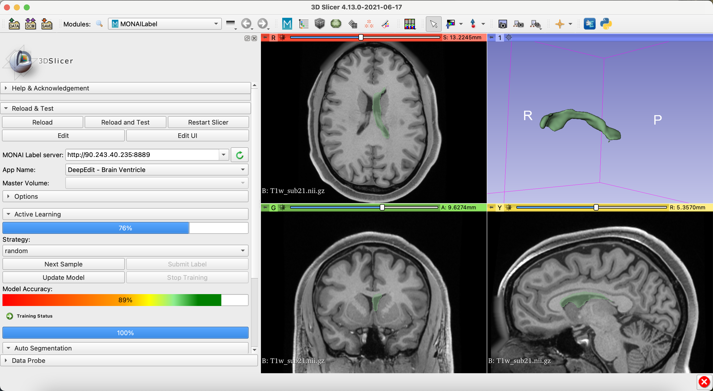

# DeepEdit for Brain Left Ventricle Segmentation

### Model Overview

Interactive MONAI Label App using DeepEdit to label left ventricle over single modality 3D MRI Images

### Data

The training data is from **PENDING LINK**.

- Target: Left Ventricle
- Task: Segmentation 
- Modality: MRI

### Inputs

- 1 channel MRI (T1W)
- 3 channels (T1W + foreground points + background points)

### Output

- 1 channel representing left ventricle

