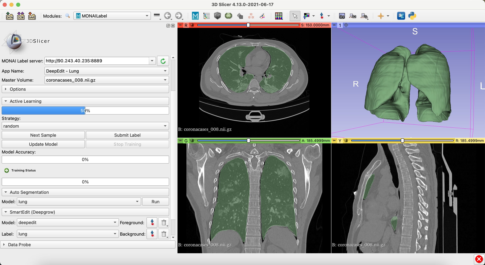

# DeepEdit for Lung Segmentation

### Model Overview

Interactive MONAI Label App using DeepEdit to label lungs over CT Images

### Data

The training data is from Kaggle (https://www.kaggle.com/andrewmvd/covid19-ct-scans).

- Target: Lungs
- Task: Segmentation 
- Modality: CT

### Input

Inputs: 

- 1 channel CT
- 3 channels (CT + foreground points + background points)

### Output

Output: 1 channel representing lungs

