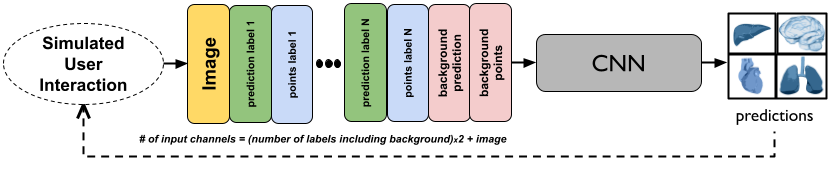

# DeepEdit Multilabel App Using Predictions and clicks as Input

The main goal of this App is to improve user interaction. This includes changing the transforms to also consider predictions generated by the model during the training process. 

Main changes done in this App

- Fix the transforms to work with a list and not a list of lists for guidance
- Add predictions to the Input Tensor for Multilabel DeepEdit for better interaction
- Change the name to some transforms to improve readability
- Modify Tensorboard handler to visualize preds during training
- Add preds tensor to values equal to 1/# of labels in Interaction class for the case when NO Interaction is performed. Specifically changed these lines: https://github.com/Project-MONAI/MONAILabel/blob/main/monailabel/deepedit/multilabel/interaction.py#L92. 
- Send the mask name from UI to the server. This should be sent along with the clicks! 
- Modify transform **_AddGuidanceSignalAndPredsd_** to add received predictions from UI
- Made it work for missing labels as done here: https://github.com/Project-MONAI/MONAILabel/blob/main/monailabel/deepedit/multilabel/transforms.py#L826

The training and testing are being tested. The only bits missing are:

- **Properly send predictions (predicted label) from Slicer UI.** Currently, UI sends the image name to be read from the datastore (labels/original). This doesn't consider potential changes made by the user with manual tools in the client.
- **What's the best way to preprocess the predictions (predicted label) sent by UI**, using the same transforms for the "image". Should we always pass the predictions through pre transforms?
  
Comments: 

- **Interaction has improved when the user provides clicks on areas that are not covered by the predictions.** 
- Even though the labels are correctly generated using softmax, **Slicer UI shows two labels in the same voxels** when modifying the labels using clicks. 

### Model Overview

This MONAI Label App is based on DeepEdit: an algorithm that combines the capabilities of multiple models into one, allowing for both interactive and automated segmentation.

DeepEdit App works in both 3DSlicer plugin and OHIF viewer. Researchers/clinicians can also place their studies in either the file archive or a DICOMweb server (i.e. Orthanc) to use DeepEdit. 

This App works for single and multiple label segmentation tasks.

If researchers are interested in using this App, please clone this folder and start the MONAI Label server using:

  > monailabel apps --download --name deepedit_multilabel --output /workspace/apps/

- Network
    > This App uses the DynUNet as the default network. This can be changed in the **main.py** file. 
  > Researchers can define their own network or use one of the listed [here](https://docs.monai.io/en/latest/networks.html)  
  
- [Spatial and intensity transformation](https://docs.monai.io/en/latest/transforms.html) for pre and post processing
  
  > By default, this App comes with the following transforms to pre process the images and simulate clicks:
  > - [LoadImaged](https://docs.monai.io/en/latest/_modules/monai/transforms/io/array.html#LoadImage) -> Loads both image and label from a dictionary
  > - [RandZoomd](https://docs.monai.io/en/latest/_modules/monai/transforms/spatial/dictionary.html#RandZoomd) -> Random zoom to the image and label,
  > - [AddChanneld](https://docs.monai.io/en/latest/_modules/monai/transforms/utility/array.html#AddChannel) -> Add an extra channel to the image and label, 
  > - [Spacingd](https://docs.monai.io/en/latest/_modules/monai/transforms/spatial/dictionary.html#Spacingd) -> Resample image and label to a different image space,
  > - [Orientationd](https://docs.monai.io/en/latest/_modules/monai/transforms/spatial/dictionary.html#Orientationd) -> Reorient image and labels,
  > - [NormalizeIntensityd](https://docs.monai.io/en/latest/_modules/monai/transforms/intensity/dictionary.html#NormalizeIntensityd) -> Normalize intensity of the image,
  > - [RandAdjustContrastd](https://docs.monai.io/en/latest/_modules/monai/transforms/intensity/dictionary.html#RandAdjustContrastd) -> This transform randomly changes image intensity by a gamma value, 
  > - [RandHistogramShiftd](https://docs.monai.io/en/latest/_modules/monai/transforms/intensity/dictionary.html#RandHistogramShiftd) -> This transfoms applies random nonlinear transform the the image's intensity histogram,
  > - [Resized](https://docs.monai.io/en/latest/_modules/monai/transforms/spatial/dictionary.html#Resized) -> Resample image to a different size,

  Transformations used for the clicks simulation [(DeepGrow App)](https://docs.monai.io/en/latest/apps.html)
  > 
  > - [FindAllValidSlicesd](https://docs.monai.io/en/latest/_modules/monai/apps/deepgrow/transforms.html#FindAllValidSlicesd) -> This transform finds/lists all valid slices in labels. Label is assumed to be a 4D Volume with shape CHWD, where C=1,
  > - [AddInitialSeedPointd](https://docs.monai.io/en/latest/_modules/monai/apps/deepgrow/transforms.html#AddInitialSeedPointd) -> This transform adds random guidance as initial seed point for the given labels,
  > - [AddGuidanceSignald](https://docs.monai.io/en/latest/_modules/monai/apps/deepgrow/transforms.html#AddGuidanceSignald) -> This transform adds guidance signal (labels and background clicks) for input image,

- Training hyperparameters (i.e. Number of epochs, learning rate, validation split, ...)
  > Default values are in [conf argument](https://github.com/Project-MONAI/MONAILabel/blob/72574542bcb23fb1eb7973ac35f45b59b0976d17/monailabel/interfaces/app.py#L60)

### Inputs

- 1 channel for the image modality -> Automated mode
- 1+N channels (image modality + points for N labels including background) -> Interactive mode

### Output

- N channels representing the segmented organs/tumors/tissues

### Structure of the App

- **[./lib/infer.py](./lib/infer.py)** is the script where researchers define the inference class (i.e. type of inferer, pre transforms for inference, etc).
- **[./lib/train.py](./lib/train.py)** is the script to define the pre and post transforms to train the network/model
- **[./lib/activelearning.py](./lib/activelearning.py)** is the file to define the image selection techniques.
- **[./lib/transforms.py](./lib/transforms.py)** is the file to define customised transformations to be used in the App
- **[main.py](./main.py)** is the script to define network architecture, enable the active learning strategy, etc

