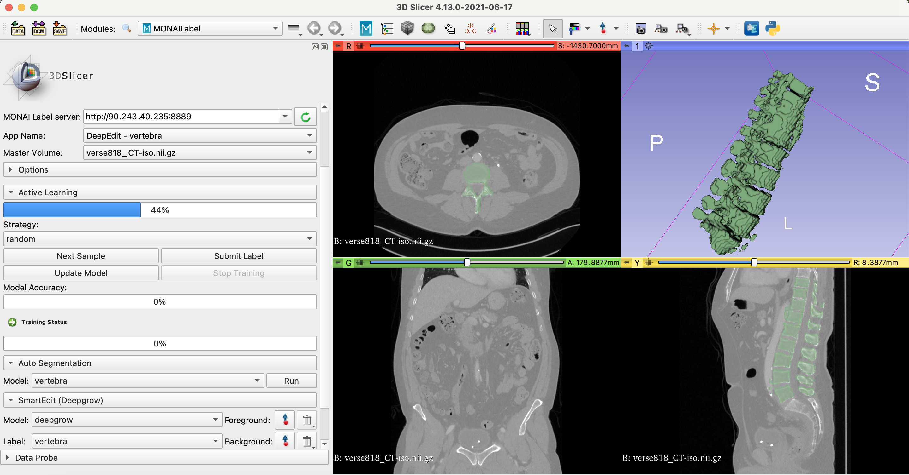

# DeepEdit for spine/vertebra segmentation

### Model Overview

Interactive MONAI Label App using DeepEdit to label the spine over CT Images

### Data

The training data is from VerSe2020 dataset (https://osf.io/t98fz/). Single label dataset is available at https://tinyurl.com/SingleLabelVerSe2020

- Target: Spine/Vertebra
- Task: Segmentation 
- Modality: CT

### Input

Inputs: 

- 1 channel CT
- 3 channels (CT + foreground points + background points)

### Output

Output: 1 channel representing the Spine

