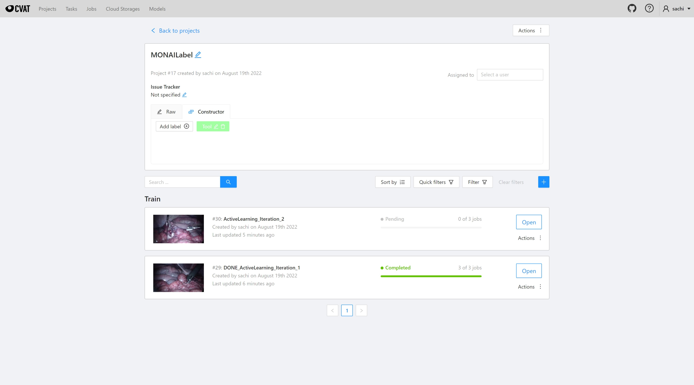

<!--
Copyright (c) MONAI Consortium
Licensed under the Apache License, Version 2.0 (the "License");
you may not use this file except in compliance with the License.
You may obtain a copy of the License at
    http://www.apache.org/licenses/LICENSE-2.0
Unless required by applicable law or agreed to in writing, software
distributed under the License is distributed on an "AS IS" BASIS,
WITHOUT WARRANTIES OR CONDITIONS OF ANY KIND, either express or implied.
See the License for the specific language governing permissions and
limitations under the License.
-->

# Endoscopy Sample Application
This template includes example models for interactive and automated tool tracking segmentation and a classification model for InBody vs. OutBody images in endoscopy-related images.

### Table of Contents
- [Supported Viewers](#supported-viewers)
- [Pretrained Models](#pretrained-models)
- [How To Use the App](#how-to-use-the-app)
- [Model Details](#model-overview)
- [Active Learning Workflow](#active-learning-workflow)
- [Performance Benchmarking](#performance-benchmarking)

### Supported Viewers
The Endoscopy Sample Application supports the following viewers:

- [CVAT](../../plugins/cvat/)

### Pretrained Models

Below is a list of models that are currently available in the Endoscopy App:

| Name                          | Description                                                                                                                                                                                                |
|-------------------------------|------------------------------------------------------------------------------------------------------------------------------------------------------------------------------------------------------------|
| [deepedit](#deepedit)         | This model combines the capabilities of multiple models into one, allowing for both interactive and automated segmentation to label **Tool** among in-body images. Based on the DeepEdit algorithm. |
| [tooltracking](#tooltracking) | A standard (non-interactive) segmentation model to label **Tool** among in-body images.                                                                                                                    |
| [inbody](#inbody)             | A standard (non-interactive) classification model to determine **InBody** or **OutBody** images.                                                                                                           |

### How To Use the App

```bash
# Download Endoscopy App (skip this if you have already downloaded the app or using the GitHub repository)
monailabel apps --download --name endoscopy --output workspace

# Start MONAI Label Server with the tooltracking model, download latest bundle version by default
monailabel start_server --app workspace/endoscopy --studies workspace/images --conf models tooltracking

# Start MONAI Label Server with the tooltracking model, download specific bundle version
monailabel start_server --app workspace/endoscopy --studies workspace/images --conf models tooltracking --conf tooltracking 0.4.8

# Start MONAI Label Server with the DeepEdit model
monailabel start_server --app workspace/endoscopy --studies workspace/images --conf models deepedit

# Start MONAI Label Server with the DeepEdit model and repload on GPU
monailabel start_server --app workspace/endoscopy --studies workspace/images --conf models deepedit --conf preload true

# Start MONAI Label Server with DeepEdit in Inference Only mode
monailabel start_server --app workspace/endoscopy --studies workspace/images --conf models deepedit --conf skip_trainers true
```

#### With CVAT (Active Learning)
```bash
export MONAI_LABEL_DATASTORE=cvat
export MONAI_LABEL_DATASTORE_URL=http://127.0.0.1:8080
export MONAI_LABEL_DATASTORE_USERNAME=myuser
export MONAI_LABEL_DATASTORE_PASSWORD=mypass

monailabel start_server \
  --app workspace/endoscopy \
  --studies workspace/images \
  --conf models tooltracking \
  --conf epistemic_enabled true \
  --conf epistemic_top_k 10 \
  --conf auto_finetune_models tooltracking \
  --conf auto_finetune_check_interval 30
```

**Note:** The `epistemic_top_k` argument specifies the number of images to label in each iteration. If you do not have externally provided validation data, MONAI Label Server will automatically split the annotated data into train and validation sets by percentage. However, if you have no external validation data and set `epistemic_top_k` to a value less than 5, the model will be trained without being saved. To avoid this issue, provide a value for `epistemic_top_k` that is greater than or equal to 5, or supply your own validation data.

The following are additional configurations that can be useful when using CVAT for active learning workflows. To use these configurations, pass them as `--conf name value` when running the relevant commands:

| Name                         | Values | Default                  | Description                                                                                               |
|------------------------------|--------|--------------------------|-----------------------------------------------------------------------------------------------------------|
| use_pretrained_model         | bool   | true                     | Disable this NOT to load any pretrained weights                                                           |
| preload                      | bool   | false                    | Preload model into GPU                                                                                    |
| skip_scoring                 | bool   | false                    | Disable this to allow scoring methods to be used                                                          |
| skip_strategies              | bool   | false                    | Disable this to add active learning strategies                                                            |
| epistemic_enabled            | bool   | false                    | Enable Epistemic based Active Learning Strategy                                                           |
| epistemic_max_samples        | int    | 0                        | Limit number of samples to run epistemic scoring (**_zero_** for no limit)                                |
| epistemic_simulation_size    | int    | 5                        | Number of simulations per image to run epistemic scoring                                                  |
| epistemic_top_k              | int    | 10                       | Select Top-K unlabeled for every active learning learning iteration                                       |
| auto_finetune_models         | str    |                          | List of models to run fine-tuning when active learning task is completed  (**_None/Empty_** to train all) |
| auto_finetune_check_interval | int    | 60                       | Interval in seconds for server to poll on **_CVAT_** to determine if active learning task is completed    |
| cvat_project                 | str    | MONAILabel               | CVAT Project Name                                                                                         |
| cvat_task_prefix             | str    | ActiveLearning_Iteration | Prefix for creating CVAT Tasks                                                                            |
| cvat_image_quality           | int    | 70                       | Image quality for uploading them to CVAT Tasks                                                            |
| cvat_segment_size            | int    | 1                        | Number of Jobs per CVAT Task                                                                              |

### Model Overview

<details id="DeepEdit">
  <summary>
  <strong>DeepEdit</strong> is an algorithm that combines the capabilities of multiple models into one, allowing for both
interactive and automated segmentation.
  </summary>
This model is currently trained to segment **Tool** from 2D in-body images.

- Network: This model uses the [BasicUNet](https://docs.monai.io/en/latest/networks.html#basicunet) as the default network.
- Labels: `{ "Tool": 1 }`
- Dataset: The model is pre-trained over few in-body Images related to Endoscopy
- Inputs: 3 channels.
    - 1 channel for the image modality -> Automated mode
    - 2 channels (image modality + points for foreground and background clicks) -> Interactive mode
- Output: 1 channel representing the segmented Tool
</details>

<details id="ToolTracking">
  <summary>
  <strong>ToolTracking</strong> is based on UNet for automated segmentation. This model works for single label segmentation tasks.
  </summary>
- Network: This model uses the [FlexibleUNet](https://docs.monai.io/en/latest/networks.html#flexibleunet) as the default network.
- Labels: `{ "Tool": 1 }`
- Dataset: The model is pre-trained over few in-body Images related to Endoscopy
- Inputs: 1 channel for the image modality
- Output: 1 channel representing the segmented Tool
</details>

<details id="InBody/OutBody">
  <summary>
  <strong>InBody/OutBody</strong> is based on SEResNet50 for classification. This model determines if tool is present or not (in-body vs out-body).
  </summary>
- Network: This model uses the [SEResNet50](https://docs.monai.io/en/latest/networks.html#seresnet50) as the default network.
- Labels: `{ "InBody": 0, "OutBody": 1 }`
- Dataset: The model is pre-trained over few in-body Images related to Endoscopy
- Inputs: 1 channel for the image modality
- Output: 2 classes (0: in_body, 1: out_body)
</details>


### Active Learning Workflow


The MONAI Label app works best with CVAT. Researchers and clinicians can place their studies in the local file folder.

1. Start with N unlabeled images (for example, 100 images in total).
2. MONAI Label computes the score and selects the first batch of unlabeled images to label, for example 10 images out of 100, based on active learning with epistemic scoring.
3. MONAI Label creates a project and task in CVAT for annotators to work on, with Project name `MONAILABEL` and Task name `ActiveLearning_Iteration_1`.
4. Annotators complete the task in CVAT.
5. MONAI Label periodically checks whether the task is complete in CVAT.
6. MONAI Label fine-tunes the existing model(s) using the newly annotated data.
7. MONAI Label recomputes the score using the latest trained model and selects the next batch of unlabeled images to label, for example another 10 images out of the remaining 90.
8. MONAI Label creates the next task in CVAT for annotators to work on, with Project name `MONAILABEL` and Task name `ActiveLearning_Iteration_2`.
9. This cycle (steps 3-8) continues until a good enough model is obtained.

#### Active Learning Performance
We conducted tests on an active learning workflow using roughly 4,281 samples of 2D frames from multiple surgical videos. The dataset breakdown for the experiment is as follows:
- Training: 3,217 samples (the samples were treated as unlabeled, except for the initial pool of samples that were selected as queries and added with their corresponding labels)
- Validation: 400 samples
- Testing: 664 samples
- Total: 4,281 samples


The following table summarizes the results for different active learning strategies:

| Method         | Active Iterations | Samples Per Iteration | % of Data Used | Test IoU   |
|----------------|-------------------|-----------------------|----------------|------------|
| _Random_       | 8                 | 20                    | 5.6%           | 0.7446     |
| _**Variance**_ | 8                 | 20                    | 5.6%           | 0.7617     |
| _Random_       | 8                 | 50                    | 14%            | 0.7712     |
| _**Variance**_ | 7                 | 50                    | **12.5%**      | **0.8028** |
| _Random_       | 15                | 50                    | 25%            | 0.7900     |
| _**Variance**_ | 15                | 50                    | **25%**        | **0.8311** |

By using an active learning strategy, it is possible to significantly reduce the number of annotations required to train a good model. As the table above shows, by selecting a small subset of samples (as little as 15% of the dataset), it is possible to achieve a model performance close to that of the full dataset. This means that it is not necessary to label all 4,281 unlabeled samples to train a high-performing model.

By selecting the right subset of data, it is possible to achieve a better performing model with only 25% of the data, compared to labeling all the data with unverified quality of labels. This not only saves time and effort but also leads to a more efficient use of resources.

The following snapshot shows the iteration cycles and progress for each active learning cycle for two different strategies, as well as the outcome of random acquisition of data:


The following snapshot shows the iteration cycles and progress for each active learning batch annotation in CVAT:



### Performance Benchmarking

The performance benchmarking of MONAILabel server for endoscopy models was carried out and summarized in the table below:

| Model        | Pre | Infer | Post | Total | Remarks                                                               |
|--------------|-----|-------|------|-------|-----------------------------------------------------------------------|
| tooltracking | 60  | 40    | 71   | 171   | **_(pre)_** Load Image: 35 ms<br/>**_(post)_** Mask to Polygon: 68 ms |
| inbody       | 50  | 30    | 1    | 81    | **_(pre)_** Load Image: 35 ms                                         |
| deepedit     | 38  | 28    | 40   | 106   | **_(pre)_** Load Image: 35 ms<br/>**_(post)_** Mask to Polygon: 32 ms |

> Latencies are in **milliseconds (ms)**;  with Input Image size of **1920 x 1080**
