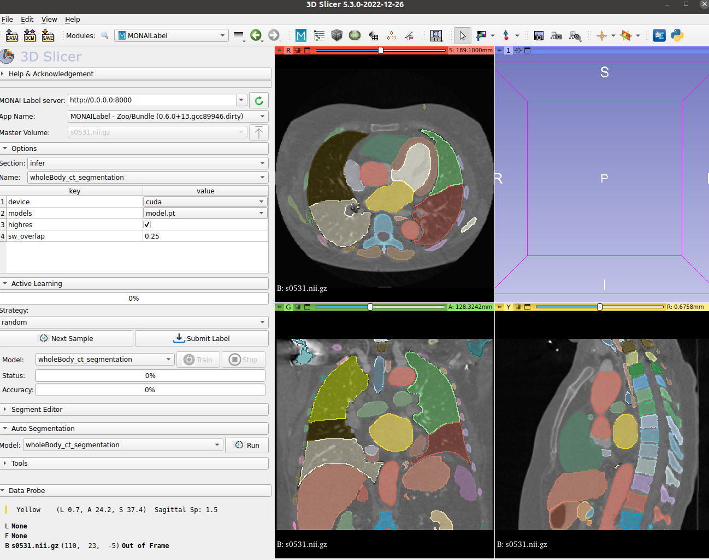

<!--
Copyright (c) MONAI Consortium
Licensed under the Apache License, Version 2.0 (the "License");
you may not use this file except in compliance with the License.
You may obtain a copy of the License at
    http://www.apache.org/licenses/LICENSE-2.0
Unless required by applicable law or agreed to in writing, software
distributed under the License is distributed on an "AS IS" BASIS,
WITHOUT WARRANTIES OR CONDITIONS OF ANY KIND, either express or implied.
See the License for the specific language governing permissions and
limitations under the License.
-->

# Integration with MONAI Bundle
The App helps to pull any MONAI Bundle from [MONAI ZOO](https://github.com/Project-MONAI/model-zoo/tree/dev/models).
However the following constraints has to be met for any monai bundle to directly import and use in MONAI Label.
 - Has to meet [MONAI Bundle Specification](https://docs.monai.io/en/latest/mb_specification.html).
 - For Inference, the bundle has defined **inference.json** or **inference.yaml** and defines [these keys](../../monailabel/tasks/infer/bundle.py)
 - For Training, the bundle has defined **train.json** or **train.yaml** and defines [these keys](../../monailabel/tasks/train/bundle.py)
 - For Multi-GPU Training, the bundle has defined **multi_gpu_train.json** or **multi_gpu_train.yaml**

> By default models are picked from https://github.com/Project-MONAI/model-zoo/blob/dev/models/model_info.json

<p align = "center"></p>
<p align = "center"><em>Whole body CT segmentation with 104 structures using TotalSegmentator Dataset</em></p>

### Structure of the App

- **[lib/infers](./lib/infers)** is to define and activate inference task over monai-bundle.
- **[lib/trainers](./lib/trainers)** is to define and activate training task over monai-bundle for single/multi gpu.
- **[lib/activelearning](./lib/activelearning)** is the module to define the image selection techniques.
- **[main.py](./main.py)** is the script to extend [MONAILabelApp](../../monailabel/interfaces/app.py) class

> Modify Constants defined in [Infer](../../monailabel/tasks/infer/bundle.py) and [Train](../../monailabel/tasks/train/bundle.py) to customize and adopt if the basic standard/schema is not met for your bundle.

### Overview

### Supported Models

The Bundle App supports most labeling models in the Model Zoo, please see the table for labeling tasks.

| Bundle | Model | Objects | Modality | Note |
|:----:|:-----:|:-------:|:--------:|:----:|
| [spleen_ct_segmentation](https://github.com/Project-MONAI/model-zoo/tree/dev/models/spleen_ct_segmentation) | UNet | Spleen | CT | A model for (3D) segmentation of the spleen |
| [swin_unetr_btcv_segmentation](https://github.com/Project-MONAI/model-zoo/tree/dev/models/swin_unetr_btcv_segmentation) | SwinUNETR | Multi-Organ | CT | A model for (3D) multi-organ segmentation |
| [prostate_mri_anatomy](https://github.com/Project-MONAI/model-zoo/tree/dev/models/prostate_mri_anatomy) | UNet | Prostate | MRI | A model for (3D) prostate segmentation from MRI image |
| [pancreas_ct_dints_segmentation](https://github.com/Project-MONAI/model-zoo/tree/dev/models/pancreas_ct_dints_segmentation) | DiNTS | Pancreas/Tumor | CT | An automl method for (3D) pancreas/tumor segmentation |
| [renalStructures_UNEST_segmentation](https://github.com/Project-MONAI/model-zoo/tree/dev/models/renalStructures_UNEST_segmentation) | UNesT | Kidney Substructure | CT |  A pre-trained for inference (3D) kidney cortex/medulla/pelvis segmentation |
| [wholeBrainSeg_UNEST_segmentation](https://github.com/Project-MONAI/model-zoo/tree/dev/models/wholeBrainSeg_Large_UNEST_segmentation) | UNesT | Whole Brain | MRI T1 |  A pre-trained for inference (3D) 133 whole brain structures segmentation |
| [spleen_deepedit_annotation](https://github.com/Project-MONAI/model-zoo/tree/dev/models/spleen_deepedit_annotation) | DeepEdit | Spleen| CT | An interactive method for 3D spleen Segmentation |
| [lung_nodule_ct_detection](https://github.com/Project-MONAI/model-zoo/tree/dev/models/lung_nodule_ct_detection) | RetinaNet | Lung Nodule| CT | The detection model for 3D CT images |
| [wholeBody_ct_segmentation](https://github.com/Project-MONAI/model-zoo/tree/dev/models/wholeBody_ct_segmentation) | SegResNet | 104 body structures| CT | The segmentation model for 104 tissue from 3D CT images (TotalSegmentator Dataset) |

Supported tasks update based on [Model-Zoo](https://github.com/Project-MONAI/model-zoo/tree/dev/models) release.

Note: MONAI Label support labeling bundle models in the MODEL ZOO, non-labeling tasks are not available for MONAI Label.

Note: the monaibundle app uses monai bundle api to get information of latest Model-Zoo. In order to increase the rate limits of calling GIthub APIs, you can input your personal access token.
    Please check the following link for more details about rate limiting:
    https://docs.github.com/en/rest/overview/resources-in-the-rest-api#rate-limiting

Set **--conf auth_token <github personal access token>** to increate rate limits.

### How To Use?

```bash
# skip this if you have already downloaded the app or using github repository (dev mode)
monailabel apps --download --name monaibundle --output workspace

# the MONAI Bundle app requires access to MODEL ZOO, please set the authentication token first.
export MONAI_ZOO_AUTH_TOKEN=<Your github auth token>

# List all available models from zoo
monailabel start_server --app workspace/monaibundle --studies workspace/images

# Pick spleen_ct_segmentation model
monailabel start_server --app workspace/monaibundle --studies workspace/images --conf models spleen_ct_segmentation

# Pick spleen_ct_segmentation model and preload
monailabel start_server --app workspace/monaibundle --studies workspace/images --conf models spleen_ct_segmentation --conf preload true

# Pick DeepEdit And Segmentation model (multiple models)
monailabel start_server --app workspace/monaibundle --studies workspace/images --conf models "spleen_ct_segmentation,spleen_deepedit_annotation"

# Skip Training Tasks or Infer only mode
monailabel start_server --app workspace/monaibundle --studies workspace/images --conf models spleen_ct_segmentation --conf skip_trainers true
```

**Specify bundle version** (Optional)
Above command will download the latest bundles from Model-Zoo by default. If a specific or older bundle version is used, users can add version `_v` followed by the bundle name. Example:

```bash
monailabel start_server --app workspace/monaibundle --studies workspace/images --conf models spleen_ct_segmentation_v0.3.7
```
Note: bundles in Model-Zoo are continuously updated, old bundles may contain deprecated API, we recommend using the latest realeased MONAI Label and bundle for the best 
 experience.

### Epistemic Scoring for monaibundle app

The monaibundle app supports epistemic scoring using bundles models. The monaibundle consumes **epistemic_model** as config parameter.
If a valid scoring bundle model is provided with **--conf epistemic_model <bundlename>**, scoring inference will be triggered.
The loaded scoring bundle model can be either model-zoo models or local bundles, the network must support **dropout** argument.

```bash
# the MONAI Bundle app requires access to MODEL ZOO, please set the authentication token first.
export MONAI_ZOO_AUTH_TOKEN=<Your github auth token>
# Use the UNet in spleen_ct_segmentation bundle as epistemic scoring model.
# Manual define epistemic scoring parameters
monailabel start_server \
  --app workspace/monaibundle \
  --studies workspace/images \
  --conf models spleen_ct_segmentation,swin_unetr_btcv_segmentation \
  --conf epistemic_model spleen_ct_segmentation
  --conf epistemic_max_samples 0 \
  --conf epistemic_simulation_size 5
  --conf epistemic_dropout 0.2

```

Users can then select active learning strategies for selecting data to label.

### Detection Model in `monaibundle` app

MONAI Label now supports detection models. We demonstrate an example of lung nodule detection model from model-zoo.

3D Slicer plugin needs to be updated or use the latest developer mode.

#### Step 1: **Prerequisites**

**Get latest MONAI Label Slicer plugin** (Optional)

If you are using older release of 3D Slicer MONAI Label plugin, you can update to the latest plugin which supports ***drawing ROI nodes from MONAI Label server prediction***.

Or to use the developer mode of MONAI Label plugin by:

 - Pull latest MONAI Label repo:
 ```bash
 git clone https://github.com/Project-MONAI/MONAILabel.git
 ```
 - Go to `MONAILabel/plugins/slicer/`
 - Follow the Readme page to use developer mode of Slicer plugin.
 https://github.com/Project-MONAI/MONAILabel/tree/main/plugins/slicer#install-plugin-in-developer-mode
    - Install Plugin in Developer Mode
        - Open 3D Slicer: Go to Edit -> Application Settings -> Modules -> Additional Module Paths
        - Add New Module Path: <FULL_PATH>/plugins/slicer/MONAILabel
        - Restart 3D Slicer

#### Step 2: Download `monaibundle` App

Sample-app with built-in versions are in the downloads, fetch the `monaibundle` app using monailabel API

```bash
  monailabel apps --download --name monaibundle --output apps
```

#### Step 3: Prepare Sample Data

The lung nodule detection model are trained and evaluated using [LUNA16](https://luna16.grand-challenge.org/Home/) dataset.

LUNA16 is a public dataset of CT lung nodule detection. Using raw CT scans, the goal is to identify locations of possible nodules, and to assign a probability for being a nodule to each location.

Disclaimer: We are not the host of the data. Please make sure to read the requirements and usage policies of the data and give credit to the authors of the dataset! We acknowledge the National Cancer Institute and the Foundation for the National Institutes of Health, and their critical role in the creation of the free publicly available LIDC/IDRI Database used in this study.

 - If you are going to use full datset of LUNA16, please refer to the dataset link, download the data, create and preprocess the images following [this page](        https://github.com/Project-MONAI/model-zoo/tree/dev/models/lung_nodule_ct_detection#data
).

 - In this tutorial, we prepared a sample subset, resampled and ready to use. The subset is only for demonstration. Download [here](https://github.com/Project-MONAI/MONAILabel/releases/download/data/detection_dataset.zip).

  Or use these commands to download and extract directly.

```bash
mkdir datasets
wget "https://github.com/Project-MONAI/MONAILabel/releases/download/data/detection_dataset.zip" -O datasets/detection_dataset.zip
unzip datasets/detection_dataset.zip -d datasets/detection_dataset
```

 - The detection model also supports MSD Task06_Lung dataset for inference. Note this dataset is created for nodule segmentation task. We do not use the segmentation mask, only the images for inference. Use the following monailabel API to automatically download the dataset.

```bash
monailabel datasets --download --name Task06_Lung --output datasets
```

#### Step 4: Start MONAI Label server and 3D Slicer to Annotate

All models, datasets, and plugins are ready, start the MONAI Label server and open 3D Slicer to annotate!

```bash
# the MONAI Bundle app requires access to MODEL ZOO, please set the authentication token first.
export MONAI_ZOO_AUTH_TOKEN=<Your github auth token>
# 1: Use LUNA16 sample data
monailabel start_server --app apps/monaibundle --studies datasets/Task06_Lung/imagesTr --conf models lung_nodule_ct_detection
# 2: Use Task06_Lung data for inference demonstration
monailabel start_server --app apps/monaibundle --studies datasets/detection_dataset --conf models lung_nodule_ct_detection
```

#### Step 5: Modify Detection Parameters in the Bundle (Optional)

The lung_nodule_ct_detection bundle can set the box prediction probability threshold. In `apps/monaibundle/model/lung_nodule_ct_detection/configs/inference.json`, it's define here `score_thresh=0.02`:

```json
    "detector_ops": [
        "$@detector.set_target_keys(box_key='box', label_key='label')",
        "$@detector.set_box_selector_parameters(score_thresh=0.02,topk_candidates_per_level=1000,nms_thresh=0.22,detections_per_img=300)",
        "$@detector.set_sliding_window_inferer(roi_size=@infer_patch_size,overlap=0.25,sw_batch_size=1,mode='constant',device='cpu')"
    ],

```

This parameter will impact the number of boxes in the final prediction output. Then show all boxes ROIs in 3D Slicer.

If users want to limit the number of predicted boxes showing on 3D Slicer, users can set higher `score_thresh`, e.g., `score_thresh=0.5`, `score_thresh=0.6`, or even higher.

#### Additional Configs

Pass them as **--conf _name_ _value_** while starting MONAILabelServer

| Name                      | Values          | Description                                                                                 |
|---------------------------|-----------------|---------------------------------------------------------------------------------------------|
| zoo_source                | string          | _Default value:_ github                                                                     |
| zoo_repo                  | string          | _Default value:_ Project-MONAI/model-zoo/hosting_storage_v1                                 |
| preload                   | true, **false** | Preload model into GPU                                                                      |
| skip_trainers             | true, **false** | Skip adding training tasks (Run in Infer mode only)                                         |
| epistemic_max_samples     | int             | _Default value:_ 0    ;  Epistemic scoring parameters                                       |
| epistemic_simulation_size | int             | _Default value:_ 5    ;  Epistemic simulation size parameters                               |
| epistemic_dropout         | float           | _Default value:_ 0.2  ;  Epistemic scoring parameters: Dropout rate for scoring models      |                               |
