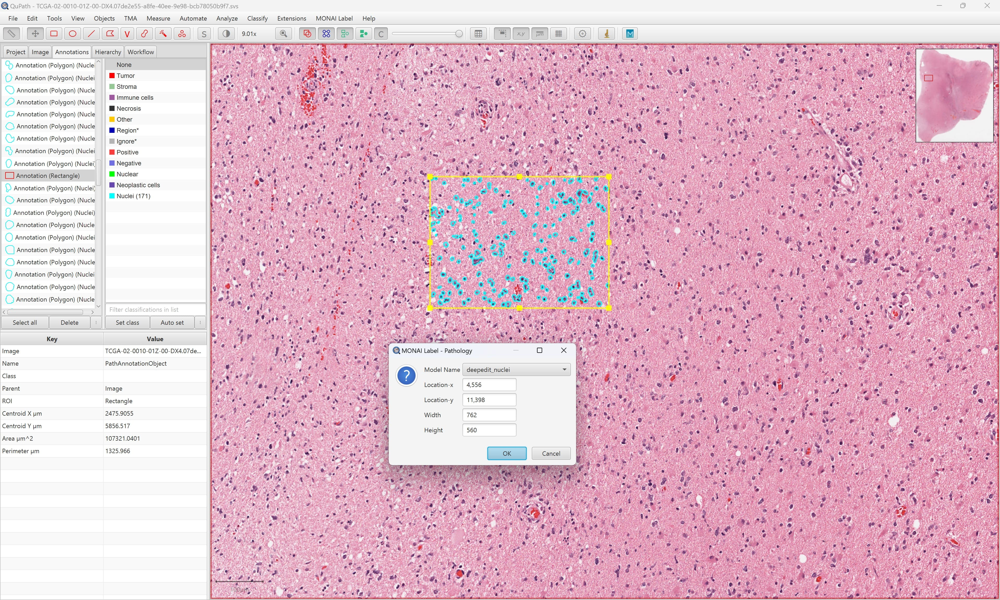
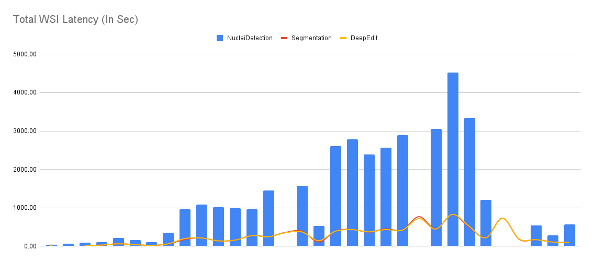
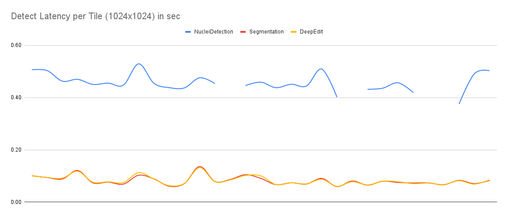
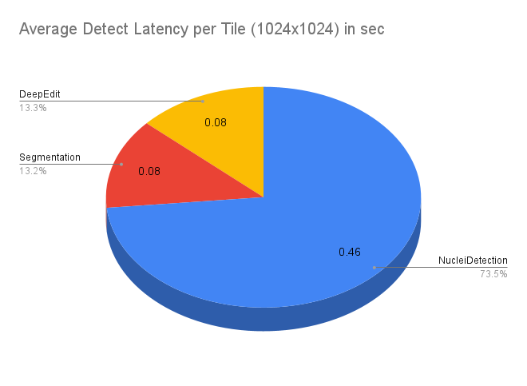

<!--
Copyright (c) MONAI Consortium
Licensed under the Apache License, Version 2.0 (the "License");
you may not use this file except in compliance with the License.
You may obtain a copy of the License at
    http://www.apache.org/licenses/LICENSE-2.0
Unless required by applicable law or agreed to in writing, software
distributed under the License is distributed on an "AS IS" BASIS,
WITHOUT WARRANTIES OR CONDITIONS OF ANY KIND, either express or implied.
See the License for the specific language governing permissions and
limitations under the License.
-->

# Pathology Use Case

### Overview

This is a reference app to run infer + train tasks to segment Nuclei. It comes with following 2 pre-trained
weights/model (UNET).

- **Segmentation Nuclei** - This show-cases an example for multi-label segmentation. It tries segment following labels.
    - Neoplastic cells
    - Inflammatory
    - Connective/Soft tissue cells
    - Dead Cells
    - Epithelial
- **DeepEdit Nuclei** - It is a combination of
  both [Interaction + Auto Segmentation](https://github.com/Project-MONAI/MONAILabel/wiki/DeepEdit) model which is
  trained to segment Nuclei cells that combines all above labels as *Nuclei*.
- **NuClick** - This is NuClick implementation (UNet model) as provided at: https://github.com/mostafajahanifar/nuclick_torch.  Training task for monailabel is not yet supported.

### Dataset

Above _Nuclei_ models are trained
on [PanNuke Dataset for Nuclei Instance Segmentation and Classification](https://warwick.ac.uk/fac/cross_fac/tia/data/pannuke)

### Inputs

- WSI Images
- Region (ROI) of WSI Image

### Output

Segmentation Mask are produced in one of the following formats

- Standard JSON
- [DSA Document](https://digitalslidearchive.github.io/HistomicsTK/examples/segmentation_masks_to_annotations) (JSON)
- [ASAP Annotation XML](https://computationalpathologygroup.github.io/ASAP/)

### Usage (Development Mode)

We recommend to use Digital Slide Archive as endpoint for studies. However you can also also use FileSystem as studies
folder.

```bash
git clone https://github.com/Project-MONAI/MONAILabel.git
cd MONAILabel
pip install -r requirements.txt
```

> Install [Openslide](https://openslide.org/) binaries manually and make sure .dll or .so files for openslide are in system load path.
> - For windows, make sure **&lt;openslide_folder&gt;**/bin is added in PATH environment.
> - For ubuntu: `apt install openslide-tools`

#### FileSystem as Datastore

```bash
# download sample wsi image (skip this if you already have some)
mkdir sample_wsi
cd sample_wsi
wget https://demo.kitware.com/histomicstk/api/v1/item/5d5c07539114c049342b66fb/download
cd -

# run server
./monailabel/scripts/monailabel start_server --app sample-apps/pathology --studies datasets/wsi
```

###### QuPath

Once the server is up and running, download QuPath and
install [MONAILabel plugin for QuPath](../../plugins/qupath) to run annotations using models
available through Pathology App.

The current version of plugin comes with **limited features** to support basic annotations, submitting label and trigger training.  _Looking for more contributions from QuPath Developer/Opensource community to make it better._

- Make sure MONAILabel Server URL is correctly through `Preferences`.
- Open Sample Whole Slide Image in QuPath (which is shared as studies for MONAILabel server)
- Add/Select Rectangle ROI to run annotations using MONAI Label models.
- For Interative model (e.g. DeepEdit) you can choose to provide `Positive` and `Negative` points through Annotation panel.



#### Digital Slide Arhive (DSA) as Datastore

###### DSA

You need to install DSA and upload some test images.
Refer: https://github.com/DigitalSlideArchive/digital_slide_archive/tree/master/devops/dsa

##### MONAILabel Server

Following are some config options:

| Name                 | Description                                                                                                                 |
|----------------------|-----------------------------------------------------------------------------------------------------------------------------|
| preload              | Preload models into GPU. Default is False.                                                                                  |
| roi_size             | Default ROI Size for inference in [x,y] format. Default is [1024,1024].                                                       |
| dsa_folder           | Optional. Comma seperated DSA Folder IDs. Normally it is <folder_id> of a folder under Collections where Images are stored. |
| dsa_api_key          | Optional. API Key helps to query asset store to fetch direct local path for WSI Images.                                     |
| dsa_asset_store_path | Optional. It is the DSA assetstore path that can be shared with MONAI Label server to directly read WSI Images.             |

```bash
  # run server (Example: DSA API URL is http://0.0.0.0:8080/api/v1)
  ./monailabel/scripts/monailabel start_server --app sample-apps/pathology \
    --studies http://0.0.0.0:8080/api/v1 \

  # run server (Advanced options)
  ./monailabel/scripts/monailabel start_server --app sample-apps/pathology \
    --studies http://0.0.0.0:8080/api/v1 \
    --conf dsa_folder 621e94e2b6881a7a4bef5170 \
    --conf dsa_api_key OJDE9hjuOIS6R8oEqhnVYHUpRpk18NfJABMt36dJ \
    --conf dsa_asset_store_path digital_slide_archive/devops/dsa/assetstore

```

##### DSA Client Plugin
You can use [projectmonai/monailabel-dsa:latest](https://hub.docker.com/r/projectmonai/monailabel-dsa/tags) plugin from dockerhub.  Otherwise you can build from sources as follows.
```bash
  cd plugins/dsa
  docker build -t projectmonai/monailabel-dsa:latest .
```

Upload new Task (under Slicer CLI Web Tasks) using the above docker image. This will add/enable MONAILabel under
Analysis Page.


### Performance Benchmarking

The performance benchmarking is done using MONAILabel server and DSA client. All the details are
captured [here](https://docs.google.com/spreadsheets/d/1TeSOGzcTeeIThEvd_eflJNx0hhZiELNGBiYzwKyYEFg/edit?usp=sharing).

Following is summary of the same:

- NucleiDetection (CPU Based DSA Algorithm)
- Segmentation/DeepEdit (MONAILabel models)

<table>
<tr>
<td colspan="2"></td>
</tr>
<tr>
<td></td>
<td></td>
</tr>
</table>
