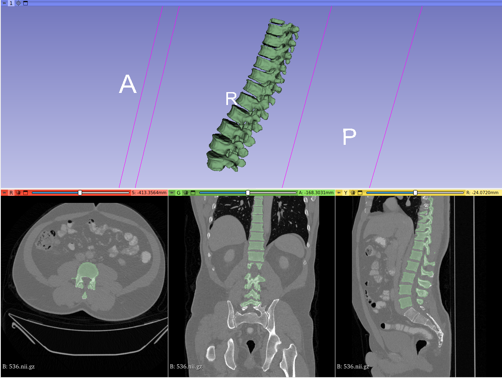
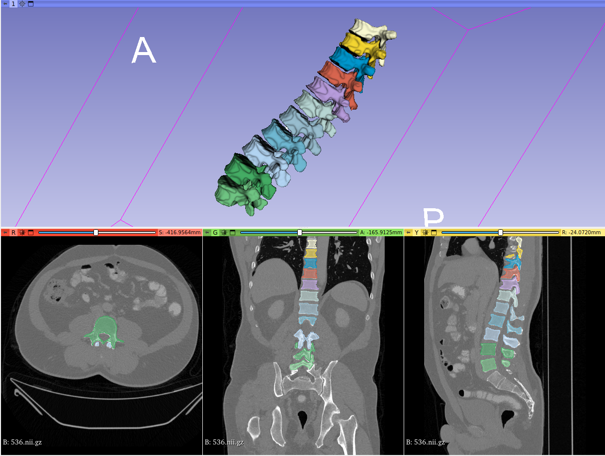

<!--
Copyright (c) MONAI Consortium
Licensed under the Apache License, Version 2.0 (the "License");
you may not use this file except in compliance with the License.
You may obtain a copy of the License at
    http://www.apache.org/licenses/LICENSE-2.0
Unless required by applicable law or agreed to in writing, software
distributed under the License is distributed on an "AS IS" BASIS,
WITHOUT WARRANTIES OR CONDITIONS OF ANY KIND, either express or implied.
See the License for the specific language governing permissions and
limitations under the License.
-->

# DeepLearning models for Radiology use-case(s).

The App works in both 3DSlicer plugin and OHIF viewer. Researchers/clinicians can also place their studies in either the
file archive or a DICOMweb server (i.e. Orthanc).

### Structure of the App

- **[lib/infers](./lib/infers)** is the module where researchers define the inference class (i.e. type of inferer, pre
  transforms for inference, etc).
- **[lib/trainers](./lib/trainers)** is the module to define the pre and post transforms to train the network/model.
- **[lib/configs](./lib/configs)** is the module to define the image selection techniques.
- **[lib/transforms](./lib/transforms)** is the module to define customised transformations to be used in the App.
- **[lib/activelearning](./lib/activelearning)** is the module to define the image selection techniques.
- **[main.py](./main.py)** is the script to extend [MONAILabelApp](../../monailabel/interfaces/app.py) class

Refer [How To Add New Model?](#how-to-add-new-model) section if you are looking to add your own model using this App as
reference.

### List of Pretrained Models

```bash
# List all the possible models
monailabel start_server --app /workspace/apps/radiology --studies /workspace/images
```

Following are the models which are currently added into Radiology App:

| Name                                                                  | Description                                                                                                                                                                                |
|-----------------------------------------------------------------------|--------------------------------------------------------------------------------------------------------------------------------------------------------------------------------------------|
| [deepedit](#deepedit)                                                 | This model is based on DeepEdit: an algorithm that combines the capabilities of multiple models into one, allowing for both interactive and automated segmentation.                        |
| [deepgrow](#deepgrow)                                                 | This model is based on [DeepGrow](https://arxiv.org/abs/1903.08205) which allows for an interactive segmentation.                                                                          |
| [segmentation](#segmentation)                                         | A standard (non-interactive) [multilabel](https://www.synapse.org/#!Synapse:syn3193805/wiki/217789) *[spleen, kidney, liver, stomach, aorta, etc..]* model using UNET to label 3D volumes. |
| [segmentation_spleen](#segmentation_spleen)                           | It uses pre-trained weights/model (UNET) from [NVIDIA Clara](https://catalog.ngc.nvidia.com/orgs/nvidia/teams/med/models/clara_pt_spleen_ct_segmentation) for spleen segmentation.         |
| [Multistage Vertebra Segmentation](#Multistage-Vertebra-Segmentation) | This is an example of a multistage approach for segmenting several structures on a CT image.                                                                                               |
### How To Use?

```bash
# skip this if you have already downloaded the app or using github repository (dev mode)
monailabel apps --download --name radiology --output workspace

# Pick DeepEdit model
monailabel start_server --app workspace/radiology --studies workspace/images --conf models deepedit

# Pick Deepgrow And Segmentation model (multiple models)
monailabel start_server --app workspace/radiology --studies workspace/images --conf models "deepgrow_2d,deepgrow_3d,segmentation"

# Pick all stages for vertebra segmentation
monailabel start_server --app workspace/radiology --studies workspace/images --conf models "localization_spine,localization_vertebra,segmentation_vertebra"

# Pick All
monailabel start_server --app workspace/radiology --studies workspace/images --conf models all

# Pick All + Preload into All GPU devices
monailabel start_server --app workspace/radiology --studies workspace/images --conf models all --conf preload true

# Pick All (Skip Training Tasks or Infer only mode)
monailabel start_server --app workspace/radiology --studies workspace/images --conf models all --conf skip_trainers true
```

### Model Overview

#### [DeepEdit](./lib/configs/deepedit.py)

This model based on DeepEdit: an algorithm that combines the capabilities of multiple models into one, allowing for both
interactive and automated segmentation.

This model works for single and multiple label segmentation tasks.

> monailabel start_server --app workspace/radiology --studies workspace/images --conf models deepedit

- Additional Configs *(pass them as **--conf name value**) while starting MONAILabelServer*

| Name                 | Values             | Description                                                        |
|----------------------|--------------------|--------------------------------------------------------------------|
| network              | **dynunet**, unetr | Using one of these network and corresponding pretrained weights    |
| use_pretrained_model | **true**, false    | Disable this NOT to load any pretrained weights                    |
| skip_scoring         | **true**, false    | Disable this to allow scoring methods to be used                   |
| skip_strategies      | **true**, false    | Disable this to add active learning strategies                     |
| epistemic_enabled    | true, **false**    | Enable Epistemic based Active Learning Strategy                    |
| epistemic_samples    | int                | Limit number of samples to run epistemic scoring                   |
| tta_enabled          | true, **false**    | Enable TTA (Test Time Augmentation) based Active Learning Strategy |
| tta_samples          | int                | Limit number of samples to run tta scoring                         |
| preload              | true, **false**    | Preload model into GPU                                                                                |

A command example to use active learning strategies with DeepEdit would be:

> monailabel start_server --app workspace/radiology --studies workspace/images --conf models deepedit --conf skip_scoring false --conf skip_strategies false --conf tta_enabled true

- Network: This model uses the DynUNet as the default network. It also comes with pretrained model for [UNETR](https://docs.monai.io/en/latest/networks.html#unetr). Researchers can define their own network or use one of the listed [here](https://docs.monai.io/en/latest/networks.html)
- Labels:
  ```json
  {
      "spleen": 1,
      "right kidney": 2,
      "left kidney": 3,
      "liver": 6,
      "stomach": 7,
      "aorta": 8,
      "inferior vena cava": 9,
      "background": 0
  }
  ```
- Dataset: The model is pre-trained over dataset: https://www.synapse.org/#!Synapse:syn3193805/wiki/217789

- Inputs
    - 1 channel for the image modality -> Automated mode
    - 1+N channels (image modality + points for N labels including background) -> Interactive mode

- Output: N channels representing the segmented organs/tumors/tissues

#### [Deepgrow](./lib/configs)

This model based on Deepgrow: an algorithm that combines the capabilities of multiple models into one, allowing
interactive segmentation based on foreground/background clicks (https://arxiv.org/abs/1903.08205). It uses pre-trained
weights
from [NVIDIA Clara](https://catalog.ngc.nvidia.com/models?filters=&orderBy=dateModifiedDESC&query=clara_pt_deepgrow).

It provides both [2D](./lib/configs/deepgrow_2d.py) and [3D](./lib/configs/deepgrow_3d.py) version to annotate images.
Additionally, it also provides [DeepgrowPipeline](lib/infers/deepgrow_pipeline.py) _(infer only)_ that
combines best results of 3D and 2D results.
_Deepgrow 2D model trains faster with higher accuracy compared to Deepgrow 3D model._

The labels get flattened as part of [pre-processing](./lib/trainers/deepgrow.py) step and the model is trained over
binary labels. As an advantage, you can **feed in any new labels** the model dynamically _(zero code change)_ and expect
the model to learn on new organ.

> monailabel start_server --app workspace/radiology --studies workspace/images --conf models deepgrow_2d,deepgrow_3d

- Additional Configs *(pass them as **--conf name value**) while starting MONAILabelServer*

| Name                 | Values             | Description                                                     |
|----------------------|--------------------|-----------------------------------------------------------------|
| preload              | true, **false**    | Preload model into GPU                                                                                |

- Network: This App uses the [BasicUNet](https://docs.monai.io/en/latest/networks.html#basicunet) as the default network.
- Labels:
  ```json
  [
    "spleen",
    "right kidney",
    "left kidney",
    "gallbladder",
    "esophagus",
    "liver",
    "stomach",
    "aorta",
    "inferior vena cava",
    "portal vein and splenic vein",
    "pancreas",
    "right adrenal gland",
    "left adrenal gland"
  ]
  ```
  > **NOTE::** You can feed any new labels to the network to learn on new organs/tissues etc..
- Dataset: The model is pre-trained over dataset: https://www.synapse.org/#!Synapse:syn3193805/wiki/217789
- Inputs: 3 channel that represents image + foreground clicks + background clicks
- Output: 1 channel representing the segmented organs/tumors/tissues

#### [Segmentation](./lib/configs/segmentation.py)

This model based on UNet for automated segmentation. This model works for single and multiple label segmentation tasks.

> monailabel start_server --app workspace/radiology --studies workspace/images --conf models segmentation

- Additional Configs *(pass them as **--conf name value**) while starting MONAILabelServer*

| Name                 | Values             | Description                                                     |
|----------------------|--------------------|-----------------------------------------------------------------|
| use_pretrained_model | **true**, false    | Disable this NOT to load any pretrained weights                 |
| preload              | true, **false**    | Preload model into GPU                                                                                |

- Network: This model uses the [UNet](https://docs.monai.io/en/latest/networks.html#unet) as the default network. Researchers can define their own network or use one of the listed [here](https://docs.monai.io/en/latest/networks.html)
- Labels
  ```json
  {
    "spleen": 1,
    "right kidney": 2,
    "left kidney": 3,
    "gallbladder": 4,
    "esophagus": 5,
    "liver": 6,
    "stomach": 7,
    "aorta": 8,
    "inferior vena cava": 9,
    "portal vein and splenic vein": 10,
    "pancreas": 11,
    "right adrenal gland": 12,
    "left adrenal gland": 13
  }
  ```
- Dataset: The model is pre-trained over dataset: https://www.synapse.org/#!Synapse:syn3193805/wiki/217789
- Inputs: 1 channel for the image modality
- Output: N channels representing the segmented organs/tumors/tissues

#### [Segmentation Spleen](./lib/configs/segmentation_spleen.py)

This model based on UNet for automated segmentation for single label spleen. It uses pre-trained weights
from [NVIDIA Clara](https://catalog.ngc.nvidia.com/models?filters=&orderBy=dateModifiedDESC&query=clara_pt_deepgrow).

> This is the simple reference for users to add their simple model to the Radiology App.

> monailabel start_server --app workspace/radiology --studies workspace/images --conf models segmentation_spleen

- Additional Configs *(pass them as **--conf name value**) while starting MONAILabelServer*

| Name                 | Values          | Description                                                        |
|----------------------|-----------------|--------------------------------------------------------------------|
| use_pretrained_model | **true**, false | Disable this NOT to load any pretrained weights                    |
| skip_scoring         | **true**, false | Disable this to allow scoring methods to be used                   |
| skip_strategies      | **true**, false | Disable this to add active learning strategies                     |
| epistemic_enabled    | true, **false** | Enable Epistemic based Active Learning Strategy                    |
| epistemic_samples    | int             | Limit number of samples to run epistemic scoring                   |
| tta_enabled          | true, **false** | Enable TTA (Test Time Augmentation) based Active Learning Strategy |
| tta_samples          | int             | Limit number of samples to run tta scoring                         |
| preload              | true, **false** | Preload model into GPU                                                                                |


A command example to use active learning strategies with segmentation_spleen would be:

> monailabel start_server --app workspace/radiology --studies workspace/images --conf models segmentation_spleen --conf skip_scoring false --conf skip_strategies false --conf tta_enabled true


- Network: This App uses the [UNet](https://docs.monai.io/en/latest/networks.html#unet) as the default network.
- Labels: `{ "Spleen": 1 }`
- Dataset: The model is pre-trained over dataset: http://medicaldecathlon.com/
- Inputs: 1 channel for the image modality
- Output: 1 channels representing the segmented spleen


#### [Multistage Vertebra Segmentation](./lib/infers/vertebra_pipeline.py)

This is an example of a multistage approach for segmenting several structures on a CT image. The model has three stages that can be use together or independently:

**_Stage 1:_**  [Spine Localization](./lib/configs/localization_spine.py)

As the name suggests, this stage localizes the spine as a single label. See the following image:


**_Stage 2:_**  [Vertebra Localization](./lib/configs/localization_vertebra.py)

This images uses the ouput of the first stage, crop the volume around the spine and roughly segments the vertebras.

**_Stage 3:_**  [Vertebra Segmentation](./lib/configs/segmentation_vertebra.py)

Finally, this stage takes the output of the second stage, compute the centroids and then segments each vertebra at a time. See the folloiwng image:



The difference between second and third stage is that third stage get a more fine segmentation of each vertebra.

> monailabel start_server --app workspace/radiology --studies workspace/images --conf models localization_spine,localization_vertebra,segmentation_vertebra

- Additional Configs *(pass them as **--conf name value**) while starting MONAILabelServer*

| Name                 | Values             | Description                                                     |
|----------------------|--------------------|-----------------------------------------------------------------|
| use_pretrained_model | **true**, false    | Disable this NOT to load any pretrained weights                 |

- Network: This App uses the [UNet](https://docs.monai.io/en/latest/networks.html#unet) as the default network.
- Labels:
  ```json
  {
            "C1": 1,
            "C2": 2,
            "C3": 3,
            "C4": 4,
            "C5": 5,
            "C6": 6,
            "C7": 7,
            "Th1": 8,
            "Th2": 9,
            "Th3": 10,
            "Th4": 11,
            "Th5": 12,
            "Th6": 13,
            "Th7": 14,
            "Th8": 15,
            "Th9": 16,
            "Th10": 17,
            "Th11": 18,
            "Th12": 19,
            "L1": 20,
            "L2": 21,
            "L3": 22,
            "L4": 23,
            "L5": 24
  }
  ```
- Dataset: The model is pre-trained over VerSe dataset: https://github.com/anjany/verse
- Inputs: 1 channel for the CT image
- Output: N channels representing the segmented vertebras


### How To Add New Model?

Researches might want to define/add their own model(s). Or if there is a model as part of radiology use-case which is
generic and helpful for larger community, then you can follow the below steps to add a new model and using the same.

> As an example, you want to add new Segmentation model for **lung**

- Create new TaskConfig **_segmentation_lung.py_** in [lib/configs](./lib/configs).
    - Refer: [segmentation_spleen.py](./lib/configs/segmentation_spleen.py)
    - Fix attributes like network, labels, pretrained URL etc...
    - Implement abstract classes. Following are important ones.
        - `infer(self) -> Union[InferTask, Dict[str, InferTask]]` to return one or more Infer Task.
        - `trainer(self) -> Optional[TrainTask]` to return TrainTask. Return `None` if you are looking for Infer only
          model.
    - You can accept any `--conf <name> <value>` and define the behavior of any function based on new conf.
- Create new Infer Task **_segmentation_lung.py_** in [lib/infers](./lib/infers).
    - Refer: [segmentation_spleen.py](./lib/infers/segmentation_spleen.py)
    - Importantly you will define pre/post transforms.
- Create new Train Task **_segmentation_lung.py_** in [lib/trainers](./lib/trainers).
    - Refer: [segmentation_spleen.py](./lib/trainers/segmentation_spleen.py)
    - Importantly you will define loss_function, optimizer and pre/post transforms for training/validation stages.

- Run the app using new model
  > monailabel start_server --app workspace/radiology --studies workspace/images --conf models segmentation_lung

For development or debugging purpose you can modify the **main()** function in [main.py](./main.py) and run train/infer
tasks in headless mode.

```bash
export PYTHONPATH=workspace/radiology:$PYTHONPATH
python workspace/radiology/main.py
```
