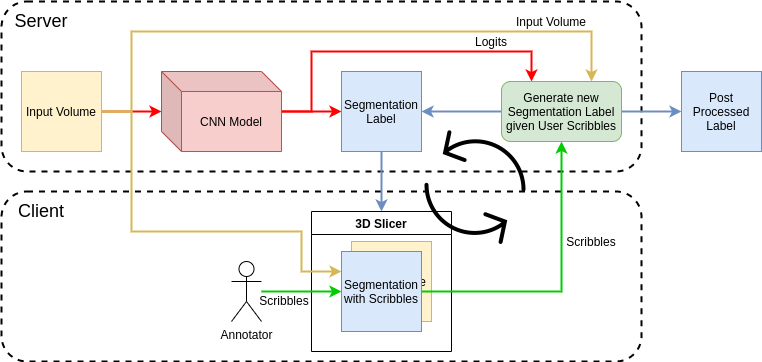
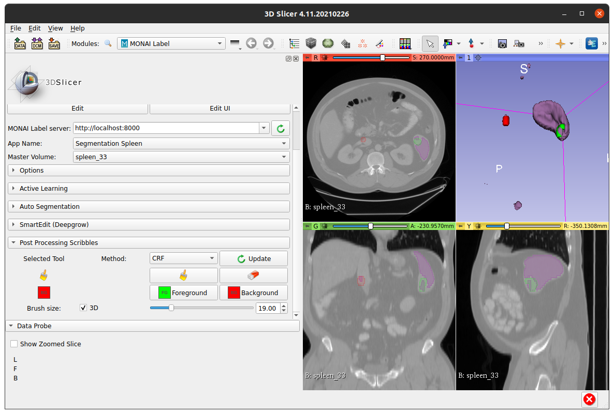

# MONAI Label with User Scribbles based post processing
This is an initial prototype for incorporating user scribbles into a post processing method that can be used to improve segmentations from a deep learning model.

The flow of this application is outlined below:

In the diagram, the neural network (inference) stage is run only once for a given sample. The logits for this run are saved and used throughout scribble based updates to the same sample.

## Installing pre-requisites

### 1. Install MONAI with BUILD_MONAI=1
Uses CRF layer from MONAI, which requires compiling the C++/CUDA code following instructions from [MONAI docs](https://docs.monai.io/en/latest/installation.html#option-1-as-a-part-of-your-system-wide-module). 
This can be done by uninstalling any previous monai/monai-weekly version and running the following command:

`BUILD_MONAI=1 pip install git+https://github.com/Project-MONAI/MONAI#egg=monai`

### 2. Install SimpleCRF
Current application provides an option to switch to SimpleCRF library for doing the CRF part. This can be installed as:

`pip install simplecrf`

## Running the app

### Server
Run server using:

`CUDA_VISIBLE_DEVICES=0 PYTHONPATH=../. python main.py --app ../sample-apps/segmentation_spleen_crf --studies /path/to/Datasets/MSDDataset/Task09_Spleen/imagesTr`

### Client
Run slicer and load monailabel extension:

Load a sample with its initial segmentation by clicking on *Next Sample* in Active Learning. Scribbles functionality is inside *Post Processing Scribbles* tab.
Add scribbles by selecting *Painter/Eraser* and appropriate label and paint into regions as needed. Once done, click *Update* to update segmentations using user scribbles. 

## CRF Timing
At the moment, there is a bug in MONAI CRF code that prevents us from running it in GPU mode (see: [MONAI#2098](https://github.com/Project-MONAI/MONAI/issues/2098)). Therefore the CRF part takes ~ 1 min to complete. Once this bug is fixed, we can switch back to GPU version which is much faster to run the post processing. 
