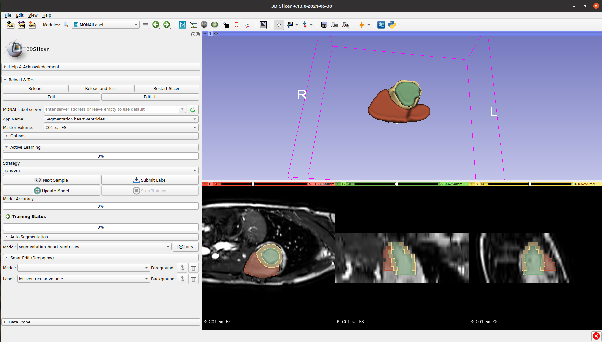

#  Heart ventricles segmentation using DynUNet

### Model Overview

Standard (non-interactive) MONAI Label App using [DynUNet](https://docs.monai.io/en/latest/_modules/monai/networks/nets/dynunet.html) to label left and right ventricle over MR (SAX) Images

### Data

The training data is from ...

- Target: Left and right ventricles of the heart
- Task: Segmentation 
- Modality: MR (SAX)

### Input

- 1 channel MR

### Output

- 4 channel representing background, right ventricle (RV), left ventricle (LV), and LV wall

