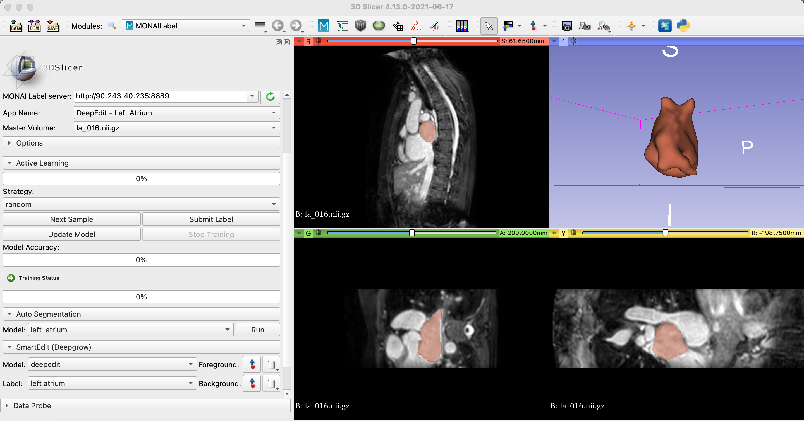

# Left Atrium Segmentation using UNet

### Model Overview

Standard (non-interactive) MONAI Label App using UNet to label left atrium over single modality 3D MRI Images

### Data

The training data is from Medical Segmentation Decathlon (http://medicaldecathlon.com/).

- Target: Left Atrium
- Task: Segmentation 
- Modality: MRI

### Input

- 1 channel MRI

### Output

- 1 channel representing left atrium

