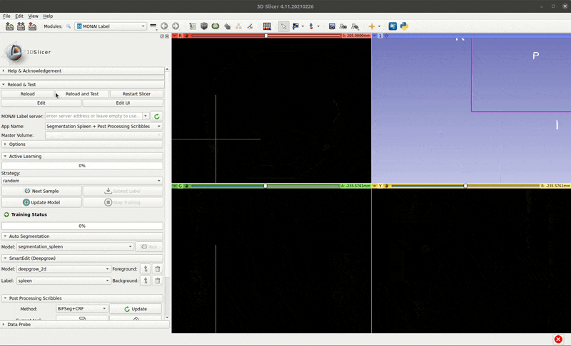
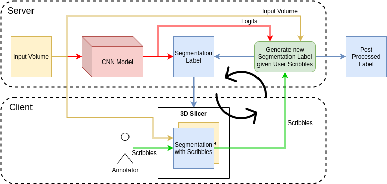

# MONAILabel App to enable User Scribbles based post processing

## Short Demo
<!--  -->

## About
This MONAILabel app enables user scribbles based post processing to improve a given segmentation label. It can be used to improve segmentations from a deep learning model and hence can be used as part of an active learning framework where the improved labels can in turn improve the dataset and the corresponding deep learning model.

The flow of this application is outlined below:

In the diagram, the neural network (inference) stage is run only once for a given input volume. The logits for this run are saved and used throughout scribble based updates to the same sample. The inferred label is shown to a user through MONAILabel's client extension. The user provides scribbles to indicate corrections needed, which are transferred to server and used along with the logits and original input volume by a post processing algorithm to improve the label. The process is repeated multiple times and the resulting improved label is saved for future training of the deep learning model.

# Installing pre-requisites

## 1. Install MONAI with BUILD_MONAI=1
Uses CRF layer from MONAI, which requires compiling the C++/CUDA code following instructions from [MONAI docs](https://docs.monai.io/en/latest/installation.html#option-1-as-a-part-of-your-system-wide-module). 
This can be done by uninstalling any previous monai/monai-weekly version and running the following command:

`BUILD_MONAI=1 pip install git+https://github.com/Project-MONAI/MONAI#egg=monai`

Another way is use docker for MONAI

`docker run --gpus all --rm -ti --ipc=host --net=host -v /xyz:/workspace projectmonai/monai:latest`

## 2. Install SimpleCRF
Current application provides an option to switch to SimpleCRF library for doing the CRF/GraphCut part. This can be installed as:

`pip install simplecrf`

# Running the app

## Server
On the server side, run server app using the following command:

`CUDA_VISIBLE_DEVICES=0 ./monailabel start_server --app ../sample-apps/segmentation_spleen_postproc/ --studies /path/to/dataset/Task09_Spleen/imagesTrSmall/`

## Client
On the client side, run slicer and load MONAILabel extension:

1. Click **Next Sample** to load a sample with its initial segmentation
2. Scribbles functionality is inside **Post Processing Scribbles** section
3. To add scribbles select **Painter** or **Eraser** Tool and appropriate layer **Foreground** or **Background**
4. Painting/Erasing tool will be activated, add scribbles to each slice/view
5. Once done, click **Update** to send scribbles to server for applying the selected post processing method

Further help on setting up MONAILabel apps can be found in the [main README document](../../README.md).
