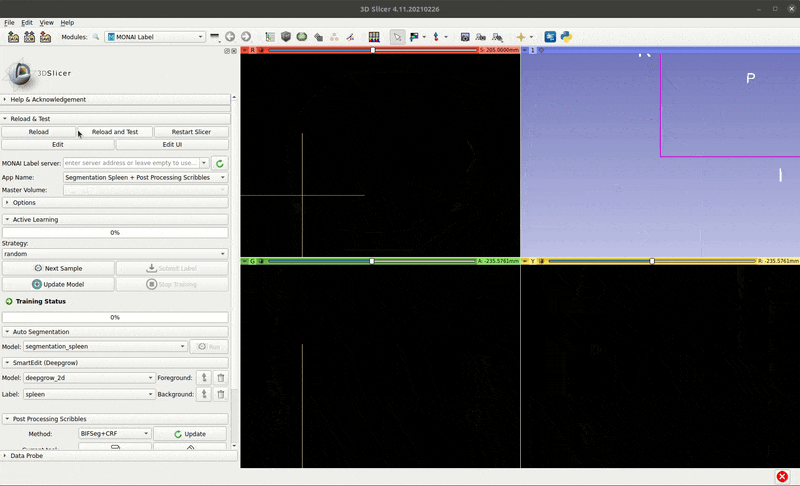
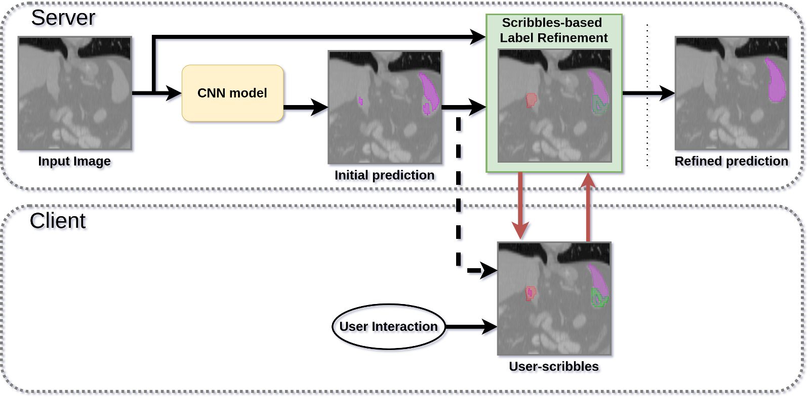
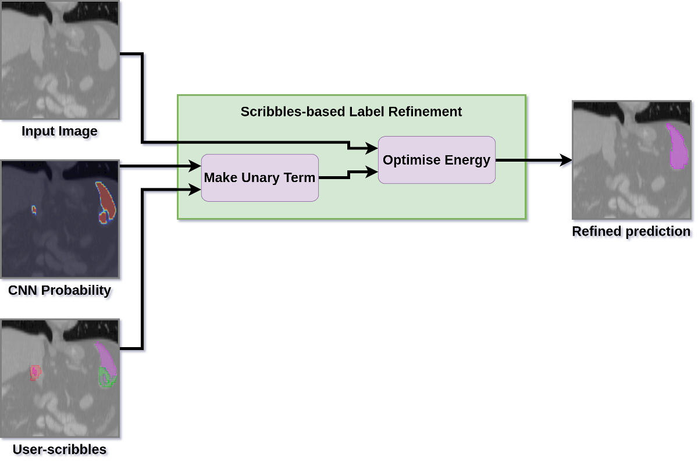

# MONAILabel App to enable User Scribbles-based Label Refinement

## Short Demo

## About
This MONAILabel app enables user scribbles-based label refinement to improve a given segmentation label. It can be used to improve segmentations from a deep learning model and hence can be used as part of an active learning framework where the improved labels can in turn improve the dataset and the corresponding deep learning model.

The flow of this application is outlined below:

In the diagram, the neural network (inference) stage is run only once for a given input volume. The logits for this run are saved and used throughout scribbles-based updates to the same sample. The inferred label is shown to a user through MONAILabel's client extension. The user provides scribbles to indicate corrections needed, which are transferred to server and used along with the logits and original input volume by a label refinement algorithm to improve the label. The process is repeated multiple times and the resulting improved label is saved for future training of the deep learning model.

## Scribbles-based label refinement methods

The included label refinement methods take as input 1) original image volume 2) logits from model and 3) scribbles from user indicating corrections for initial segmentation from model. User-scribbles are incorporated using Equation 7 on page 4 of [this paper](https://arxiv.org/pdf/1710.04043.pdf). This method is referred to here as ISeg (Interactive Segmentation using Scribbles). ISeg equation can be optimised with different optimisation techniques, the ones included within this app are:

| Method Name                | Description                      |
|----------------------------|----------------------------------|
| ISeg + GraphCut           | ISeg optimised using [SimpleCRF's GraphCut module](https://github.com/HiLab-git/SimpleCRF)               |
| ISeg + CRF                | ISeg optimised using [MONAI's CRF module](https://docs.monai.io/en/latest/networks.html#crf)             |
| ISeg + SimpleCRF          | ISeg optimised using [SimpleCRF's CRF module](https://github.com/HiLab-git/SimpleCRF)                    |
| ISeg + InteractiveGraphCut | ISeg optimised using [SimpleCRF's Interactive GraphCut module](https://github.com/HiLab-git/SimpleCRF) |

>Note: this sample app has been tested and developed for Ubuntu and may work for Windows (depending on MONAI's/SimpleCRF's compilation dependencies)

# Using the app

## Install relevant requirements

`BUILD_MONAI=1 pip install -r requirements.txt`

Another way is use docker for MONAI

`docker run --gpus all --rm -ti --ipc=host --net=host -v /xyz:/workspace projectmonai/monai:latest`

## Running the app

### Server
On the server side, run server app using the following command:

`CUDA_VISIBLE_DEVICES=0 monailabel start_server --app /path/to/sample-apps/segmentation_spleen_scribbles/ --studies /path/to/dataset/Task09_Spleen/imagesTrSmall/`

### Client
On the client side, run slicer and load MONAILabel extension:

1. Click **Next Sample** to load a sample with its initial segmentation
2. Scribbles functionality is inside **Scribbles** section
3. To add scribbles select **Painter** or **Eraser** Tool and appropriate layer **Foreground** or **Background**
4. Painting/Erasing tool will be activated, add scribbles to each slice/view
5. Once done, click **Update** to send scribbles to server for applying the selected scribbles-based label refinement method

Further help on setting up MONAILabel apps can be found in the [main README document](../../README.md).
